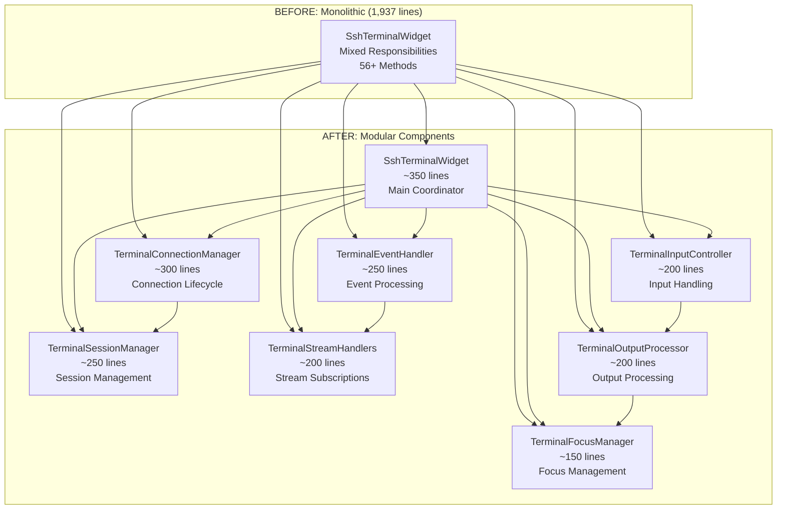

# SSH Terminal Widget Refactoring Plan (Phase 4.2)

**Date**: 2025-08-30  
**Type**: VERY HIGH RISK Widget Refactoring  
**Scope**: SSH Terminal Widget Component Extraction (Phase 4.2 of Comprehensive Plan)  
**Context Tokens**: Refactor ssh_terminal_widget.dart (1,937 lines, 56+ methods) into focused components under 500 lines each.

## Executive Summary

This plan addresses the refactoring of the SSH Terminal Widget, the largest and most critical file in the DevPocket Flutter codebase. The current monolithic implementation at 1,937 lines with 56+ methods violates Single Responsibility Principle and creates severe maintainability issues. This VERY HIGH RISK refactoring will extract the component into 8 focused, testable modules while maintaining full backward compatibility and all existing functionality.

**Risk Level**: VERY HIGH - Core terminal functionality with deep service integration  
**Impact**: System-wide - Affects all terminal operations, SSH connections, and user interactions  
**Approach**: Progressive, safety-first component extraction with comprehensive testing

## Current State Analysis

### File Overview
- **File**: `lib/widgets/terminal/ssh_terminal_widget.dart`
- **Current Size**: 1,937 lines (largest file in codebase)
- **Main Class**: `SshTerminalWidget` (ConsumerStatefulWidget)
- **State Class**: `_SshTerminalWidgetState` 
- **Methods**: 56+ methods with extensive mixed responsibilities
- **Dependencies**: 15+ service integrations, complex stream management

### Responsibility Analysis

#### Current Mixed Responsibilities (Critical SRP Violations)

1. **Connection Management** (~300 lines)
   - SSH profile connection setup and lifecycle
   - Local terminal session creation
   - Connection status tracking and error handling
   - Reconnection logic and session cleanup

2. **Event Processing** (~250 lines)
   - SSH connection event stream handling
   - Terminal input mode event processing
   - Active block event management
   - Focus event coordination

3. **Session Management** (~250 lines)
   - Session creation and termination
   - Data transmission to SSH/local sessions
   - Session state synchronization
   - Welcome message handling

4. **Input Handling** (~200 lines)
   - Command input processing and validation
   - Interactive input routing to active blocks
   - Input mode switching (Command/AI)
   - Keyboard shortcut and control key handling

5. **Output Processing** (~200 lines)
   - Terminal output stream routing
   - Block-based vs terminal-view output handling
   - ANSI escape sequence processing
   - Output buffering and stream management

6. **Focus Management** (~150 lines)
   - Block focus coordination
   - Input routing to focused blocks
   - Block interaction handling
   - Focus state synchronization

7. **Stream Subscriptions** (~200 lines)
   - Multiple StreamSubscription management
   - Stream cleanup and error handling
   - Output controller lifecycle
   - Event stream coordination

8. **UI Building & Rendering** (~350 lines)
   - Status bar rendering with connection indicators
   - Block-based terminal content display
   - XTerm fallback terminal rendering
   - Input controls and keyboard shortcuts
   - Context menus and options dialogs
   - Welcome block specialized rendering

### Critical Dependencies Identified

#### Service Integration (15+ Services)
- **SshConnectionManager**: Complex event-driven SSH connection handling
- **TerminalSessionHandler**: Local session management and output processing
- **TerminalInputModeService**: AI/Command mode switching with event streams
- **ActiveBlockManager**: Interactive process management and focus coordination
- **PTYFocusManager**: Terminal focus management with event handling
- **PersistentProcessDetector**: Long-running process detection
- **FullscreenCommandDetector**: Interactive command detection
- **InteractiveCommandManager**: Fullscreen modal command handling
- **AnsiTextProcessor**: Terminal text processing and formatting
- **TerminalTextEncodingService**: Text encoding and ANSI processing

#### Model Dependencies
- **SshProfile**: SSH connection configuration
- **TerminalBlockData**: Block-based terminal state
- **EnhancedTerminalBlockData**: Enhanced block functionality
- **TerminalOutput**: Output stream data structures
- **Various Event Models**: SSH, input mode, active block events

#### State Management (Riverpod)
- **Theme Providers**: Font size, font family, theme state
- **Complex State Synchronization**: Multiple streams and service states

### Risk Assessment

#### VERY HIGH RISK Factors
1. **Critical Functionality**: Core terminal operations that users depend on daily
2. **Complex State Management**: 7+ stream subscriptions with intricate cleanup logic
3. **Deep Service Integration**: Changes could break 15+ service integrations
4. **User Data Risk**: SSH connections and terminal sessions contain sensitive data
5. **Performance Critical**: Terminal responsiveness directly impacts user experience
6. **Cross-Platform Complexity**: iOS/Android terminal behavior differences

#### Potential Failure Points
- Stream subscription lifecycle management
- SSH connection state synchronization
- Block-based vs terminal-view mode switching
- Interactive process focus management
- Memory leaks from improper stream cleanup
- Race conditions in session management

## Refactoring Strategy

### Component Extraction Architecture

Following the successful Phase 4.1 pattern, extract into 8 focused components with clear responsibilities:



### Key Architectural Principles

1. **Single Responsibility**: Each component handles one specific aspect of terminal functionality
2. **Composition Over Inheritance**: Components are composed, not extended
3. **Clear Interfaces**: Well-defined contracts between components
4. **Stream Isolation**: Each component manages its own stream subscriptions
5. **Error Boundaries**: Isolated error handling prevents cascade failures
6. **Testability**: Components can be unit tested and mocked independently

## Component Specifications

### 1. SshTerminalWidget (Main Coordinator) - ~350 lines

**Responsibility**: Primary widget interface and component orchestration

**Key Functions**:
- Maintain public API compatibility with existing implementation
- Coordinate between extracted components
- Handle widget lifecycle (initState, dispose)
- Manage overall widget state and UI building
- Route events between components

**Dependencies**: All other components as composition
**Streams**: None (delegates to components)
**Risk Level**: MEDIUM (coordinator role, less complex logic)

**Methods to Retain**:
- `build()` - Main UI building
- `initState()` - Component initialization
- `dispose()` - Cleanup coordination
- Widget property handling

### 2. TerminalConnectionManager (Connection Lifecycle) - ~300 lines

**Responsibility**: SSH and local terminal connection management

**Key Functions**:
- SSH profile connection setup and authentication
- Local terminal session creation
- Connection status tracking and reporting
- Reconnection logic and error recovery
- Connection cleanup and resource management

**Methods to Extract**:
- `_setupSession()` - Connection establishment
- `_reconnectSession()` - Reconnection handling
- `_disconnectSession()` - Clean disconnection
- Connection status management
- Welcome message handling

**Dependencies**: SshConnectionManager, TerminalSessionHandler
**Streams**: None (uses service events)
**Risk Level**: HIGH (critical connection logic)

### 3. TerminalSessionManager (Session Management) - ~250 lines

**Responsibility**: Terminal session data management and coordination

**Key Functions**:
- Session data transmission (SSH/local)
- Session state synchronization
- Data encoding and formatting
- Session lifecycle management
- Error handling and recovery

**Methods to Extract**:
- `_sendData()` - Data transmission
- `_sendCommand()` - Command execution
- `_sendInteractiveInput()` - Interactive input handling
- Session validation and error handling

**Dependencies**: SshConnectionManager, TerminalSessionHandler
**Streams**: None (uses provided connections)
**Risk Level**: HIGH (data transmission logic)

### 4. TerminalEventHandler (Event Processing) - ~250 lines

**Responsibility**: Process and coordinate all terminal-related events

**Key Functions**:
- SSH connection event processing
- Terminal input mode event handling
- Active block event coordination
- Focus event management
- Event routing and delegation

**Methods to Extract**:
- `_handleSshEvent()` - SSH event processing
- `_handleActiveBlockEvent()` - Block event handling
- `_handleFocusEvent()` - Focus event management
- Event filtering and validation

**Dependencies**: Event models, component interfaces
**Streams**: Consumes events from services
**Risk Level**: MEDIUM (event routing logic)

### 5. TerminalStreamHandlers (Stream Management) - ~200 lines

**Responsibility**: Manage all stream subscriptions and lifecycle

**Key Functions**:
- Stream subscription creation and management
- Stream cleanup and disposal
- Output controller lifecycle
- Stream error handling and recovery
- Memory leak prevention

**Methods to Extract**:
- Stream subscription setup
- `_currentOutputController` management
- Stream cleanup in dispose()
- Error handling for stream failures

**Dependencies**: Service streams, output controllers
**Streams**: Manages all stream subscriptions
**Risk Level**: HIGH (memory management critical)

### 6. TerminalInputController (Input Handling) - ~200 lines

**Responsibility**: Process all user input and routing

**Key Functions**:
- Command input validation and processing
- Interactive input routing to blocks
- Input mode switching coordination
- Keyboard shortcut handling
- Focus-based input routing

**Methods to Extract**:
- `_handleMainInputSubmission()` - Main input processing
- `_handleEnhancedBlockInput()` - Block input handling
- `_toggleInputMode()` - Mode switching
- Input validation and formatting

**Dependencies**: TerminalInputModeService, focus management
**Streams**: Input mode events
**Risk Level**: MEDIUM (input processing logic)

### 7. TerminalOutputProcessor (Output Processing) - ~200 lines

**Responsibility**: Process and route terminal output

**Key Functions**:
- Terminal output stream processing
- Block-based vs terminal-view routing
- Output formatting and encoding
- ANSI escape sequence handling
- Output buffering and streaming

**Methods to Extract**:
- `_handleTerminalOutput()` - Output processing
- `_createCommandBlock()` - Block creation
- `_updateCurrentBlockStatus()` - Status updates
- Output formatting and routing

**Dependencies**: AnsiTextProcessor, TerminalTextEncodingService
**Streams**: Output streams from sessions
**Risk Level**: MEDIUM (output processing logic)

### 8. TerminalFocusManager (Focus Management) - ~150 lines

**Responsibility**: Manage terminal and block focus coordination

**Key Functions**:
- Block focus state management
- Input routing based on focus
- Focus event coordination
- Block interaction handling
- Focus state synchronization

**Methods to Extract**:
- `_handleBlockTap()` - Block focus handling
- Focus validation and routing
- Block interaction coordination
- Focus state management

**Dependencies**: PTYFocusManager, ActiveBlockManager
**Streams**: Focus events
**Risk Level**: MEDIUM (focus coordination logic)

## Implementation Plan

### Phase 1: Preparation & Risk Mitigation (2-3 days)

#### 1.1 Test Coverage Audit
- [ ] Audit existing tests for SSH terminal functionality
- [ ] Create comprehensive integration tests for SSH connection flows
- [ ] Test terminal input/output in both Block UI and Terminal View modes
- [ ] Document current behavior patterns for regression testing
- [ ] Set up test data and mock services for component testing

#### 1.2 Safety Infrastructure
- [ ] Implement feature flag system for old/new implementation switching
- [ ] Set up comprehensive logging for refactoring monitoring
- [ ] Create rollback scripts and procedures
- [ ] Establish performance baseline metrics
- [ ] Set up memory leak detection and monitoring

#### 1.3 Component Interface Design
- [ ] Define clear interfaces for all 8 components
- [ ] Specify data contracts and event flows between components
- [ ] Design error handling and recovery mechanisms
- [ ] Plan stream subscription lifecycle management
- [ ] Create component interaction diagrams

### Phase 2: Progressive Component Extraction (4-5 days)

#### 2.1 Low-Risk Components (Day 1-2)
**Extract in order of increasing risk:**

**Step 1: TerminalFocusManager**
- [ ] Extract focus management methods
- [ ] Create component interface and implementation
- [ ] Implement stream subscription handling
- [ ] Add comprehensive unit tests
- [ ] Integrate with main widget

**Step 2: TerminalStreamHandlers**
- [ ] Extract stream subscription management
- [ ] Implement proper cleanup mechanisms
- [ ] Add memory leak protection
- [ ] Test stream lifecycle thoroughly
- [ ] Integrate with main widget

#### 2.2 Medium-Risk Components (Day 2-3)
**Step 3: TerminalEventHandler**
- [ ] Extract event processing methods
- [ ] Implement event routing and filtering
- [ ] Add event validation and error handling
- [ ] Create comprehensive event flow tests
- [ ] Integrate with existing event streams

**Step 4: TerminalInputController**
- [ ] Extract input processing methods
- [ ] Implement input validation and routing
- [ ] Add mode switching coordination
- [ ] Test all input modes and scenarios
- [ ] Integrate with focus management

**Step 5: TerminalOutputProcessor**
- [ ] Extract output processing methods
- [ ] Implement output routing and formatting
- [ ] Add block creation and management
- [ ] Test output handling in all modes
- [ ] Integrate with stream handlers

#### 2.3 High-Risk Components (Day 3-5)
**Step 6: TerminalSessionManager**
- [ ] Extract session management methods
- [ ] Implement data transmission handling
- [ ] Add session state synchronization
- [ ] Test SSH and local session scenarios
- [ ] Integrate with connection manager

**Step 7: TerminalConnectionManager**
- [ ] Extract connection management methods
- [ ] Implement connection lifecycle handling
- [ ] Add reconnection and error recovery
- [ ] Test all connection scenarios thoroughly
- [ ] Integrate with session manager

**Step 8: SshTerminalWidget Refactoring**
- [ ] Refactor main widget to use extracted components
- [ ] Remove extracted code from main widget
- [ ] Implement component orchestration
- [ ] Verify backward compatibility
- [ ] Test complete integration

### Phase 3: Integration & Validation (2-3 days)

#### 3.1 Component Integration
- [ ] Wire up all component interactions
- [ ] Implement error handling between components
- [ ] Verify stream cleanup and resource management
- [ ] Test component lifecycle management
- [ ] Validate service integration points

#### 3.2 Comprehensive Testing
- [ ] Run full test suite for regression detection
- [ ] Perform SSH connection testing across all profiles
- [ ] Test terminal operations in all modes and scenarios
- [ ] Validate performance against baseline metrics
- [ ] Test memory usage and leak detection

#### 3.3 User Acceptance Validation
- [ ] Test all terminal input modes (Command/AI)
- [ ] Verify SSH connection flows and error handling
- [ ] Test block-based and terminal-view mode switching
- [ ] Validate interactive command handling
- [ ] Test focus management and block interactions

## Testing Strategy

### Unit Testing Approach
Each extracted component must have comprehensive unit tests covering:

- **TerminalConnectionManager**:
  - Connection establishment success/failure scenarios
  - Reconnection logic and error recovery
  - Session cleanup and resource management
  - Welcome message handling

- **TerminalSessionManager**:
  - Data transmission to SSH/local sessions
  - Session state synchronization
  - Error handling and recovery
  - Command execution validation

- **TerminalEventHandler**:
  - Event routing and filtering
  - Event validation and error handling
  - Cross-component event coordination
  - Event stream lifecycle management

- **TerminalStreamHandlers**:
  - Stream subscription lifecycle
  - Stream cleanup and disposal
  - Memory leak prevention
  - Error handling and recovery

- **TerminalInputController**:
  - Input validation and processing
  - Mode switching coordination
  - Focus-based input routing
  - Keyboard shortcut handling

- **TerminalOutputProcessor**:
  - Output formatting and routing
  - Block creation and management
  - ANSI processing validation
  - Output buffering logic

- **TerminalFocusManager**:
  - Focus state management
  - Block interaction handling
  - Focus event coordination
  - Input routing validation

### Integration Testing Requirements

#### SSH Connection Flow Tests
- SSH profile connection establishment
- Authentication handling and error scenarios
- Data transmission and command execution
- Connection recovery and reconnection
- Session cleanup and termination

#### Terminal Operation Tests
- Block-based UI functionality
- Terminal-view mode operations
- Mode switching between Block UI and Terminal View
- Input mode switching (Command/AI)
- Interactive command handling

#### Stream Management Tests
- Stream subscription creation and cleanup
- Memory leak detection and prevention
- Error handling and recovery
- Output controller lifecycle
- Event stream coordination

### Performance Testing
- Response time benchmarks for terminal operations
- Memory usage monitoring during long sessions
- Stream subscription overhead measurement
- Component initialization performance
- UI rendering performance validation

## Risk Mitigation Strategies

### 1. Feature Flag Implementation
Implement runtime switching between old and new implementations:

```dart
// Feature flag service
class TerminalRefactoringFeatureFlag {
  static bool get useRefactoredComponents => 
    // Implementation switches based on configuration
    _getFeatureFlag('terminal_refactoring_enabled', defaultValue: false);
}

// Usage in main widget
Widget build(BuildContext context) {
  return TerminalRefactoringFeatureFlag.useRefactoredComponents
    ? _buildRefactoredTerminal()
    : _buildLegacyTerminal();
}
```

### 2. Progressive Rollout Strategy
- Start with internal testing on development builds
- Gradual rollout to beta users
- Monitor error rates and performance metrics
- Quick rollback capability if issues detected

### 3. Comprehensive Monitoring
```dart
// Monitoring hooks in components
class TerminalComponentMonitor {
  static void logComponentEvent(String component, String event, {Map<String, dynamic>? data}) {
    // Comprehensive logging for monitoring
  }
  
  static void logError(String component, String error, StackTrace stackTrace) {
    // Error tracking and alerting
  }
}
```

### 4. Memory Leak Prevention
- Implement automatic stream disposal tracking
- Add memory usage monitoring hooks
- Create leak detection tests
- Implement resource usage alerts

### 5. Error Recovery Mechanisms
- Component-level error boundaries
- Automatic fallback to stable states
- Error reporting and recovery guidance
- Graceful degradation strategies

## Backward Compatibility Assurance

### Public API Preservation
The `SshTerminalWidget` constructor and public methods must remain identical:

```dart
// MUST MAINTAIN: Exact same constructor signature
const SshTerminalWidget({
  super.key,
  this.profile,
  this.sessionId,
  this.enableInput = true,
  this.onSessionClosed,
});

// MUST MAINTAIN: Same callback signatures
final SshProfile? profile;
final String? sessionId;
final bool enableInput;
final VoidCallback? onSessionClosed;
```

### State Management Compatibility
- Preserve all Riverpod provider integrations
- Maintain same widget tree structure for existing tests
- Keep identical rendering behavior
- Preserve performance characteristics

### Service Integration Compatibility
- Maintain exact same service call patterns
- Preserve all existing service event handling
- Keep same data flow patterns
- Maintain identical error handling behavior

## Success Criteria

### Functional Requirements
- [ ] All existing SSH terminal functionality works identically
- [ ] All terminal input modes function correctly (Command/AI)
- [ ] Block-based and Terminal View modes work seamlessly
- [ ] SSH connections and local sessions operate normally
- [ ] Interactive commands and focus management work properly

### Code Quality Metrics
- [ ] All files under 500 lines (target achieved)
- [ ] 95%+ test coverage on extracted components
- [ ] No memory leaks detected in testing
- [ ] Performance within 5% of baseline metrics
- [ ] All linting and analysis checks pass

### Risk Mitigation Validation
- [ ] Feature flag system operational
- [ ] Rollback procedures tested and validated
- [ ] Monitoring and logging systems active
- [ ] Error recovery mechanisms tested
- [ ] Component isolation verified

### Documentation Requirements
- [ ] Component architecture documented
- [ ] Integration patterns documented
- [ ] Testing procedures documented
- [ ] Rollback procedures documented
- [ ] Performance characteristics documented

## Timeline Summary

**Total Estimated Time**: 7-11 days
- **Phase 1 (Preparation)**: 2-3 days
- **Phase 2 (Component Extraction)**: 4-5 days  
- **Phase 3 (Integration & Validation)**: 2-3 days

**Critical Path Dependencies**:
1. Test infrastructure setup (Phase 1)
2. Component interface design (Phase 1) 
3. Low-risk component extraction (Phase 2.1)
4. High-risk component extraction (Phase 2.3)
5. Full integration testing (Phase 3)

**Risk Buffers**:
- Add 2-3 extra days for unforeseen integration issues
- Plan for potential rollback and re-architecture if needed
- Schedule thorough user acceptance testing
- Allow time for performance optimization if required

## Conclusion

This refactoring represents the most critical component extraction in the DevPocket codebase. The SSH Terminal Widget's 1,937 lines and 56+ methods create significant maintainability challenges that must be addressed. By following the proven Phase 4.1 pattern with enhanced safety measures, comprehensive testing, and careful risk mitigation, we can successfully decompose this monolithic widget into 8 focused, maintainable components.

The key to success lies in the progressive extraction approach, comprehensive testing at each step, and the ability to quickly rollback if issues arise. This refactoring will dramatically improve code maintainability, testability, and long-term development velocity while maintaining the robust terminal functionality that users depend on.