# DevPocket Flutter Codebase Refactoring Plan

**Date**: 2025-08-29  
**Type**: Comprehensive Refactoring  
**Scope**: System-wide codebase cleanup and component extraction  
**Context Tokens**: Refactor oversized files (10+ files >500 lines), extract components for better maintainability, remove unused code, and improve context engineering for long-term development efficiency.

## Executive Summary
This plan addresses critical codebase maintainability issues in the DevPocket Flutter app by refactoring large, monolithic files into smaller, focused components. The primary focus is reducing file sizes to under 500 lines and improving code organization while maintaining all existing functionality.

## Current State Analysis

### Critical Issues with Current Implementation
- [ ] **Massive Widget Files**: ssh_terminal_widget.dart (1,937 lines) is a God class with 56+ methods
- [ ] **Oversized Components**: 10+ files exceed 500-line target, harming context engineering
- [ ] **Complex Service Files**: secure_ssh_service.dart (1,009 lines) handles too many responsibilities
- [ ] **Large UI Screens**: Multiple screens >700 lines with mixed concerns
- [ ] **Maintenance Burden**: Large files are hard to understand, test, and modify

### Metrics (Before)
- **Files >500 lines**: 15+ files identified
- **Largest file**: ssh_terminal_widget.dart (1,937 lines, 56 methods)
- **Average file size**: ~400 lines (acceptable baseline, but outliers are problematic)
- **God classes**: 5+ classes with excessive responsibilities

## Context Links
- **Affected Modules**: Terminal widgets, SSH services, UI screens, model files
- **Dependencies**: Riverpod providers, service integrations, xterm terminal
- **Related Documentation**: 
  - `./docs/codebase-summary.md`
  - `./docs/devpocket-development-guide.md`
  - `./docs/devpocket-architecture-guide.md`

## Refactoring Strategy

### Approach
Extract large files into smaller, single-responsibility components using composition over inheritance. Prioritize high-impact, low-risk changes first, then tackle complex terminal widgets with comprehensive testing.

### Architecture Changes

```mermaid
graph TB
    subgraph "BEFORE: Monolithic Structure"
        A[SshTerminalWidget<br/>1,937 lines]
        B[SecureSSHService<br/>1,009 lines]
        C[EnhancedTerminalBlock<br/>1,118 lines]
    end
    
    subgraph "AFTER: Modular Structure"
        A1[SshTerminalWidget<br/>~300 lines]
        A2[TerminalConnectionManager<br/>~250 lines]
        A3[TerminalEventHandler<br/>~200 lines]
        A4[TerminalSessionManager<br/>~200 lines]
        A5[TerminalInputController<br/>~150 lines]
        
        B1[SecureSSHService<br/>~300 lines]
        B2[SSHConnectionHandler<br/>~200 lines]
        B3[SSHAuthenticationManager<br/>~250 lines]
        B4[SSHKeyManager<br/>~200 lines]
        
        C1[EnhancedTerminalBlock<br/>~400 lines]
        C2[TerminalBlockRenderer<br/>~250 lines]
        C3[TerminalBlockInteraction<br/>~200 lines]
        C4[TerminalBlockState<br/>~150 lines]
    end
    
    A --> A1
    A --> A2
    A --> A3
    A --> A4
    A --> A5
    
    B --> B1
    B --> B2
    B --> B3
    B --> B4
    
    C --> C1
    C --> C2
    C --> C3
    C --> C4
```

### Key Improvements
- **Single Responsibility**: Each component handles one specific aspect of functionality
- **Testability**: Smaller components are easier to unit test and mock
- **Maintainability**: Developers can focus on specific areas without cognitive overload
- **Context Engineering**: Files under 500 lines improve AI/developer context understanding
- **Reusability**: Extracted components can be reused across different parts of the app

## Implementation Plan

### Phase 1: Preparation & Low-Risk Refactoring (Est: 3-4 days)
**Scope**: Setup, testing infrastructure, and safe model/utility refactoring

1. [ ] **Test Coverage Audit**
   - Audit existing tests for terminal and SSH functionality
   - Create integration tests for critical SSH connection flows
   - Document current behavior for regression testing

2. [ ] **Model File Organization** (LOW RISK)
   - Refactor `enhanced_ssh_models.dart` (786 lines) → Split into logical files:
     - `ssh_host_models.dart` (~250 lines)
     - `ssh_connection_models.dart` (~250 lines) 
     - `ssh_security_models.dart` (~200 lines)
   - Refactor `ssh_models.dart` (698 lines) → Split into:
     - `ssh_key_models.dart` (~350 lines)
     - `ssh_profile_models.dart` (~350 lines)

3. [ ] **Service File Splitting - Non-Critical** (LOW RISK)
   - Extract `audit_service.dart` (771 lines) → Split into:
     - `audit_service.dart` (~300 lines) - Core audit functionality
     - `audit_logger.dart` (~200 lines) - Logging specific logic
     - `audit_storage.dart` (~200 lines) - Storage and persistence

### Phase 2: UI Screen Refactoring (Est: 4-5 days)
**Scope**: Break down large UI screens into smaller components

4. [ ] **API Key Screen Refactoring** (MEDIUM RISK)
   - File: `lib/screens/settings/api_key_screen.dart` (944 lines)
   - Extract components:
     - `api_key_form.dart` (~250 lines) - Form handling
     - `api_key_validation.dart` (~200 lines) - Validation logic
     - `api_key_status.dart` (~200 lines) - Status display
     - Main screen reduced to ~300 lines

5. [ ] **SSH Key Detail Screen** (MEDIUM RISK)
   - File: `lib/screens/ssh_keys/ssh_key_detail_screen.dart` (814 lines)
   - Extract components:
     - `ssh_key_info_widget.dart` (~250 lines) - Key information display
     - `ssh_key_actions_widget.dart` (~200 lines) - Actions (copy, delete, etc.)
     - `ssh_key_security_widget.dart` (~200 lines) - Security information
     - Main screen reduced to ~300 lines

6. [ ] **Host Management Screens** (MEDIUM RISK)
   - `lib/screens/vaults/hosts_list_screen.dart` (754 lines)
   - `lib/screens/vaults/host_edit_screen.dart` (722 lines)
   - `lib/screens/vaults/vaults_screen.dart` (668 lines)
   - Extract shared components:
     - `host_list_item.dart` (~200 lines)
     - `host_form_components.dart` (~300 lines)
     - `host_connection_status.dart` (~150 lines)

### Phase 3: Service Layer Refactoring (Est: 5-6 days)
**Scope**: Critical services - requires extensive testing

7. [ ] **SSH Host Service Refactoring** (HIGH RISK)
   - File: `lib/services/ssh_host_service.dart` (823 lines)
   - Extract components:
     - `ssh_host_service.dart` (~300 lines) - Core service
     - `ssh_host_validator.dart` (~200 lines) - Validation logic
     - `ssh_host_persistence.dart` (~200 lines) - Data persistence
     - `ssh_host_sync.dart` (~150 lines) - Synchronization

8. [ ] **Secure SSH Service Refactoring** (HIGH RISK)
   - File: `lib/services/secure_ssh_service.dart` (1,009 lines)
   - Extract components:
     - `secure_ssh_service.dart` (~350 lines) - Core service interface
     - `ssh_connection_handler.dart` (~250 lines) - Connection management
     - `ssh_authentication_manager.dart` (~200 lines) - Authentication logic
     - `ssh_security_validator.dart` (~150 lines) - Security validation

### Phase 4: Terminal Widget Refactoring (Est: 7-8 days)
**Scope**: Most complex refactoring - the massive terminal widgets

9. [ ] **Enhanced Terminal Block** (HIGH RISK)
   - File: `lib/widgets/terminal/enhanced_terminal_block.dart` (1,118 lines)
   - Extract components:
     - `enhanced_terminal_block.dart` (~400 lines) - Main widget
     - `terminal_block_renderer.dart` (~250 lines) - Rendering logic
     - `terminal_block_interaction.dart` (~200 lines) - User interactions
     - `terminal_block_state_manager.dart` (~150 lines) - State management
     - `terminal_block_animations.dart` (~100 lines) - Animation logic

10. [ ] **SSH Terminal Widget - Critical Refactoring** (VERY HIGH RISK)
    - File: `lib/widgets/terminal/ssh_terminal_widget.dart` (1,937 lines, 56 methods)
    - Extract components:
      - `ssh_terminal_widget.dart` (~350 lines) - Main widget coordinator
      - `terminal_connection_manager.dart` (~300 lines) - Connection lifecycle
      - `terminal_event_handler.dart` (~250 lines) - Event processing
      - `terminal_session_manager.dart` (~250 lines) - Session management
      - `terminal_input_controller.dart` (~200 lines) - Input handling
      - `terminal_output_processor.dart` (~200 lines) - Output processing
      - `terminal_focus_manager.dart` (~150 lines) - Focus management
      - `terminal_stream_handlers.dart` (~200 lines) - Stream subscriptions

### Phase 5: Integration & Validation (Est: 3-4 days)
**Scope**: Ensure everything works together

11. [ ] **Integration Testing**
    - Comprehensive testing of SSH connections
    - Terminal functionality validation
    - AI command generation testing
    - Cross-platform testing (iOS/Android)

12. [ ] **Performance Validation** 
    - Memory usage benchmarking
    - App startup time measurement
    - Terminal rendering performance
    - SSH connection establishment time

13. [ ] **Documentation Updates**
    - Update architecture documentation
    - Component interaction diagrams
    - New file structure documentation

## Backward Compatibility
- **Breaking Changes**: None - all public APIs maintained
- **Migration Path**: Internal refactoring only, no user-facing changes
- **Deprecation Timeline**: N/A - internal restructuring

## Success Metrics (After)
- **Files >500 lines**: 0-2 files maximum
- **Largest file**: <500 lines (vs current 1,937 lines)
- **Average widget complexity**: Reduced by 60%
- **Test coverage**: Maintain or improve existing coverage
- **Build time**: No regression, potential improvement
- **Context engineering**: Improved developer/AI understanding

## Risk Assessment

| Risk | Impact | Likelihood | Mitigation |
|------|--------|------------|------------|
| SSH connection breaks | High | Medium | Comprehensive integration tests, gradual rollout |
| Terminal rendering issues | High | Medium | Extensive terminal testing, fallback widgets |
| State management issues | Medium | Low | Riverpod provider testing, state validation |
| Performance regression | Medium | Low | Benchmarking before/after, profiling |
| UI responsiveness | Medium | Low | Widget performance testing |
| Build failures | Low | Low | CI/CD validation, incremental changes |

## Risk Mitigation Strategies

### High-Risk Components
1. **SSH Terminal Widget**: Create comprehensive test suite before refactoring
2. **SSH Services**: Implement feature flags for gradual rollout
3. **Terminal Blocks**: Maintain backward compatibility interfaces

### Safety Measures
1. **Feature Flags**: Implement toggles for new components
2. **A/B Testing**: Gradual rollout to validate functionality
3. **Rollback Plan**: Keep original files until validation complete
4. **Monitoring**: Add telemetry to track component performance

## TODO Checklist

### Phase 1: Preparation (3-4 days)
- [ ] Test coverage audit complete
- [ ] Model file refactoring complete
- [ ] Non-critical service splitting complete
- [ ] Integration test suite created

### Phase 2: UI Screens (4-5 days)  
- [ ] API key screen refactored
- [ ] SSH key detail screen refactored
- [ ] Host management screens refactored
- [ ] UI component extraction complete

### Phase 3: Services (5-6 days)
- [ ] SSH host service refactored
- [ ] Secure SSH service refactored
- [ ] Service layer testing complete

### Phase 4: Terminal Widgets (7-8 days)
- [ ] Enhanced terminal block refactored
- [ ] SSH terminal widget refactored (CRITICAL)
- [ ] Terminal functionality validated

### Phase 5: Integration (3-4 days)
- [ ] Integration testing complete
- [ ] Performance benchmarks validated
- [ ] Documentation updated
- [ ] Code review passed

### Final Validation
- [ ] All files under 500 lines
- [ ] No functionality regressions
- [ ] Performance maintained or improved
- [ ] CI/CD pipeline passes
- [ ] Team review and approval

## Implementation Notes

### Development Guidelines
1. **Incremental Approach**: Refactor one component at a time
2. **Test-Driven**: Create tests before refactoring
3. **Feature Parity**: Ensure all existing features remain functional
4. **Performance Monitoring**: Benchmark before/after each phase
5. **Code Review**: Each phase requires team review

### File Naming Conventions
- Use descriptive names that indicate single responsibility
- Group related files with common prefixes
- Maintain consistent naming patterns across modules

### Component Design Principles
- **Single Responsibility**: Each component handles one concern
- **Composition over Inheritance**: Prefer composition for flexibility
- **Immutable State**: Use immutable data structures where possible
- **Error Boundaries**: Implement proper error handling at component level
- **Testability**: Design components to be easily unit tested

This comprehensive refactoring plan will transform the DevPocket codebase from a collection of large, monolithic files into a well-organized, maintainable system of focused components, significantly improving developer productivity and code quality.