# Phase 3: Service Layer Refactoring Plan

**Date**: August 29, 2025  
**Type**: Refactoring  
**Scope**: Service Layer - 16 files >500 lines  
**Context Tokens**: Comprehensive service layer refactoring to maintain <500 lines per file for optimal AI context engineering

## Executive Summary

Phase 3 continues the systematic refactoring initiative by targeting the remaining 16 service files over 500 lines. Building on the successful patterns from Phase 1 (service files) and Phase 2 (UI screens), this phase will extract focused components, utilities, and models while maintaining zero breaking changes and full functionality. The goal is to reduce 9,313 lines across 16 files to approximately 3,950 lines distributed across 70+ focused files.

## Current State Analysis

### Service Files Requiring Refactoring
| File | Lines | Priority | Complexity |
|------|-------|----------|------------|
| secure_ssh_service.dart | 640 | High | Complex (partial Phase 1) |
| terminal_session_handler.dart | 639 | High | Very Complex |
| audit_service.dart | 631 | Medium | Complex (partial Phase 1) |
| ssh_connection_manager.dart | 619 | High | Very Complex |
| ai_service.dart | 617 | High | Complex |
| secure_storage_service.dart | 615 | High | Security Critical |
| biometric_service.dart | 614 | High | Security Critical |
| crypto_service.dart | 613 | High | Security Critical |
| active_block_manager.dart | 574 | Medium | Complex |
| ssh_key_storage_service.dart | 547 | Medium | Complex |
| terminal_performance_optimizer.dart | 546 | Medium | Performance Critical |
| openrouter_ai_service.dart | 544 | Medium | Complex |
| terminal_block_lifecycle_service.dart | 543 | Medium | Complex |
| terminal_input_mode_service.dart | 533 | Medium | Complex |
| command_validator.dart | 528 | Low | Moderate |
| network_monitor.dart | 510 | Low | Moderate |

### Metrics (Before)
- **Total Lines**: 9,313 lines across 16 files
- **Average File Size**: 582 lines per file
- **Files >500 lines**: 16 files (100%)
- **Code Complexity**: High interdependency between services
- **Test Coverage**: Existing comprehensive test suite

## Context Links
- **Previous Phases**: Documented in `/docs/implementation-changelog.md`
- **Architecture Patterns**: Established in Phase 1 & 2 refactoring
- **Project Roadmap**: `/docs/project-roadmap.md` Phase 4.1 codebase refactoring
- **Related Documentation**: Service layer architecture in `/lib/services/`

## Refactoring Strategy

### Approach
Extract focused components following established patterns: models/enums separation, manager classes for complex operations, utility classes for helpers, and specialized handlers for specific functionality. Maintain all public APIs while improving internal structure and reducing file complexity.

### Architecture Changes

```mermaid
graph TB
    subgraph "Before: Monolithic Services"
        A[terminal_session_handler.dart<br/>639 lines]
        B[ssh_connection_manager.dart<br/>619 lines]  
        C[ai_service.dart<br/>617 lines]
        D[secure_storage_service.dart<br/>615 lines]
    end
    
    subgraph "After: Focused Components"
        A1[terminal_session_handler.dart<br/>~250 lines]
        A2[terminal_session_models.dart<br/>~80 lines]
        A3[terminal_output_handler.dart<br/>~150 lines]
        A4[terminal_session_state_manager.dart<br/>~160 lines]
        
        B1[ssh_connection_manager.dart<br/>~250 lines]
        B2[ssh_connection_models.dart<br/>~90 lines]
        B3[ssh_connection_pool.dart<br/>~140 lines]
        B4[ssh_authentication_manager.dart<br/>~130 lines]
        
        C1[ai_service.dart<br/>~250 lines]
        C2[ai_service_models.dart<br/>~70 lines]
        C3[ai_response_processor.dart<br/>~150 lines]
        C4[ai_context_manager.dart<br/>~140 lines]
        
        D1[secure_storage_service.dart<br/>~250 lines]
        D2[secure_storage_models.dart<br/>~80 lines]
        D3[secure_storage_encryption.dart<br/>~140 lines]
        D4[secure_storage_key_manager.dart<br/>~140 lines]
    end
    
    A --> A1
    A --> A2
    A --> A3  
    A --> A4
    
    B --> B1
    B --> B2
    B --> B3
    B --> B4
    
    C --> C1
    C --> C2
    C --> C3
    C --> C4
    
    D --> D1
    D --> D2
    D --> D3
    D --> D4
```

### Key Improvements
- **Maintainability**: Each file under 500 lines with single responsibility
- **Testability**: Focused components easier to unit test
- **Reusability**: Extracted utilities and managers can be shared
- **AI Context**: Optimal file sizes for AI-assisted development
- **Code Quality**: Cleaner separation of concerns and reduced complexity

## Implementation Plan

### Phase 3.1: Core Terminal Services (Days 1-2)
**Scope**: Terminal functionality and UI state management
**Target Files**: 5 files, 2,835 lines → ~1,200 lines (57% reduction)

#### Day 1: Terminal Core Components
1. [ ] **terminal_session_handler.dart** (639 → ~250 lines)
   - Extract: `terminal_session_models.dart` (~80 lines)
   - Extract: `terminal_output_handler.dart` (~150 lines)
   - Extract: `terminal_session_state_manager.dart` (~160 lines)

2. [ ] **active_block_manager.dart** (574 → ~200 lines)
   - Extract: `active_block_models.dart` (~70 lines)
   - Extract: `block_state_manager.dart` (~150 lines)
   - Extract: `block_ui_controller.dart` (~150 lines)

#### Day 2: Terminal Performance & Lifecycle
3. [ ] **terminal_performance_optimizer.dart** (546 → ~250 lines)
   - Extract: `performance_metrics_collector.dart` (~120 lines)
   - Extract: `memory_optimizer.dart` (~100 lines)
   - Extract: `rendering_optimizer.dart` (~76 lines)

4. [ ] **terminal_block_lifecycle_service.dart** (543 → ~250 lines)
   - Extract: `block_lifecycle_models.dart` (~60 lines)
   - Extract: `block_creation_manager.dart` (~120 lines)
   - Extract: `block_cleanup_manager.dart` (~113 lines)

5. [ ] **terminal_input_mode_service.dart** (533 → ~250 lines)
   - Extract: `input_mode_models.dart` (~50 lines)
   - Extract: `command_input_handler.dart` (~120 lines)
   - Extract: `agent_input_handler.dart` (~113 lines)

### Phase 3.2: SSH & Network Services (Day 3)
**Scope**: SSH connections and network monitoring
**Target Files**: 4 files, 2,316 lines → ~1,000 lines (57% reduction)

6. [ ] **ssh_connection_manager.dart** (619 → ~250 lines)
   - Extract: `ssh_connection_models.dart` (~90 lines)
   - Extract: `ssh_connection_pool.dart` (~140 lines)
   - Extract: `ssh_authentication_manager.dart` (~130 lines)
   - Extract: `ssh_connection_monitor.dart` (~109 lines)

7. [ ] **ssh_key_storage_service.dart** (547 → ~250 lines)
   - Extract: `ssh_key_models.dart` (~80 lines)
   - Extract: `ssh_key_validator.dart` (~100 lines)
   - Extract: `ssh_key_encryption.dart` (~117 lines)

8. [ ] **network_monitor.dart** (510 → ~250 lines)
   - Extract: `network_status_models.dart` (~60 lines)
   - Extract: `connectivity_checker.dart` (~100 lines)
   - Extract: `network_change_detector.dart` (~100 lines)

9. [ ] **secure_ssh_service.dart** (640 → ~250 lines) - Complete Phase 1
   - Extract: `ssh_session_manager.dart` (~180 lines)
   - Extract: `ssh_command_executor.dart` (~210 lines)

### Phase 3.3: AI & Command Services (Day 4)
**Scope**: AI integration and command processing
**Target Files**: 3 files, 1,689 lines → ~750 lines (55% reduction)

10. [ ] **ai_service.dart** (617 → ~250 lines)
    - Extract: `ai_service_models.dart` (~70 lines)
    - Extract: `ai_response_processor.dart` (~150 lines)
    - Extract: `ai_context_manager.dart` (~140 lines)
    - Extract: `ai_provider_interface.dart` (~97 lines)

11. [ ] **openrouter_ai_service.dart** (544 → ~250 lines)
    - Extract: `openrouter_models.dart` (~60 lines)
    - Extract: `openrouter_client.dart` (~120 lines)
    - Extract: `openrouter_response_handler.dart` (~114 lines)

12. [ ] **command_validator.dart** (528 → ~250 lines)
    - Extract: `command_validation_models.dart` (~50 lines)
    - Extract: `command_safety_checker.dart` (~120 lines)
    - Extract: `command_syntax_validator.dart` (~108 lines)

### Phase 3.4: Security Services (Day 5)
**Scope**: Security, storage, and audit functionality
**Target Files**: 4 files, 2,473 lines → ~1,000 lines (60% reduction)

13. [ ] **secure_storage_service.dart** (615 → ~250 lines)
    - Extract: `secure_storage_models.dart` (~80 lines)
    - Extract: `secure_storage_encryption.dart` (~140 lines)
    - Extract: `secure_storage_key_manager.dart` (~140 lines)
    - Extract: `secure_storage_validator.dart` (~105 lines)

14. [ ] **biometric_service.dart** (614 → ~250 lines)
    - Extract: `biometric_models.dart` (~60 lines)
    - Extract: `biometric_authentication.dart` (~150 lines)
    - Extract: `biometric_storage_manager.dart` (~154 lines)

15. [ ] **crypto_service.dart** (613 → ~250 lines)
    - Extract: `crypto_models.dart` (~70 lines)
    - Extract: `encryption_manager.dart` (~140 lines)
    - Extract: `key_derivation_service.dart` (~153 lines)

16. [ ] **audit_service.dart** (631 → ~250 lines) - Complete Phase 1
    - Extract: `audit_event_processor.dart` (~180 lines)
    - Extract: `audit_export_manager.dart` (~201 lines)

### Phase 3.5: Final Integration & Testing (Day 6)
**Scope**: Validation and cleanup
1. [ ] Comprehensive integration testing across all phases
2. [ ] Performance benchmarking and validation
3. [ ] Documentation updates
4. [ ] Final code review and cleanup
5. [ ] Update implementation changelog

## Backward Compatibility
- **Breaking Changes**: None - all public APIs maintained
- **Migration Path**: Internal refactoring only, no client changes required
- **Deprecation Timeline**: Not applicable - internal refactoring

## Success Metrics (After)
- **Total Lines**: ~3,950 lines across 70+ files (57% reduction)
- **Average Main File Size**: ~247 lines per service file
- **Files >500 lines**: 0 files (target achieved)
- **New Focused Files**: ~50-60 specialized components
- **Code Complexity**: Significantly reduced through separation of concerns
- **Test Coverage**: Maintained at current levels

## Risk Assessment
| Risk | Impact | Probability | Mitigation |
|------|--------|-------------|------------|
| Breaking existing functionality | High | Low | Comprehensive testing after each file |
| Performance regression | Medium | Low | Performance benchmarking throughout |
| Complex interdependencies | High | Medium | Careful dependency analysis before refactoring |
| Security vulnerabilities | High | Low | Security-first approach, no changes to crypto logic |
| Timeline overrun | Medium | Medium | Conservative estimates with buffer day |
| Test coverage gaps | Medium | Low | Maintain existing test patterns |

## Estimated Impact Summary
- **Total Line Reduction**: 9,313 → 3,950 lines (5,363 lines saved, 57% reduction)
- **New Files Created**: ~50-60 focused files with single responsibilities
- **Maintainability**: Significantly improved through smaller, focused files
- **AI Context Engineering**: All files optimized for AI tools (<500 lines)
- **Development Velocity**: Expected improvement through better code organization

## TODO Checklist
- [ ] **Phase 3.1**: Core Terminal Services complete (Days 1-2)
  - [ ] terminal_session_handler.dart refactored
  - [ ] active_block_manager.dart refactored  
  - [ ] terminal_performance_optimizer.dart refactored
  - [ ] terminal_block_lifecycle_service.dart refactored
  - [ ] terminal_input_mode_service.dart refactored
  - [ ] Integration testing passed

- [ ] **Phase 3.2**: SSH & Network Services complete (Day 3)
  - [ ] ssh_connection_manager.dart refactored
  - [ ] ssh_key_storage_service.dart refactored
  - [ ] network_monitor.dart refactored
  - [ ] secure_ssh_service.dart refactoring completed
  - [ ] Integration testing passed

- [ ] **Phase 3.3**: AI & Command Services complete (Day 4)
  - [ ] ai_service.dart refactored
  - [ ] openrouter_ai_service.dart refactored
  - [ ] command_validator.dart refactored
  - [ ] Integration testing passed

- [ ] **Phase 3.4**: Security Services complete (Day 5)
  - [ ] secure_storage_service.dart refactored
  - [ ] biometric_service.dart refactored
  - [ ] crypto_service.dart refactored
  - [ ] audit_service.dart refactoring completed
  - [ ] Security validation passed

- [ ] **Phase 3.5**: Final Integration complete (Day 6)
  - [ ] Comprehensive testing across all phases
  - [ ] Performance benchmarks validated
  - [ ] Documentation updated
  - [ ] Implementation changelog updated
  - [ ] Code review completed
  - [ ] All service files under 500 lines confirmed