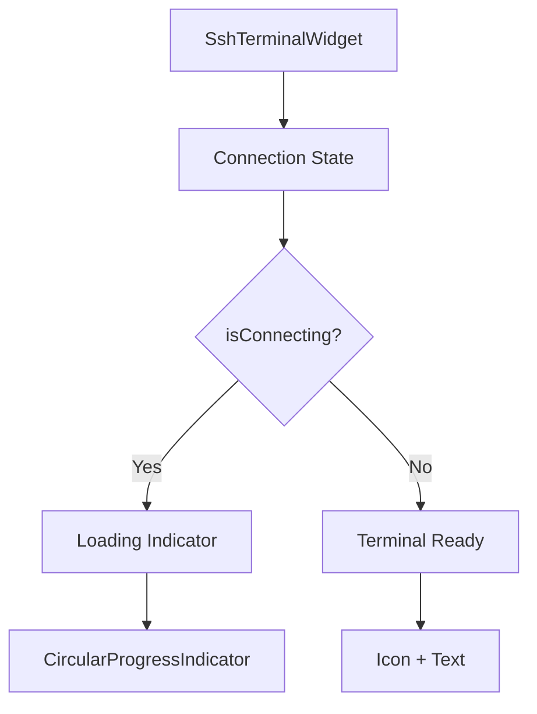

# SSH Connection Loading Indicator Implementation Plan

**Date**: 2025-01-27  
**Type**: Feature Implementation  
**Status**: Planning  
**Context Tokens**: <200 words

## Executive Summary
Enhance the SSH connection UX by adding a spinning loading indicator in the center of the "Terminal Ready" container during connection establishment. This improves user feedback and clearly indicates when the system is actively connecting to SSH hosts.

## Context Links
- **Related Plans**: None
- **Dependencies**: Flutter Material components, SSH connection state management
- **Reference Docs**: [Flutter App Structure](./docs/flutter-app-structure.md)

## Requirements
### Functional Requirements
- [ ] Display loading spinner during SSH connection process
- [ ] Center the spinner in the empty terminal blocks area
- [ ] Show spinner only when connection state is "Connecting..." or "Authenticating..."
- [ ] Hide spinner when connection succeeds or fails
- [ ] Maintain existing "Terminal Ready" UI for non-connecting states

### Non-Functional Requirements  
- [ ] Smooth animation with no jank
- [ ] Consistent with app's neobrutalism design theme
- [ ] Accessible loading state indication
- [ ] No performance impact on terminal operations

## Architecture Overview


### Key Components
- **SshTerminalWidget**: Main terminal widget managing SSH sessions
- **_buildEmptyBlocksState**: Method rendering the empty terminal state
- **Connection State Variables**: _status, _isConnected flags

### Data Models
- **Connection States**: Initializing, Connecting, Authenticating, Connected, Failed
- **UI State**: Loading indicator visibility based on connection state

## Implementation Phases

### Phase 1: Add Loading State Detection (Est: 0.5 days)
**Scope**: Create helper method to determine loading state
**Tasks**:
1. [ ] Add `_isConnecting` getter method - file: `lib/widgets/terminal/ssh_terminal_widget.dart`
2. [ ] Check for "Connecting...", "Authenticating...", "Starting local terminal..." states
3. [ ] Test state detection logic

**Acceptance Criteria**:
- [ ] Loading state correctly identified during connection
- [ ] State transitions properly detected

### Phase 2: Implement Loading UI (Est: 0.5 days)
**Scope**: Modify empty blocks state to show loading indicator
**Tasks**:
1. [ ≈ Update `_buildEmptyBlocksState` method - file: `lib/widgets/terminal/ssh_terminal_widget.dart`
2. [ ] Add conditional rendering for loading/ready states
3. [ ] Implement CircularProgressIndicator with proper styling
4. [ ] Add "Connecting to host..." subtitle text

**Acceptance Criteria**:
- [ ] Loading spinner displays during connection
- [ ] Spinner properly centered in container
- [ ] Visual consistency with app theme

### Phase 3: Polish & Edge Cases (Est: 0.5 days)
**Scope**: Handle edge cases and enhance UX
**Tasks**:
1. [ ] Handle reconnection states
2. [ ] Add loading text variations based on connection phase
3. [ ] Ensure smooth transitions between states
4. [ ] Test with various SSH profiles and connection scenarios

**Acceptance Criteria**:
- [ ] No flashing/jank during state transitions
- [ ] All connection states properly handled
- [ ] Loading indicator disappears on success/failure

## Testing Strategy
- **Unit Tests**: Test _isConnecting getter logic
- **Widget Tests**: Verify loading indicator visibility based on state
- **Integration Tests**: Test full SSH connection flow with loading states
- **Manual Testing**: Verify visual appearance and animations

## Security Considerations
- [ ] No sensitive connection details exposed in loading state
- [ ] Loading indicator doesn't reveal connection timing information

## Risk Assessment
| Risk | Impact | Mitigation |
|------|--------|------------|
| State race conditions | Medium | Add proper state synchronization |
| Animation performance | Low | Use built-in Flutter optimized widgets |
| Inconsistent state detection | Medium | Centralize connection state logic |

## Quick Reference
### Key Commands
```bash
flutter run
flutter test
```

### Configuration Files
- `lib/widgets/terminal/ssh_terminal_widget.dart`: Main implementation file
- `lib/themes/app_theme.dart`: Theme constants for styling

## Implementation Details

### Code Changes Required

#### 1. Add Connection State Detection
```dart
// In SshTerminalWidget class
bool get _isConnecting {
  return _status == 'Connecting...' || 
         _status == 'Authenticating...' ||
         _status == 'Starting local terminal...' ||
         _status == 'Connecting to ${widget.profile?.connectionString}...' ||
         _status == 'Reconnecting...' ||
         _status == 'Initializing...';
}
```

#### 2. Update _buildEmptyBlocksState Method
```dart
Widget _buildEmptyBlocksState() {
  if (_isConnecting) {
    return Center(
      child: Column(
        mainAxisAlignment: MainAxisAlignment.center,
        children: [
          const CircularProgressIndicator(
            valueColor: AlwaysStoppedAnimation<Color>(AppTheme.primaryColor),
            strokeWidth: 3,
          ),
          const SizedBox(height: 20),
          Text(
            _status,  // Show the actual connection status
            style: const TextStyle(
              color: AppTheme.darkTextPrimary,
              fontSize: 14,
              fontWeight: FontWeight.w500,
            ),
          ),
          const SizedBox(height: 4),
          const Text(
            'Please wait...',
            style: TextStyle(
              color: AppTheme.darkTextSecondary,
              fontSize: 12,
            ),
          ),
        ],
      ),
    );
  }
  
  // Existing Terminal Ready UI
  return const Center(
    child: Column(
      mainAxisAlignment: MainAxisAlignment.center,
      children: [
        Icon(
          Icons.terminal,
          size: 48,
          color: AppTheme.darkTextSecondary,
        ),
        SizedBox(height: 12),
        Text(
          'Terminal Ready',
          style: TextStyle(
            color: AppTheme.darkTextSecondary,
            fontSize: 16,
            fontWeight: FontWeight.w500,
          ),
        ),
        SizedBox(height: 4),
        Text(
          'Enter a command to get started',
          style: TextStyle(
            color: AppTheme.darkTextSecondary,
            fontSize: 12,
          ),
        ),
      ],
    ),
  );
}
```

## TODO Checklist
- [ ] Add _isConnecting getter method
- [ ] Update _buildEmptyBlocksState with conditional rendering
- [ ] Implement CircularProgressIndicator with theme styling
- [ ] Add connection status text display
- [ ] Test with SSH connections
- [ ] Test with local terminal
- [ ] Handle reconnection scenarios
- [ ] Verify smooth state transitions
- [ ] Test on iOS and Android devices
- [ ] Code review
- [ ] Documentation update if needed