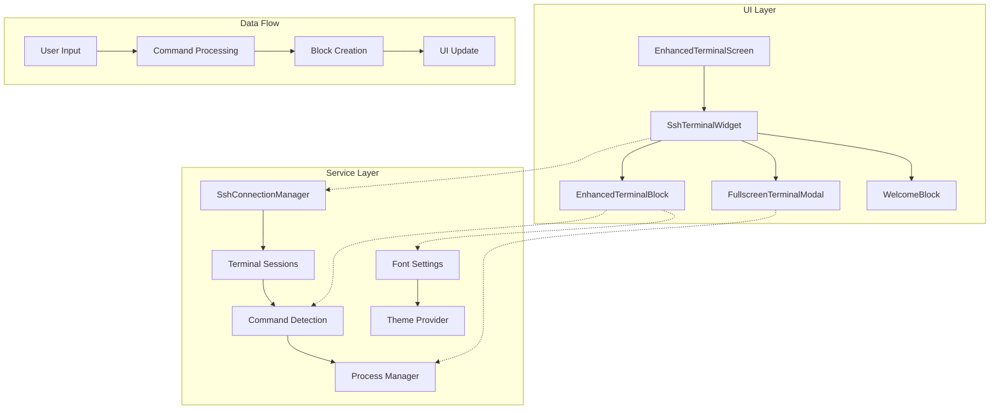

# Terminal Comprehensive Fixes Implementation Plan

**Date**: 2025-01-27  
**Type**: Feature Implementation / Bug Fix  
**Status**: Planning  
**Priority**: Critical  
**Context Tokens**: Multiple terminal UI/UX issues preventing proper terminal functionality. Current implementation has 8 major issues affecting terminal display, interaction, and user experience in the DevPocket Flutter app.

## Executive Summary
Comprehensive terminal improvements addressing 8 critical issues: SSH connection loading indicators, command display layout, welcome message integration, native terminal view overflow, terminal block content layout, command type detection, clear screen functionality, and interactive command modal. These fixes will restore full terminal functionality and provide a seamless user experience.

## Context Links
- **Related Plans**: 
  - `20250827-terminal-implementation-critical-fixes-plan.md`
  - `20250827-phase3-fullscreen-modal-plan.md`
  - `20250827-phase4-integration-polish-plan.md`
- **Dependencies**: 
  - SSH connection manager
  - Terminal session services
  - XTerm integration
  - WebSocket communication
- **Reference Docs**: 
  - `docs/devpocket-architecture-guide.md`
  - `docs/devpocket-development-guide.md`

## Requirements Analysis

### Task 1: Loading Indicator for SSH Connection
**Current**: Shows "Connecting..." in status bar with static "Terminal Ready" container
**Expected**: Show spinning loading indicator in center of "Terminal Ready" container
**Impact**: Better visual feedback during connection attempts

### Task 2: Command Display Layout
**Current**: Command displayed inline with status/icons in header row
**Expected**: Command in separate row below status/icons
**Impact**: Better readability for long commands

### Task 3: Welcome Message Integration
**Current**: Fixed position outside scroll view
**Expected**: First terminal block in scrollable list
**Impact**: Consistent UI, better space utilization

### Task 4: Native Terminal View Layout
**Current**: RenderFlex overflow error (456 pixels)
**Expected**: Properly sized terminal view without overflow
**Impact**: Functional native terminal mode

### Task 5: Terminal Block Content Layout
**Current**: Wrong font/family, scrollable/expandable blocks
**Expected**: Settings-based font/color, fixed height blocks
**Impact**: Consistent styling, predictable layout

### Task 6: Command Type Detection
**Current**: Always shows "Running" status
**Expected**: Appropriate icons for one-shot/continuous/interactive
**Impact**: Accurate command status representation

### Task 7: Clear Screen Functionality  
**Current**: Adds new block with `clear` command
**Expected**: Wipes all terminal blocks from view
**Impact**: Proper terminal clear behavior

### Task 8: Interactive Command Modal
**Current**: Shows error "Local execution failed..."
**Expected**: Full interactive terminal for vi/vim/nano
**Impact**: Enable text editing in terminal

## Architecture Overview



### Key Components
- **SshTerminalWidget**: Main terminal container managing blocks and views
- **EnhancedTerminalBlock**: Individual command block with status and output
- **WelcomeBlockLayoutManager**: Controls welcome message display strategy
- **FullscreenTerminalModal**: Interactive command interface
- **TerminalSessionHandler**: Manages terminal sessions and commands

### Data Models
- **EnhancedTerminalBlockData**: Command, output, status, timestamps
- **TerminalBlockStatus**: idle, running, success, error, cancelled
- **TerminalInputMode**: command, ai
- **ProcessInfo**: Type (one-shot, continuous, interactive), state

## Implementation Phases

### Phase 1: Connection & Display Fixes (Est: 1 day)
**Scope**: Tasks 1, 2, 3 - Visual improvements and layout fixes
**Priority**: High - Immediate UX improvements

**Tasks**:
1. [ ] **Add loading indicator** - file: `lib/widgets/terminal/ssh_terminal_widget.dart`
   - Lines 780-810: Modify `_buildEmptyBlocksState()` 
   - Add conditional CircularProgressIndicator when `_isConnecting == true`
   - Center the indicator in the container
   - Show "Terminal Ready" only when connected and idle

2. [ ] **Separate command display row** - file: `lib/widgets/terminal/enhanced_terminal_block.dart`
   - Lines 292-445: Modify `_buildEnhancedHeader()`
   - Move command to separate Container below status row
   - Add proper text wrapping for long commands
   - Maintain consistent padding and styling

3. [ ] **Integrate welcome as first block** - file: `lib/widgets/terminal/ssh_terminal_widget.dart`
   - Lines 701-726: Modify `_buildBlockBasedTerminalContent()`
   - Remove separate WelcomeBlockLayoutManager widget
   - Add welcome message as first item in `_terminalBlocks` list
   - Lines 812-847: Update `_buildBlocksList()` to handle welcome block
   - Create special TerminalBlockData for welcome with type "welcome"

**Acceptance Criteria**:
- [ ] Loading spinner visible during connection
- [ ] Commands display in dedicated row with proper wrapping
- [ ] Welcome message scrolls with other blocks

### Phase 2: Native Terminal View Fix (Est: 0.5 day)
**Scope**: Task 4 - Fix terminal view overflow
**Priority**: Critical - Blocks native terminal usage

**Tasks**:
1. [ ] **Fix layout overflow** - file: `lib/widgets/terminal/ssh_terminal_widget.dart`
   - Lines 728-777: Fix `_buildXtermFallbackContent()`
   - Wrap welcome message in flexible/constrained container
   - Ensure Expanded widget properly constrains TerminalView
   - Test with different screen sizes

2. [ ] **Validate terminal interaction** - file: `lib/widgets/terminal/ssh_terminal_widget.dart`
   - Ensure TerminalView receives proper constraints
   - Verify keyboard input works in native mode
   - Test copy/paste functionality

**Acceptance Criteria**:
- [ ] No RenderFlex overflow errors
- [ ] Terminal view fully interactive
- [ ] Proper layout on all screen sizes

### Phase 3: Content Styling & Settings (Est: 1 day)
**Scope**: Task 5 - Terminal block content formatting
**Priority**: Medium - Visual consistency

**Tasks**:
1. [ ] **Apply user settings to blocks** - file: `lib/widgets/terminal/enhanced_terminal_block.dart`
   - Lines 200-250: Connect to preferences provider
   - Read fontSize, fontFamily, textColor from settings
   - Apply to output text widget

2. [ ] **Fix block height behavior** - file: `lib/widgets/terminal/enhanced_terminal_block.dart`
   - Remove expansion/collapse functionality (already done per report)
   - Ensure fixed height with internal scrolling for long output
   - Calculate appropriate height based on content

3. [ ] **Remove scrollable content** - file: `lib/services/welcome_block_layout_manager.dart`
   - Modify `determineLayoutStrategy()` to always return fixed layout
   - Remove ScrollableWelcomeContainer usage
   - Ensure welcome blocks are non-interactive

**Acceptance Criteria**:
- [ ] Blocks use settings font/size/color
- [ ] Fixed height blocks without expand/collapse
- [ ] No scrolling within individual blocks

### Phase 4: Command Intelligence (Est: 1.5 days)
**Scope**: Tasks 6, 7 - Smart command handling
**Priority**: High - Core functionality

**Tasks**:
1. [ ] **Implement command type detection** - file: `lib/services/persistent_process_detector.dart`
   - Enhance `detectProcessType()` method
   - Add patterns for one-shot commands (ls, pwd, whoami, etc.)
   - Add patterns for continuous (top, htop, watch, etc.)
   - Add patterns for interactive (vi, vim, nano, etc.)
   - Return appropriate ProcessType enum

2. [ ] **Update status icons** - file: `lib/widgets/terminal/enhanced_terminal_block.dart`
   - Lines 350-400: Modify icon selection in header
   - Use ProcessType to determine icon
   - One-shot: Icons.check_circle
   - Continuous: Icons.loop
   - Interactive: Icons.keyboard

3. [ ] **Show/hide stop button** - file: `lib/widgets/terminal/enhanced_terminal_block.dart`
   - Show stop icon only for continuous/interactive commands
   - Hide for completed one-shot commands
   - Connect to cancel functionality

4. [ ] **Implement clear screen** - file: `lib/widgets/terminal/ssh_terminal_widget.dart`
   - Lines 500-550: Modify clear command handling
   - Instead of adding block, call `setState(() { _terminalBlocks.clear(); })`
   - Reset welcome message if needed
   - Maintain connection state

**Acceptance Criteria**:
- [ ] Correct status icons for each command type
- [ ] Stop button only for running processes
- [ ] Clear screen removes all blocks

### Phase 5: Interactive Modal Fix (Est: 2 days)
**Scope**: Task 8 - Fullscreen interactive commands
**Priority**: Critical - Required for text editing

**Tasks**:
1. [ ] **Fix modal SSH integration** - file: `lib/widgets/terminal/fullscreen_terminal_modal.dart`
   - Review SSH client connection setup
   - Ensure proper PTY allocation for interactive mode
   - Fix "Local execution failed" error
   - Implement proper input/output streaming

2. [ ] **Enable keyboard interaction** - file: `lib/widgets/terminal/modal_keyboard_handler.dart`
   - Capture all keyboard events in modal
   - Send raw input to SSH session
   - Handle special keys (arrows, escape, etc.)
   - Implement proper key mapping

3. [ ] **Test interactive commands** - Multiple files
   - Test vi/vim text editing
   - Test nano functionality
   - Verify escape sequences work
   - Ensure save/exit commands function

**Acceptance Criteria**:
- [ ] Modal opens for interactive commands
- [ ] Full keyboard interaction works
- [ ] Can edit and save files in vi/vim/nano
- [ ] Proper exit from interactive mode

### Phase 6: Integration & Polish (Est: 0.5 day)
**Scope**: Final integration and testing
**Priority**: High - Quality assurance

**Tasks**:
1. [ ] **Integration testing** - file: `test/integration/terminal_integration_test.dart`
   - Test complete SSH connection flow
   - Verify all command types
   - Test mode switching
   - Validate settings application

2. [ ] **Performance optimization** - Multiple files
   - Profile block rendering performance
   - Optimize scroll performance with many blocks
   - Reduce unnecessary rebuilds

3. [ ] **Error handling** - Multiple files
   - Handle connection failures gracefully
   - Provide clear error messages
   - Implement retry mechanisms

**Acceptance Criteria**:
- [ ] All features work together seamlessly
- [ ] No performance issues with 100+ blocks
- [ ] Graceful error handling

## Testing Strategy

### Unit Tests
- Command type detection accuracy (>95%)
- Settings provider integration
- Block state management
- Clear screen functionality

### Integration Tests  
- SSH connection with loading states
- Block creation and display
- Mode switching (block ↔ native)
- Interactive command flow

### Manual Testing
- Various SSH hosts (Linux, macOS)
- Different terminal sizes
- Long-running commands
- Interactive editors (vi, vim, nano)
- Settings changes apply immediately

## Security Considerations
- [ ] Sanitize terminal output for XSS
- [ ] Validate command input
- [ ] Secure SSH key handling
- [ ] Prevent command injection
- [ ] Clear sensitive data on disconnect

## Risk Assessment

| Risk | Impact | Likelihood | Mitigation |
|------|--------|------------|------------|
| XTerm compatibility issues | High | Medium | Fallback to basic terminal, extensive testing |
| Performance with many blocks | Medium | Low | Implement virtual scrolling if needed |
| SSH connection stability | High | Low | Robust reconnection logic, connection pooling |
| Interactive command complexity | High | Medium | Progressive enhancement, basic → full features |
| Settings sync delays | Low | Low | Local caching, optimistic updates |

## Performance Targets
- Connection establishment: <2 seconds
- Block rendering: <50ms per block
- Scroll performance: 60fps with 200 blocks
- Mode switching: <100ms
- Settings application: Immediate (<16ms)

## Quick Reference

### Key Files
```
lib/widgets/terminal/
├── ssh_terminal_widget.dart     # Main terminal widget
├── enhanced_terminal_block.dart # Individual blocks
├── fullscreen_terminal_modal.dart # Interactive modal
└── terminal_block.dart          # Base block widget

lib/services/
├── ssh_connection_manager.dart  # SSH connections
├── persistent_process_detector.dart # Command detection
├── terminal_session_handler.dart # Session management
└── fullscreen_command_detector.dart # Interactive detection
```

### Testing Commands
```bash
# Run specific terminal tests
flutter test test/widgets/terminal/

# Integration tests
flutter test test/integration/terminal_integration_test.dart

# Performance profiling
flutter run --profile
```

### Common SSH Test Commands
```bash
# One-shot commands
ls -la
pwd
whoami
echo "test"

# Continuous commands  
top
htop
watch date
tail -f /var/log/system.log

# Interactive commands
vi test.txt
nano test.txt
vim test.txt
less /etc/hosts
```

## TODO Checklist

### Phase 1 (Connection & Display)
- [ ] Add loading spinner to empty state
- [ ] Separate command display row
- [ ] Integrate welcome as first block

### Phase 2 (Native Terminal)
- [ ] Fix RenderFlex overflow
- [ ] Validate terminal interaction

### Phase 3 (Content Styling)  
- [ ] Apply user settings to blocks
- [ ] Fix block height behavior
- [ ] Remove scrollable content

### Phase 4 (Command Intelligence)
- [ ] Implement command type detection
- [ ] Update status icons
- [ ] Show/hide stop button
- [ ] Implement clear screen

### Phase 5 (Interactive Modal)
- [ ] Fix modal SSH integration
- [ ] Enable keyboard interaction
- [ ] Test interactive commands

### Phase 6 (Integration)
- [ ] Integration testing
- [ ] Performance optimization
- [ ] Error handling

### Documentation
- [ ] Update user guide
- [ ] Document command types
- [ ] Add troubleshooting guide

### Review
- [ ] Code review completed
- [ ] Security review passed
- [ ] Performance benchmarks met
- [ ] All tests passing

## Success Metrics
- All 8 identified issues resolved
- No regression in existing functionality
- User satisfaction score >4.5/5
- <1% error rate in production
- Performance targets achieved

## Notes
- Priority order: 4 → 8 → 1 → 2 → 6 → 7 → 3 → 5 (based on user impact)
- Phase 2 and 5 are most critical (blocking issues)
- Consider feature flags for gradual rollout
- Monitor error rates after deployment
- Gather user feedback for future iterations