# DevPocket Production Readiness Implementation Plan

**Date**: 2025-08-24  
**Type**: Feature Implementation  
**Status**: Planning  
**Context Tokens**: 190 words

## Executive Summary

This plan addresses the remaining 25% of work to bring the DevPocket Flutter app from 75% completion to 100% production readiness. With all core features implemented and working (SSH, authentication, key management, terminal functionality), the focus shifts to resolving critical testing stability issues, optimizing the build environment, and ensuring deployment confidence through robust integration testing frameworks and CI/CD pipeline optimization.

## Context Links

- **Related Plans**: [20250823-devpocket-flutter-missing-features-plan.md](./20250823-devpocket-flutter-missing-features-plan.md)
- **Dependencies**: Spot testing framework, WebSocket mock services, Android SDK, CI/CD pipeline tools
- **Reference Docs**: [Flutter Integration Testing Best Practices](https://docs.flutter.dev/testing/integration-tests), [Spot Framework Documentation](https://pub.dev/packages/spot)

## Requirements

### Functional Requirements
- [ ] **Integration Test Stability**: Eliminate timeout and hanging issues in integration tests
- [ ] **WebSocket Testing Framework**: Implement reliable WebSocket connection testing with proper mocks
- [ ] **Build Environment Setup**: Complete Android SDK configuration for full build verification
- [ ] **Performance Test Optimization**: Resolve crypto operation timeouts and memory issues
- [ ] **CI/CD Pipeline**: Establish robust continuous integration and deployment workflows

### Non-Functional Requirements  
- [ ] **Test Reliability**: 100% stable test execution without timeouts or hanging
- [ ] **Build Performance**: Sub-5-minute build times for development iterations
- [ ] **Deployment Confidence**: Automated testing ensures production readiness
- [ ] **Developer Experience**: Clear documentation and streamlined setup process

## Architecture Overview

```mermaid
graph TB
    subgraph "Testing Infrastructure"
        UnitTests[Unit Tests - 26/26 ✅]
        IntegrationTests[Integration Tests]
        E2ETests[End-to-End Tests]
        PerformanceTests[Performance Tests]
    end
    
    subgraph "Test Support Systems"
        SpotFramework[Spot Testing Framework]
        MockWebSocket[WebSocket Mock Services]
        TestTimeouts[Timeout Management]
        TestCleanup[Test Cleanup & Teardown]
    end
    
    subgraph "Build Environment"
        AndroidSDK[Android SDK Configuration]
        FlutterToolchain[Flutter Build Toolchain]
        CIDependencies[CI/CD Dependencies]
        BuildOptimization[Build Performance]
    end
    
    subgraph "Deployment Pipeline"
        GitHubActions[GitHub Actions CI/CD]
        TestAutomation[Automated Testing]
        BuildVerification[Build Verification]
        DeploymentValidation[Deployment Validation]
    end
    
    IntegrationTests --> SpotFramework
    IntegrationTests --> MockWebSocket
    IntegrationTests --> TestTimeouts
    
    BuildEnvironment --> AndroidSDK
    BuildEnvironment --> FlutterToolchain
    
    CIDependencies --> GitHubActions
    TestAutomation --> SpotFramework
    TestAutomation --> MockWebSocket
```



### Key Components

- **Spot Testing Framework**: Modern Flutter testing toolkit with better selectors, automatic screenshots, and timeline reports
- **WebSocket Mock Services**: Reliable mock implementations for testing SSH terminal WebSocket functionality
- **Test Stability Manager**: Timeout handling, proper cleanup, and test environment optimization
- **Build Environment Setup**: Complete Android SDK configuration and dependency management
- **CI/CD Pipeline**: GitHub Actions workflow with automated testing and deployment verification

### Data Models

- **Test Configuration**: timeout settings, retry policies, cleanup strategies
- **Mock WebSocket State**: connection status, message history, error simulation
- **Build Environment**: SDK versions, dependencies, environment variables
- **CI/CD Pipeline State**: test results, build artifacts, deployment status

## Implementation Phases

### Phase 1: Integration Test Stability (Est: 3 days)
**Scope**: Resolve timeout and hanging issues in integration tests using Spot framework

**Tasks**:
1. [ ] Install and configure Spot testing framework - file: `pubspec.yaml`
2. [ ] Migrate existing integration tests to Spot selectors - file: `test/integration/ssh_host_management_integration_test.dart`
3. [ ] Implement proper test timeouts and cleanup - file: `test/helpers/test_helpers.dart`
4. [ ] Add timeline reporting for test debugging - file: `test/integration/ssh_terminal_integration_test.dart`
5. [ ] Optimize test environment configuration - file: `test/test_config.dart`
6. [ ] Create test stability monitoring utilities - file: `test/helpers/stability_helpers.dart`
7. [ ] Add automated screenshot capture on test failures - integrated with Spot framework

**Acceptance Criteria**:
- [ ] All integration tests run to completion without timeouts
- [ ] Test execution time reduced by 50% through optimization
- [ ] Automatic timeline reports generated for failed tests
- [ ] Zero hanging test executions in CI environment

### Phase 2: WebSocket Testing Framework (Est: 2 days)
**Scope**: Implement reliable WebSocket testing with proper mock services

**Tasks**:
1. [ ] Create WebSocket mock service implementation - file: `test/mocks/mock_websocket_service.dart`
2. [ ] Implement connection state simulation - file: `test/mocks/websocket_state_manager.dart`
3. [ ] Add message flow validation testing - file: `test/integration/websocket_message_flow_test.dart`
4. [ ] Create terminal session persistence tests - file: `test/integration/terminal_session_persistence_test.dart`
5. [ ] Implement WebSocket error scenario testing - file: `test/error_scenarios/websocket_error_test.dart`
6. [ ] Add real-time communication validation - file: `test/integration/realtime_communication_test.dart`

**Acceptance Criteria**:
- [ ] WebSocket mock services provide reliable test environment
- [ ] SSH terminal WebSocket tests execute without failures
- [ ] Connection persistence and reconnection scenarios validated
- [ ] Error handling and recovery mechanisms tested

### Phase 3: Build Environment Setup (Est: 2 days)
**Scope**: Complete Android SDK configuration and build pipeline optimization

**Tasks**:
1. [ ] Document Android SDK setup requirements - file: `docs/BUILD_ENVIRONMENT.md`
2. [ ] Create automated environment validation script - file: `scripts/validate_build_env.dart`
3. [ ] Configure Android SDK paths and versions - file: `android/local.properties.example`
4. [ ] Set up build dependency management - file: `scripts/setup_dependencies.sh`
5. [ ] Optimize build performance settings - file: `android/gradle.properties`
6. [ ] Create development environment Docker setup - file: `Dockerfile.dev`

**Acceptance Criteria**:
- [ ] Full build verification completes successfully
- [ ] Build time optimized to under 5 minutes for development
- [ ] Clear setup documentation for new developers
- [ ] Automated environment validation passes

### Phase 4: CI/CD Pipeline Setup (Est: 2 days)
**Scope**: Establish robust continuous integration and deployment workflows

**Tasks**:
1. [ ] Create GitHub Actions workflow configuration - file: `.github/workflows/ci.yml`
2. [ ] Set up automated testing pipeline - file: `.github/workflows/test.yml`
3. [ ] Configure build artifact management - file: `.github/workflows/build.yml`
4. [ ] Implement deployment verification steps - file: `.github/workflows/deploy.yml`
5. [ ] Add performance regression detection - file: `.github/workflows/performance.yml`
6. [ ] Create release automation workflow - file: `.github/workflows/release.yml`

**Acceptance Criteria**:
- [ ] Automated CI pipeline runs all tests successfully
- [ ] Build artifacts generated and stored properly
- [ ] Performance regression detection active
- [ ] Release workflow validates production readiness

### Phase 5: Performance Test Optimization (Est: 1 day)
**Scope**: Resolve crypto operation timeouts and memory management issues

**Tasks**:
1. [ ] Optimize crypto operations for test environments - file: `test/performance/crypto_performance_test.dart`
2. [ ] Implement memory usage monitoring - file: `test/performance/memory_monitoring_test.dart`
3. [ ] Add load testing validation - file: `test/performance/load_testing_suite.dart`
4. [ ] Create performance benchmark baselines - file: `test/performance/benchmark_config.dart`
5. [ ] Optimize test data generation - file: `test/helpers/test_data_generator.dart`

**Acceptance Criteria**:
- [ ] Crypto operations complete within timeout limits
- [ ] Memory usage remains within acceptable bounds
- [ ] Load testing validates app stability under stress
- [ ] Performance benchmarks establish regression detection

## Testing Strategy

### Integration Tests with Spot Framework
- **Modern Selectors**: Use `spot<Widget>()` instead of traditional `find` methods
- **Automatic Screenshots**: Capture visual state on test failures
- **Timeline Reports**: Generate HTML reports for debugging complex test scenarios
- **Chained Assertions**: Improved readability with method chaining

### WebSocket Testing Approach
- **Mock-First Strategy**: Test app logic without external WebSocket dependencies
- **State Simulation**: Mock connection states, message flows, and error conditions
- **Performance Validation**: Ensure WebSocket operations meet timing requirements
- **Error Recovery Testing**: Validate graceful handling of connection issues

### CI/CD Integration Tests
- **Environment Parity**: Ensure CI environment matches local development setup
- **Parallel Execution**: Optimize test execution time through parallel processing
- **Artifact Validation**: Verify build outputs meet quality standards
- **Deployment Readiness**: Automated checks ensure production deployment safety

## Security Considerations

- [ ] **Test Data Security**: Ensure test credentials don't leak in CI logs
- [ ] **Mock Service Isolation**: WebSocket mocks don't expose real endpoints
- [ ] **Build Environment Security**: Android SDK and dependencies from trusted sources
- [ ] **CI/CD Security**: Encrypted environment variables for sensitive configuration
- [ ] **Test Execution Isolation**: Integration tests don't interfere with each other

## Risk Assessment

| Risk | Impact | Mitigation |
|------|--------|------------|
| Spot framework compatibility issues | Medium | Thorough compatibility testing, fallback to traditional testing if needed |
| WebSocket mock complexity | High | Start with simple mocks, incrementally add complexity |
| CI/CD pipeline configuration errors | High | Test pipeline locally using act or similar tools |
| Android SDK version conflicts | Medium | Use specific SDK versions, document requirements clearly |
| Test execution environment differences | Medium | Docker containers for consistent test environments |

## Flutter Dependencies

### Required Packages
```yaml
dev_dependencies:
  flutter_test:
    sdk: flutter
  integration_test:
    sdk: flutter
  spot: ^0.11.0  # Modern Flutter testing framework
  mockito: ^5.4.2
  build_runner: ^2.4.7
  test: ^1.24.6
  fake_async: ^1.3.1
```

### Testing Infrastructure
- **Spot Framework**: Better selectors, screenshots, timeline reports
- **WebSocket Mocks**: Reliable testing of real-time features
- **Performance Monitoring**: Memory and CPU usage tracking
- **CI/CD Tools**: GitHub Actions, automated deployment

## Quick Reference

### Key Commands
```bash
# Install testing dependencies
flutter pub get

# Run integration tests with Spot
flutter test integration_test/ --dart-define=SPOT_TIMELINE_MODE=reportOnError

# Validate build environment
dart run scripts/validate_build_env.dart

# Run performance tests
flutter test test/performance/ --coverage

# Generate test coverage report
genhtml coverage/lcov.info -o coverage/html
```

### Configuration Files
- `test/test_config.dart`: Global test configuration and timeouts
- `test/helpers/test_helpers.dart`: Common test utilities and setup
- `.github/workflows/ci.yml`: Continuous integration pipeline
- `docs/BUILD_ENVIRONMENT.md`: Development environment setup guide

### Key Test Files
- `test/integration/ssh_terminal_integration_test.dart`: SSH terminal functionality
- `test/integration/websocket_integration_test.dart`: WebSocket communication
- `test/mocks/mock_websocket_service.dart`: WebSocket mock implementation
- `test/performance/performance_benchmarks_test.dart`: Performance validation

## TODO Checklist

### Phase 0: Critical SSH Bug Fix ✅ **PRODUCTION BLOCKER** 🚨
- [ ] Debug and fix API authentication token flow for SSH profiles
- [ ] Implement route generator for terminal navigation with SSH profiles
- [ ] Add comprehensive error handling for SSH connection scenarios
- [ ] Test complete SSH authentication and navigation workflow
- [ ] Validate user can connect to SSH hosts via username/password

**Related Plan**: [SSH Authentication & Navigation Bug Fix](./20250824-ssh-authentication-navigation-bug-fix-plan.md)

### Phase 1: Integration Test Stability ✅ **HIGH PRIORITY**
- [ ] Install and configure Spot testing framework
- [ ] Migrate existing integration tests to Spot selectors
- [ ] Implement proper test timeouts and cleanup
- [ ] Add timeline reporting for test debugging
- [ ] Optimize test environment configuration
- [ ] Create test stability monitoring utilities
- [ ] Add automated screenshot capture on failures

### Phase 2: WebSocket Testing Framework ✅ **HIGH PRIORITY**
- [ ] Create WebSocket mock service implementation
- [ ] Implement connection state simulation
- [ ] Add message flow validation testing
- [ ] Create terminal session persistence tests
- [ ] Implement WebSocket error scenario testing
- [ ] Add real-time communication validation

### Phase 3: Build Environment Setup ⚠️ **MEDIUM PRIORITY**
- [ ] Document Android SDK setup requirements
- [ ] Create automated environment validation script
- [ ] Configure Android SDK paths and versions
- [ ] Set up build dependency management
- [ ] Optimize build performance settings
- [ ] Create development environment Docker setup

### Phase 4: CI/CD Pipeline Setup ⚠️ **MEDIUM PRIORITY**
- [ ] Create GitHub Actions workflow configuration
- [ ] Set up automated testing pipeline
- [ ] Configure build artifact management
- [ ] Implement deployment verification steps
- [ ] Add performance regression detection
- [ ] Create release automation workflow

### Phase 5: Performance Test Optimization 🔄 **LOW PRIORITY**
- [ ] Optimize crypto operations for test environments
- [ ] Implement memory usage monitoring
- [ ] Add load testing validation
- [ ] Create performance benchmark baselines
- [ ] Optimize test data generation

---

## 🎯 **PRODUCTION READINESS CHECKLIST**

**Current Status**: **75%** → **Target**: **100%**

### ✅ **COMPLETED ACHIEVEMENTS**
- **Core Features**: 100% implemented (SSH, auth, key management, terminal)
- **Unit Tests**: 26/26 passing (100% success rate)
- **Code Quality**: 0 Flutter analyzer issues
- **API Integration**: Fully functional with snake_case support
- **Security**: All requirements met (encryption, biometrics, secure storage)

### 🎯 **FINAL MILESTONE TARGETS**

**Critical Path (Production Blockers):**
1. **Integration Test Stability** → Zero timeouts, 100% reliability
2. **WebSocket Testing** → Reliable SSH terminal test coverage
3. **Build Environment** → Complete Android SDK setup verification

**Success Metrics:**
- ✅ **100% Test Reliability**: No hanging or timeout failures
- ✅ **Complete Build Coverage**: Android and iOS build verification
- ✅ **CI/CD Pipeline**: Automated deployment confidence
- ✅ **Performance Validation**: All benchmarks within acceptable limits
- ✅ **Documentation Complete**: Setup guides and troubleshooting

**Estimated Timeline**: **12 days total**
- **Days 1-2**: Phase 0 (Critical SSH bug fix - PRODUCTION BLOCKER)
- **Days 3-7**: Phase 1-2 (Integration tests + WebSocket testing)
- **Days 8-12**: Phase 3-5 (Build environment + CI/CD + Performance)

**Production Readiness Gate**: All TODO items completed + successful end-to-end deployment test

This plan transforms DevPocket from a feature-complete application to a production-ready, deployable product with enterprise-grade testing, build reliability, and deployment confidence.