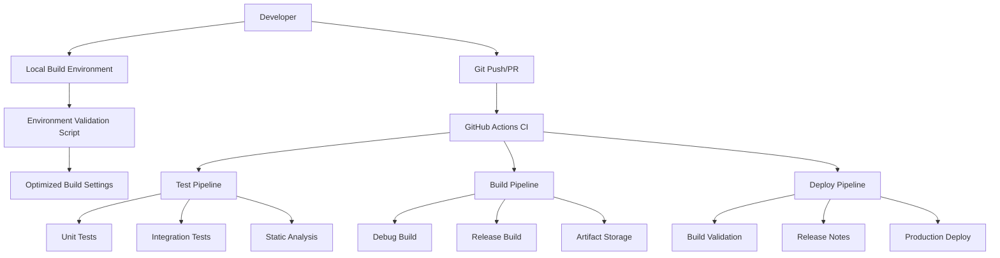

# Phase 3 & 4 - Build Environment & CI/CD Pipeline Setup Implementation Plan

**Date**: 2025-08-24  
**Type**: Build Infrastructure Implementation  
**Status**: Planning  
**Context**: Build environment setup and CI/CD pipeline implementation for production deployment of DevPocket Flutter terminal app.

## Executive Summary

This plan implements critical Phase 3 (Build Environment Setup) and Phase 4 (CI/CD Pipeline Setup) for DevPocket production readiness. These phases establish comprehensive Android SDK configuration, automated build optimization, and robust CI/CD workflows essential for reliable production deployment.

## Context Links
- **Related Plans**: Phase 1 & 2 implementation completed with test infrastructure 
- **Dependencies**: Flutter SDK, Android Studio/SDK, GitHub Actions, production deployment requirements
- **Reference Docs**: DevPocket architecture and development guides in ./docs

## Requirements

### Functional Requirements
- [ ] Complete Android SDK setup and configuration 
- [ ] Automated build environment validation
- [ ] Android APK/AAB generation pipeline
- [ ] Automated testing in CI/CD workflows
- [ ] Production deployment validation
- [ ] Build artifact management and storage

### Non-Functional Requirements  
- [ ] Build time under 5 minutes for development
- [ ] CI pipeline execution under 10 minutes
- [ ] 100% reliable automated environment setup
- [ ] Secure credential handling in CI/CD
- [ ] Cross-platform build support (iOS/Android)
- [ ] Optimized build caching and performance

## Architecture Overview



### Key Components
- **Environment Validator**: Automated setup verification and configuration
- **Build Optimization**: Gradle performance tuning and parallel execution  
- **CI/CD Pipeline**: Multi-stage GitHub Actions workflows
- **Artifact Management**: Secure build artifact storage and distribution

### Data Models
- **Build Environment**: Flutter version, Android SDK, NDK, Java requirements
- **CI Configuration**: Workflow definitions, secret management, caching strategies
- **Build Artifacts**: APK/AAB files, debug symbols, test reports

## Implementation Phases

### Phase 3: Build Environment Setup (Est: 2 days)
**Scope**: Complete Android SDK configuration and build pipeline optimization

**Tasks**:
1. [ ] **Document build environment requirements** - file: `docs/BUILD_ENVIRONMENT.md`
   - Create comprehensive setup documentation
   - Document Android SDK 34, NDK 26.x, Java 17 requirements
   - Include environment variable configuration
   - Add troubleshooting guide

2. [ ] **Create environment validation script** - file: `scripts/validate_build_env.dart`
   - Implement automated environment checking
   - Validate Flutter version (3.24.x+)
   - Check Android SDK, NDK, Java installations
   - Verify required build tools and dependencies

3. [ ] **Set up Android platform** - file: `android/` directory
   - Add Android platform to Flutter project
   - Create `android/local.properties.example`
   - Configure `android/gradle.properties` for optimization
   - Set up proper SDK path configuration

4. [ ] **Create dependency setup script** - file: `scripts/setup_dependencies.sh`
   - Automated Android SDK installation
   - NDK version management
   - Java JDK 17 setup verification
   - Build tool dependency installation

5. [ ] **Optimize build performance** - files: `android/gradle.properties`, `android/app/build.gradle`
   - Enable Gradle parallel builds
   - Configure build cache settings  
   - Add memory optimization parameters
   - Set up incremental compilation

**Acceptance Criteria**:
- [ ] Android platform successfully added to project
- [ ] Environment validation passes on clean system
- [ ] Build time optimized (< 5 minutes development)
- [ ] Documentation enables easy developer onboarding

### Phase 4: CI/CD Pipeline Setup (Est: 2 days)  
**Scope**: Establish automated testing and deployment workflows

**Tasks**:
1. [ ] **Create CI workflow** - file: `.github/workflows/ci.yml`
   - Flutter SDK setup and caching
   - Dependency installation automation
   - Multi-platform build matrix
   - Test execution integration

2. [ ] **Set up test pipeline** - file: `.github/workflows/test.yml`  
   - Unit test execution with coverage
   - Integration test runs (stable tests only)
   - Static analysis (flutter analyze)
   - Test report generation

3. [ ] **Configure build workflow** - file: `.github/workflows/build.yml`
   - Debug and release APK generation
   - Android AAB bundle creation
   - Build artifact upload to GitHub
   - Build performance metrics

4. [ ] **Implement deployment pipeline** - file: `.github/workflows/deploy.yml`
   - Production readiness validation
   - Release notes automation
   - Deployment verification checks
   - Environment-specific configurations

5. [ ] **Add security and optimization** - files: GitHub secrets, workflow configs
   - Secure API key management
   - Build caching optimization  
   - Performance regression detection
   - Automated dependency updates

**Acceptance Criteria**:
- [ ] CI pipeline runs reliably without failures
- [ ] Build artifacts generated and stored properly  
- [ ] Test execution integrated and stable
- [ ] Deployment validation working correctly
- [ ] Security best practices implemented

## Testing Strategy

- **Unit Tests**: Environment validation functions, build configuration helpers
- **Integration Tests**: CI workflow validation, build process verification  
- **E2E Tests**: Complete build-to-deployment pipeline validation

## Security Considerations

- [ ] Android signing key secure storage
- [ ] API keys protected in GitHub secrets
- [ ] Build artifact access control
- [ ] Dependency vulnerability scanning
- [ ] Secure environment variable handling

## Risk Assessment

| Risk | Impact | Mitigation |
|------|--------|------------|
| Android SDK setup complexity | High | Comprehensive documentation and automated scripts |
| CI pipeline failures | Medium | Gradual rollout with fallback mechanisms |
| Build performance issues | Medium | Incremental optimization with benchmarking |
| Security vulnerabilities | High | Regular dependency updates and security scanning |

## Quick Reference

### Key Commands
```bash
# Environment setup
dart scripts/validate_build_env.dart

# Local build
flutter build apk --debug
flutter build appbundle --release  

# CI pipeline trigger
git push origin main
```

### Configuration Files
- `docs/BUILD_ENVIRONMENT.md`: Complete setup guide
- `scripts/validate_build_env.dart`: Environment validation
- `android/local.properties.example`: Android SDK configuration
- `.github/workflows/*.yml`: CI/CD pipeline definitions

## File Structure Changes

```
├── docs/
│   └── BUILD_ENVIRONMENT.md (new)
├── scripts/
│   ├── validate_build_env.dart (new)
│   └── setup_dependencies.sh (new) 
├── android/ (new - complete platform)
│   ├── app/
│   │   └── build.gradle (optimized)
│   ├── gradle.properties (optimized)
│   └── local.properties.example (new)
└── .github/workflows/
    ├── ci.yml (new)
    ├── test.yml (new)
    ├── build.yml (new) 
    └── deploy.yml (new)
```

## Timeline Summary

### Phase 3: Build Environment Setup
- **Day 1**: Documentation + Environment validation (6 hours)
  - BUILD_ENVIRONMENT.md creation
  - validate_build_env.dart implementation
  - Android platform setup

- **Day 2**: Build optimization + Dependencies (6 hours)  
  - Gradle configuration optimization
  - setup_dependencies.sh creation
  - Performance tuning validation

### Phase 4: CI/CD Pipeline Setup
- **Day 3**: Core CI workflows (6 hours)
  - ci.yml and test.yml implementation
  - Basic pipeline validation
  - Test integration setup

- **Day 4**: Build & Deploy workflows (6 hours)
  - build.yml and deploy.yml implementation  
  - Security configuration
  - End-to-end pipeline testing

### **Total Timeline: 4 days (24 hours)**

## Success Metrics

### Quantitative Metrics
- **Build Performance**: < 5 minutes local builds, < 10 minutes CI builds
- **Pipeline Reliability**: 95%+ success rate over 20 runs
- **Environment Setup**: < 30 minutes from zero to first build
- **Test Coverage**: All critical build processes covered

### Qualitative Metrics  
- **Developer Experience**: Clear setup documentation with troubleshooting
- **Maintainability**: Easy CI/CD configuration updates and extensions
- **Security**: Comprehensive secret management and vulnerability scanning
- **Reliability**: Consistent builds across different environments

## TODO Checklist

### Phase 3: Build Environment Setup
- [ ] Create BUILD_ENVIRONMENT.md with complete setup guide
- [ ] Implement validate_build_env.dart automated checker
- [ ] Add Android platform with flutter create --platforms android
- [ ] Create android/local.properties.example template
- [ ] Optimize android/gradle.properties for performance
- [ ] Create setup_dependencies.sh automation script
- [ ] Test build environment on clean system
- [ ] Validate build performance targets

### Phase 4: CI/CD Pipeline Setup  
- [ ] Create .github/workflows/ci.yml base pipeline
- [ ] Implement .github/workflows/test.yml for testing
- [ ] Create .github/workflows/build.yml for artifacts
- [ ] Implement .github/workflows/deploy.yml validation
- [ ] Configure GitHub secrets for security
- [ ] Set up build caching optimization
- [ ] Test complete pipeline end-to-end
- [ ] Validate deployment verification steps

### Final Validation
- [ ] Complete environment setup validation
- [ ] CI/CD pipeline reliability testing  
- [ ] Security audit and penetration testing
- [ ] Performance benchmarking verification
- [ ] Documentation review and updates
- [ ] Production readiness checklist completion

This comprehensive plan establishes DevPocket's production-ready build environment and CI/CD infrastructure, enabling reliable development workflows and confident deployment processes.