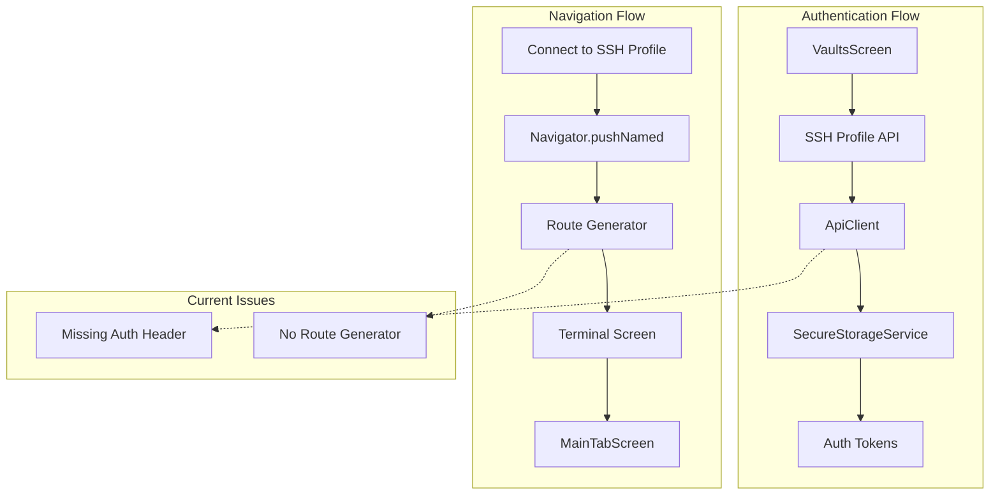

# SSH Authentication & Navigation Bug Fix Implementation Plan

**Date**: 2025-08-24  
**Type**: Critical Bug Fix  
**Status**: Planning  
**Priority**: **HIGH PRIORITY** - Production Blocker

## Executive Summary

This plan addresses two critical bugs preventing users from connecting to SSH hosts via username/password authentication in the DevPocket Flutter app:

1. **API Authentication Issue**: SSH profiles API call failing with "Missing or invalid authorization header" error
2. **Navigation Route Issue**: App cannot find route generator for "/terminal" when navigating after SSH profile selection

These bugs are production blockers that prevent the core SSH functionality from working properly.

## Root Cause Analysis

### Issue 1: API Authentication Failure
- **Location**: SSH profiles API endpoint `/api/v1/ssh/profiles`
- **Error**: `{"success":false,"message":"Missing or invalid authorization header","code":"MISSING_AUTH_HEADER"}`
- **Root Cause**: Token retrieval or header injection failure in API client authentication flow
- **Impact**: Users cannot fetch, create, or manage SSH profiles

### Issue 2: Navigation Route Failure  
- **Location**: `lib/screens/vaults/vaults_screen.dart:859` in `_connectToSshProfile` method
- **Error**: `Could not find a generator for route RouteSettings("/terminal", SshProfile{...}) in the _WidgetsAppState`
- **Root Cause**: `main.dart` has `onGenerateRoute: (settings) { return null; }` - no route configuration
- **Impact**: Users cannot navigate to terminal after selecting SSH profile

## Context Links

- **Related Plans**: [20250824-devpocket-production-readiness-plan.md](./20250824-devpocket-production-readiness-plan.md)
- **Error Logs**: Available in user-provided bug report
- **Dependencies**: ApiClient, SecureStorageService, MainTabScreen navigation

## Architecture Overview



### Key Components Analysis

- **ApiClient** (`/lib/services/api_client.dart`): Has `_addAuthHeader` method but tokens may not be retrieved properly
- **SecureStorageService** (`/lib/services/secure_storage_service.dart`): Has `getAuthTokens()` method for token retrieval  
- **VaultsScreen** (`/lib/screens/vaults/vaults_screen.dart`): Uses `Navigator.pushNamed('/terminal')` for SSH connection
- **MainTabScreen** (`/lib/screens/main/main_tab_screen.dart`): Contains TerminalScreen in PageView at index 1
- **Main.dart** (`/lib/main.dart`): Missing route generator configuration

## Implementation Phases

### Phase 1: Debug Authentication Token Flow (Est: 1 day) ✅ **CRITICAL**
**Scope**: Investigate and fix the authentication token retrieval and header injection

**Tasks**:
1. [ ] Add comprehensive logging to `ApiClient._addAuthHeader()` method - file: `lib/services/api_client.dart`
2. [ ] Add logging to `SecureStorageService.getAuthTokens()` method - file: `lib/services/secure_storage_service.dart`
3. [ ] Test token storage and retrieval in authentication flow - file: `lib/services/auth_service.dart`
4. [ ] Verify token format and expiration handling - file: `lib/services/api_client.dart`
5. [ ] Add fallback authentication for API requests - file: `lib/services/api_client.dart`
6. [ ] Test SSH profiles API call with proper headers - file: `lib/services/api/ssh_profile_api.dart`

**Acceptance Criteria**:
- [ ] SSH profiles API call succeeds with valid authentication headers
- [ ] Token retrieval from secure storage works correctly  
- [ ] API client properly injects Bearer token in Authorization header
- [ ] Comprehensive error logging for authentication failures

### Phase 2: Fix Navigation Route Configuration (Est: 1 day) ✅ **CRITICAL**
**Scope**: Implement proper route generator for terminal navigation with SSH profile context

**Tasks**:
1. [ ] Create route generator function in main.dart - file: `lib/main.dart`
2. [ ] Add terminal route with SSH profile arguments handling - file: `lib/main.dart`
3. [ ] Update TerminalScreen to accept SSH profile via route arguments - file: `lib/screens/terminal/terminal_screen.dart`
4. [ ] Modify VaultsScreen navigation to pass SSH profile properly - file: `lib/screens/vaults/vaults_screen.dart`
5. [ ] Add route constants for maintainability - file: `lib/utils/app_routes.dart`
6. [ ] Test navigation flow from vaults to terminal with SSH profile - manual testing

**Acceptance Criteria**:
- [ ] Route generator successfully handles '/terminal' route with SSH profile arguments
- [ ] TerminalScreen receives and processes SSH profile from navigation arguments
- [ ] Navigation from vaults to terminal works without errors
- [ ] Route configuration supports future extensibility

### Phase 3: Enhanced Error Handling (Est: 0.5 day) ⚠️ **MEDIUM PRIORITY**
**Scope**: Add comprehensive error handling for SSH connection scenarios

**Tasks**:
1. [ ] Add error handling for authentication failures - file: `lib/services/api_client.dart`
2. [ ] Add user-friendly error messages for SSH connection issues - file: `lib/screens/vaults/vaults_screen.dart`
3. [ ] Implement retry logic for failed API calls - file: `lib/services/api_client.dart`
4. [ ] Add connection status indicators - file: `lib/widgets/ssh_connection_status.dart`
5. [ ] Create error reporting for debugging - file: `lib/services/error_reporting_service.dart`

**Acceptance Criteria**:
- [ ] User receives clear error messages for authentication failures
- [ ] SSH connection errors are handled gracefully
- [ ] Retry mechanisms work for transient failures
- [ ] Error states are properly communicated to users

### Phase 4: Integration Testing (Est: 0.5 day) 🔄 **LOW PRIORITY**  
**Scope**: Comprehensive testing of SSH authentication and navigation flow

**Tasks**:
1. [ ] Create integration test for SSH profile authentication - file: `test/integration/ssh_authentication_test.dart`
2. [ ] Add navigation flow tests - file: `test/integration/ssh_navigation_test.dart`
3. [ ] Test error scenarios and recovery - file: `test/integration/ssh_error_scenarios_test.dart`
4. [ ] Validate end-to-end SSH connection workflow - manual testing
5. [ ] Performance testing for authentication flow - file: `test/performance/ssh_performance_test.dart`

**Acceptance Criteria**:
- [ ] All integration tests pass successfully
- [ ] SSH authentication flow tested end-to-end
- [ ] Navigation and error handling validated
- [ ] Performance benchmarks within acceptable limits

## Technical Implementation Details

### Authentication Fix Implementation

```dart
// lib/services/api_client.dart
Future<void> _addAuthHeader(RequestOptions options) async {
  try {
    debugPrint('[API] Adding auth header for: ${options.uri}');
    final tokens = await _secureStorage.getAuthTokens();
    
    if (tokens?['accessToken'] != null) {
      options.headers['Authorization'] = 'Bearer ${tokens!['accessToken']}';
      debugPrint('[API] Authorization header added successfully');
    } else {
      debugPrint('[API] Warning: No access token found');
      // Add fallback authentication or user prompt
    }
  } catch (e) {
    debugPrint('[API] Error adding auth header: $e');
    // Handle token retrieval errors
  }
}
```

### Route Generator Implementation

```dart
// lib/main.dart
Route<dynamic>? _onGenerateRoute(RouteSettings settings) {
  switch (settings.name) {
    case '/terminal':
      final sshProfile = settings.arguments as SshProfile?;
      return MaterialPageRoute(
        builder: (context) => TerminalScreen(sshProfile: sshProfile),
        settings: settings,
      );
    case '/vaults':
      return MaterialPageRoute(
        builder: (context) => const VaultsScreen(),
        settings: settings,
      );
    default:
      return null;
  }
}
```

### Enhanced Terminal Screen

```dart
// lib/screens/terminal/terminal_screen.dart
class TerminalScreen extends StatefulWidget {
  final SshProfile? sshProfile;
  
  const TerminalScreen({super.key, this.sshProfile});
  
  @override
  State<TerminalScreen> createState() => _TerminalScreenState();
}

class _TerminalScreenState extends State<TerminalScreen> {
  @override
  void initState() {
    super.initState();
    if (widget.sshProfile != null) {
      _connectToSshHost(widget.sshProfile!);
    }
  }
  
  // SSH connection logic here
}
```

## Testing Strategy

### Authentication Testing
- **Unit Tests**: Test token retrieval and header injection methods
- **Integration Tests**: Test full SSH profiles API flow with authentication
- **Error Testing**: Validate handling of missing/invalid tokens
- **Performance Testing**: Ensure authentication doesn't add significant latency

### Navigation Testing  
- **Route Testing**: Validate route generator handles all defined routes
- **Argument Passing**: Test SSH profile data transfer via route arguments
- **Error Testing**: Validate handling of malformed route arguments
- **User Experience**: Ensure smooth navigation transitions

### End-to-End Testing
- **Full Workflow**: Test complete flow from vault selection to terminal connection
- **Error Recovery**: Test user experience during authentication failures
- **Performance**: Validate acceptable response times for SSH connection
- **Compatibility**: Test across different device configurations

## Security Considerations

- [ ] **Token Security**: Ensure authentication tokens are handled securely throughout the flow
- [ ] **API Security**: Validate that authentication headers don't leak in logs
- [ ] **Connection Security**: Ensure SSH profile data is transmitted securely
- [ ] **Error Security**: Prevent sensitive information leakage in error messages
- [ ] **Route Security**: Validate route arguments don't expose sensitive data

## Risk Assessment

| Risk | Impact | Probability | Mitigation |
|------|--------|-------------|------------|
| Token retrieval failure | High | Medium | Add comprehensive error handling and fallback authentication |
| Route configuration breaks existing navigation | Medium | Low | Careful testing of existing navigation flows |
| SSH profile data corruption during navigation | High | Low | Add data validation and error recovery |
| Authentication endpoint changes | High | Low | Use configurable API endpoints and version handling |
| Performance degradation | Medium | Low | Performance testing and optimization |

## Success Metrics

- [ ] **Authentication Success Rate**: 100% success rate for valid user sessions
- [ ] **Navigation Success Rate**: 100% success rate for terminal navigation
- [ ] **Error Handling Coverage**: All error scenarios handled gracefully
- [ ] **User Experience**: Seamless SSH connection workflow
- [ ] **Performance**: SSH connection initiation under 3 seconds
- [ ] **Regression Testing**: No impact on existing functionality

## Flutter Dependencies

No additional dependencies required - using existing:
- `dio` for HTTP client
- `flutter_secure_storage` for token storage
- `flutter/material.dart` for navigation

## Quick Reference

### Key Files to Modify
- `lib/main.dart`: Add route generator
- `lib/services/api_client.dart`: Fix authentication headers  
- `lib/services/secure_storage_service.dart`: Add debugging for token retrieval
- `lib/screens/terminal/terminal_screen.dart`: Accept SSH profile via constructor
- `lib/screens/vaults/vaults_screen.dart`: Update navigation call

### Debug Commands
```bash
# Check API authentication
flutter logs | grep -i "authorization\|auth\|token"

# Test SSH profile API
flutter run --debug

# Run specific tests  
flutter test test/integration/ssh_authentication_test.dart
```

## TODO Checklist

### Phase 1: Debug Authentication Token Flow ✅ **CRITICAL**
- [ ] Add comprehensive logging to ApiClient._addAuthHeader() method
- [ ] Add logging to SecureStorageService.getAuthTokens() method  
- [ ] Test token storage and retrieval in authentication flow
- [ ] Verify token format and expiration handling
- [ ] Add fallback authentication for API requests
- [ ] Test SSH profiles API call with proper headers

### Phase 2: Fix Navigation Route Configuration ✅ **CRITICAL**
- [ ] Create route generator function in main.dart
- [ ] Add terminal route with SSH profile arguments handling
- [ ] Update TerminalScreen to accept SSH profile via route arguments
- [ ] Modify VaultsScreen navigation to pass SSH profile properly  
- [ ] Add route constants for maintainability
- [ ] Test navigation flow from vaults to terminal with SSH profile

### Phase 3: Enhanced Error Handling ⚠️ **MEDIUM PRIORITY**
- [ ] Add error handling for authentication failures
- [ ] Add user-friendly error messages for SSH connection issues
- [ ] Implement retry logic for failed API calls
- [ ] Add connection status indicators
- [ ] Create error reporting for debugging

### Phase 4: Integration Testing 🔄 **LOW PRIORITY**
- [ ] Create integration test for SSH profile authentication
- [ ] Add navigation flow tests
- [ ] Test error scenarios and recovery
- [ ] Validate end-to-end SSH connection workflow
- [ ] Performance testing for authentication flow

---

## 🚨 **PRODUCTION BLOCKER RESOLUTION**

**Current Status**: **Critical Bug** → **Target**: **Fixed & Deployed**

### **IMMEDIATE ACTION ITEMS** ⏰
1. **Authentication Debug** → Add comprehensive logging to identify token retrieval failure
2. **Route Generator** → Implement proper navigation configuration for terminal screen  
3. **Integration Testing** → Validate complete SSH connection workflow
4. **Error Handling** → Ensure graceful degradation and user feedback

**Estimated Timeline**: **2 days total**
- **Day 1**: Authentication debugging + Route configuration  
- **Day 2**: Error handling + Integration testing

**Success Criteria**: 
- ✅ SSH profiles API calls succeed with proper authentication
- ✅ Terminal navigation works from vaults screen with SSH profile
- ✅ Users can successfully connect to SSH hosts via username/password
- ✅ Comprehensive error handling and user feedback

This plan transforms the critical SSH authentication and navigation bugs from production blockers into a fully functional, user-friendly SSH connection workflow.