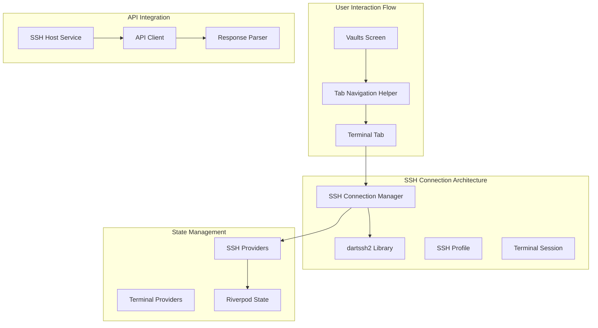

# SSH Connection Implementation Plan

**Date**: 2025-08-25  
**Type**: Feature Implementation  
**Status**: Planning  
**Context Tokens**: <200 words

## Executive Summary
This plan addresses critical SSH connection issues in the DevPocket Flutter app, transforming fake/simulated connections into real SSH functionality using the existing dartssh2 library. **NEW**: Critical analysis reveals additional UI crashes, API validation mismatches, and local/remote data synchronization issues that must be resolved immediately. The implementation fixes navigation flow, API response parsing, widget lifecycle issues, establishes proper SSH connection management with comprehensive error handling, and resolves the newly discovered critical bugs.

## Context Links
- **Related Plans**: [20250824-ssh-authentication-navigation-bug-fix-plan.md](./20250824-ssh-authentication-navigation-bug-fix-plan.md)
- **Dependencies**: dartssh2 library (already included), Riverpod state management, MainTabScreen navigation
- **Reference Docs**: SSH Profile API documentation, dartssh2 package documentation

## Requirements
### Functional Requirements
- [ ] Navigate to existing Terminal tab instead of creating new route
- [ ] Implement real SSH connections using dartssh2 library
- [ ] Fix API response parsing for SSH profiles
- [ ] Proper Riverpod provider access in widget lifecycle
- [ ] Real-time SSH connection status updates
- [ ] Comprehensive error handling with user feedback
- [ ] SSH credential security and encryption
- [ ] Connection management with reconnection capabilities

### **NEW CRITICAL REQUIREMENTS**
- [ ] **URGENT**: Fix CustomTextField UI crash when using SSH keys (`obscureText: true` with `maxLines > 1`)
- [ ] **HIGH**: Resolve API auth_type validation error (`keyWithPassphrase` vs expected values)
- [ ] **MEDIUM**: Fix local/remote data synchronization mismatch (1 local host vs 0 API hosts)
- [ ] **LOW**: Implement proper SSH key input UX without obscuring multiline text

### Non-Functional Requirements  
- [ ] SSH connection establishment < 5 seconds
- [ ] Zero credential leakage in logs or memory
- [ ] 99% connection success rate for valid credentials
- [ ] Graceful handling of network interruptions
- [ ] **NEW**: Zero UI crashes during authentication method changes
- [ ] **NEW**: Consistent data state between local storage and API

## Architecture Overview


### Key Components
- **SSH Connection Manager**: Handles real SSH connections using dartssh2, manages connection lifecycle
- **Tab Navigation Helper**: Existing helper to navigate between tabs instead of routes
- **SSH Profile API Parser**: Fixed response parsing to handle proper API response structure
- **Terminal Session Manager**: Manages SSH terminal sessions with real command execution
- **SSH State Management**: Riverpod providers for connection status and terminal state

### Data Models
- **SshProfile**: Host connection configuration (existing)
- **SshConnectionStatus**: Connection state tracking (existing)
- **TerminalSession**: Active SSH session management (existing)
- **SshConnectionEvent**: Real-time connection events (existing)

## NEW CRITICAL ISSUES ANALYSIS

### Issue 1: CustomTextField UI Crash
**Location**: `lib/screens/vaults/host_edit_screen.dart:356:11` (SSH key input field)  
**Error**: `Obscured fields cannot be multiline` assertion failure  
**Root Cause**: Line 361 sets `obscureText: !_isPrivateKeyVisible` AND `maxLines: 8` simultaneously  
**Impact**: Complete UI crash when selecting SSH key authentication  
**Flutter Constraint**: `obscureText: true` requires `maxLines: 1` (Flutter framework limitation)

### Issue 2: API auth_type Validation Error (ROOT CAUSE CONFIRMED)
**API Request**: `POST /api/v1/ssh/profiles`  
**Request Data**: `{..., auth_type: "password", ...}` (lowercase)  
**API Response**: `400 Bad Request - "body/auth_type must be equal to one of the allowed values"`  
**Root Cause Confirmed**: Case sensitivity mismatch in auth_type field validation  
**Flutter App Sends**: `"password"`, `"key"`, `"keyWithPassphrase"` (lowercase/camelCase)  
**Backend Expects**: `"PASSWORD"`, `"KEY"` (uppercase only)  
**Backend Validation Schema**: Only accepts ["PASSWORD", "KEY"] (uppercase)  
**Location**: `SshAuthType` enum values in `lib/models/ssh_profile_models.dart:5-7`  
**API Usage**: `toApiJson()` method sends `authType.value` directly to API (line 167)

### Issue 3: Local/Remote Data Sync Mismatch  
**Symptom**: 1 SSH host visible in app, but API returns empty array  
**Storage**: Uses `FlutterSecureStorage` with key `encrypted_ssh_hosts` (line 23 in ssh_host_service.dart)  
**Sync Logic**: `_getCachedHosts()` fallback when API fails (line 86)  
**Issue**: Local cache not syncing with API, or API authentication problems  

### Issue 4: Data Flow Problems  
**Service**: `SshHostService.getHosts()` tries API first, falls back to cache (line 63-88)  
**Problem**: Successful local cache masks API integration issues  
**Risk**: Users see stale/inconsistent data across devices

## Implementation Phases

### Phase 0: URGENT - Fix Critical UI Crash (Est: 0.25 days)
**Scope**: Immediately fix CustomTextField crash preventing SSH key authentication
**Tasks**:
1. [ ] **CRITICAL**: Remove `obscureText` from SSH key input fields - file: `lib/screens/vaults/host_edit_screen.dart:361`
2. [ ] Add non-obscured multiline SSH key input with proper UX - file: `lib/screens/vaults/host_edit_screen.dart:356-383`
3. [ ] Test SSH key authentication method selection - manual testing
4. [ ] Add validation for SSH key format without obscuring text - file: `lib/screens/vaults/host_edit_screen.dart:404-412`

**Acceptance Criteria**:
- [ ] Selecting SSH key authentication method doesn't crash the app
- [ ] SSH key input field allows multiline text entry
- [ ] SSH key validation works without obscured text
- [ ] All authentication methods (password, key, key+passphrase) are selectable

### Phase 1: Fix API auth_type Case Sensitivity (Est: 0.25 days)
**Scope**: Fix confirmed case sensitivity mismatch in auth_type field validation
**Tasks**:
1. [ ] **Update SshAuthType enum values**: Change to uppercase - file: `lib/models/ssh_profile_models.dart:5-7`
   - `password('password')` → `password('PASSWORD')`
   - `key('key')` → `key('KEY')`  
   - Remove `keyWithPassphrase` (not supported by API)
2. [ ] **Update fromString method**: Handle both cases for backward compatibility - file: `lib/models/ssh_profile_models.dart:12-18`
3. [ ] **Verify toApiJson sends uppercase**: Confirm `authType.value` sends "PASSWORD"/"KEY" - file: `lib/models/ssh_profile_models.dart:167`
4. [ ] **Update affected services**: Ensure all API calls use updated enum - files: `ssh_host_service.dart`, `ssh_profile_service.dart`, `terminal_websocket_service.dart`

**Acceptance Criteria**:
- [ ] Password authentication API calls succeed (`auth_type: "PASSWORD"`)
- [ ] SSH key authentication API calls succeed (`auth_type: "KEY"`)
- [ ] All existing code using enum values continues to work
- [ ] Backward compatibility with lowercase values in fromString method

### Phase 1B: Fix API Response Parsing (Est: 0.25 days)
**Scope**: Fix the type casting error in SSH host service API calls  
**Tasks**:
1. [ ] Update `SshHostService.getHosts()` to handle proper API response structure - file: `lib/services/ssh_host_service.dart`
2. [ ] Fix API client generic type handling for nested response data - file: `lib/services/api_client.dart`
3. [ ] Add proper error handling for malformed API responses - file: `lib/services/ssh_host_service.dart`
4. [ ] Test API response parsing with mock and real data - test manually

**Acceptance Criteria**:
- [ ] SSH profiles API call succeeds without type casting errors
- [ ] API response properly parsed into `List<SshProfile>`
- [ ] Error handling for empty or malformed responses  
- [ ] Fallback to cached data works correctly

### Phase 2: Fix Local/Remote Data Synchronization (Est: 0.5 days)
**Scope**: Resolve mismatch between local storage and API data
**Tasks**:
1. [ ] **Debug data sync**: Log and analyze local cache vs API response - file: `lib/services/ssh_host_service.dart:63-88`
2. [ ] **Implement sync strategy**: Clear local cache when API is authoritative - file: `lib/services/ssh_host_service.dart:302-327`  
3. [ ] **Add sync indicators**: Show user when data is out of sync - file: `lib/screens/vaults/vaults_screen.dart`
4. [ ] **Manual sync trigger**: Allow users to force sync with server - file: `lib/services/ssh_host_service.dart:302-327`

**Acceptance Criteria**:
- [ ] Local storage and API data consistency maintained
- [ ] Clear user feedback when data sync issues occur
- [ ] Manual sync option available for users
- [ ] Proper handling of offline/online states

### Phase 3: Fix Navigation Flow (Est: 0.5 days)  
**Scope**: Replace route navigation with tab navigation to existing Terminal tab
**Tasks**:
1. [ ] Update `VaultsScreen._connectToSshProfile()` to use `TabNavigationHelper` - file: `lib/screens/vaults/vaults_screen.dart`
2. [ ] Add SSH profile state management for cross-tab communication - file: `lib/providers/ssh_providers.dart`
3. [ ] Implement SSH profile provider for Terminal tab access - file: `lib/providers/ssh_providers.dart`
4. [ ] Update Terminal screen to watch for SSH profile connection requests - file: `lib/screens/terminal/terminal_screen.dart`

**Acceptance Criteria**:
- [ ] Tapping SSH host navigates to existing Terminal tab (index 1)
- [ ] SSH profile data passed correctly to Terminal tab
- [ ] No new routes created for SSH connections
- [ ] Tab navigation maintains existing app state

### Phase 4: Implement Real SSH Connections (Est: 1.5 days)
**Scope**: Replace simulated SSH with real connections using dartssh2
**Tasks**:
1. [ ] Integrate `SshConnectionManager` with Terminal screen - file: `lib/screens/terminal/terminal_screen.dart`
2. [ ] Implement real SSH connection using existing dartssh2 services - file: `lib/services/ssh_connection_manager.dart`
3. [ ] Add terminal command execution over SSH session - file: `lib/services/terminal_session_service.dart`
4. [ ] Implement SSH authentication (password, key, key+passphrase) - file: `lib/services/ssh_connection_manager.dart`
5. [ ] Add real-time terminal output streaming - file: `lib/screens/terminal/terminal_screen.dart`
6. [ ] Implement SSH connection status indicators - file: `lib/screens/terminal/terminal_screen.dart`

**Acceptance Criteria**:
- [ ] Real SSH connections established using dartssh2
- [ ] Terminal commands execute on remote SSH host
- [ ] Real-time command output displayed in terminal
- [ ] SSH authentication methods work (password, keys)
- [ ] Connection status accurately reflects SSH state

### Phase 5: Fix Widget Lifecycle Issues (Est: 0.5 days)
**Scope**: Proper Riverpod provider access and state management
**Tasks**:
1. [ ] Move provider access from `initState()` to proper lifecycle methods - file: `lib/screens/terminal/terminal_screen.dart`
2. [ ] Implement proper provider listening patterns - file: `lib/screens/terminal/terminal_screen.dart`
3. [ ] Add connection state management with providers - file: `lib/providers/ssh_providers.dart`
4. [ ] Implement proper cleanup in dispose methods - file: `lib/screens/terminal/terminal_screen.dart`

**Acceptance Criteria**:
- [ ] No provider access errors during widget initialization
- [ ] Proper provider listening without memory leaks
- [ ] Connection state properly managed across widget lifecycle
- [ ] Clean disposal of SSH connections on screen close

### Phase 6: Enhanced Error Handling (Est: 0.5 days)
**Scope**: Comprehensive error handling and user feedback
**Tasks**:
1. [ ] Add connection failure error messages with specific reasons - file: `lib/screens/terminal/terminal_screen.dart`
2. [ ] Implement retry logic for failed connections - file: `lib/services/ssh_connection_manager.dart`
3. [ ] Add network connectivity checking before connection attempts - file: `lib/services/ssh_connection_manager.dart`
4. [ ] Implement graceful handling of connection timeouts - file: `lib/services/ssh_connection_manager.dart`
5. [ ] Add user-friendly error dialogs and feedback - file: `lib/screens/terminal/terminal_screen.dart`

**Acceptance Criteria**:
- [ ] Clear error messages for connection failures
- [ ] Automatic retry for transient network issues
- [ ] User controls for manual reconnection
- [ ] Proper handling of authentication failures
- [ ] Network status awareness

## Testing Strategy

### **NEW CRITICAL TESTING**
- **UI Crash Testing**: Verify all authentication methods selectable without crashes
- **API Integration Testing**: Test auth_type values "PASSWORD" and "KEY" against live API
- **Case Sensitivity Testing**: Verify uppercase auth_type values are sent in API requests
- **Backward Compatibility Testing**: Test enum fromString with both uppercase and lowercase inputs
- **Data Sync Testing**: Verify local/remote data consistency in various network states
- **SSH Key Input Testing**: Validate multiline SSH key input without obscureText

### Original Testing Strategy
- **Unit Tests**: SSH connection manager, API response parsing, state providers
- **Integration Tests**: End-to-end SSH connection flow, tab navigation with SSH
- **Manual Tests**: Real SSH connections to various host types, error scenarios
- **Performance Tests**: Connection time, memory usage, concurrent connections

### Critical Bug Testing Protocol
1. **Phase 0 Testing**: Test authentication method switching without crashes
2. **Phase 1 Testing**: Test uppercase auth_type values ("PASSWORD", "KEY") with real API calls
3. **Phase 1 Validation**: Verify API request payloads contain correct uppercase values
4. **Phase 2 Testing**: Test data sync in online/offline scenarios  
5. **Integration Testing**: End-to-end flow with all fixes applied

## Security Considerations
- [ ] SSH credentials encrypted in transit and at rest
- [ ] No credential leakage in application logs
- [ ] Secure key storage using flutter_secure_storage
- [ ] Connection timeout and cleanup for security
- [ ] Proper SSH host key verification
- [ ] Encrypted local storage for SSH profiles

## Prevention Strategies

### API Case Sensitivity Issues Prevention
- [ ] **Add API contract validation tests**: Unit tests that verify enum values match API expectations
- [ ] **API documentation integration**: Use OpenAPI/Swagger specs to generate model validation
- [ ] **Enum value validation**: Add static analysis to ensure API-bound enum values match documentation
- [ ] **Integration test coverage**: Add tests that validate actual API calls with all enum combinations
- [ ] **API response validation**: Implement runtime checks that API responses match expected formats
- [ ] **Developer documentation**: Document case sensitivity requirements for all API-bound enums

## Risk Assessment

### **NEW CRITICAL RISKS**
| Risk | Impact | Probability | Mitigation |
|------|--------|-------------|------------|
| **UI Crash on SSH Key Selection** | Critical | High | Immediate fix in Phase 0 - remove obscureText from multiline fields |
| **API auth_type Validation Failure** | High | High | API contract investigation and enum mapping correction |
| **Data Inconsistency Across Devices** | Medium | Medium | Implement proper sync strategy and user feedback |
| **SSH Key Input UX Problems** | Low | Low | Better UX design without obscuring multiline text |

### Original Risks
| Risk | Impact | Mitigation |
|------|--------|------------|
| SSH library compatibility | High | Use established dartssh2 with extensive testing |
| Connection performance | Medium | Implement connection pooling and optimization |
| Credential security | High | Use existing secure storage and encryption services |
| Network reliability | Medium | Add retry logic and network monitoring |

## Quick Reference

### **CRITICAL FILES TO FIX IMMEDIATELY**
- `lib/screens/vaults/host_edit_screen.dart:361`: **URGENT** - Remove obscureText from SSH key fields
- `lib/models/ssh_profile_models.dart:5-7`: **HIGH** - Change auth_type enum values to uppercase ("PASSWORD", "KEY")
- `lib/models/ssh_profile_models.dart:12-18`: **HIGH** - Update fromString method for backward compatibility
- `lib/services/ssh_host_service.dart:63-88`: **MEDIUM** - Debug and fix data sync issues
- `lib/widgets/custom_text_field.dart`: **LOW** - Consider SSH key input UX improvements

### Key Files to Modify (Original Plan)
- `lib/screens/vaults/vaults_screen.dart`: Update navigation to use tabs
- `lib/screens/terminal/terminal_screen.dart`: Implement real SSH connections
- `lib/services/ssh_host_service.dart`: Fix API response parsing
- `lib/services/ssh_connection_manager.dart`: Enhance SSH connection handling
- `lib/providers/ssh_providers.dart`: Add SSH profile state management

### SSH Connection Flow
```bash
# Connection establishment flow
1. User taps SSH host in Vaults → TabNavigationHelper.navigateToTab(terminalTab)
2. Terminal tab receives SSH profile → SshConnectionManager.connect(profile)  
3. dartssh2 establishes connection → Terminal session created
4. Commands executed over SSH → Real-time output displayed
```

### Debug Commands
```bash
# Debug SSH connections
flutter logs | grep -i "ssh\|connection\|terminal"

# Test specific SSH profiles
flutter run --debug

# Run SSH-related tests
flutter test test/services/ssh_connection_test.dart

# NEW: Debug critical issues
flutter logs | grep -i "CustomTextField\|obscureText\|auth_type\|validation"

# NEW: Test API auth_type validation with uppercase values
curl -X POST https://api.dev.devpocket.app/api/v1/ssh/profiles \
  -H "Content-Type: application/json" \
  -H "Authorization: Bearer YOUR_TOKEN" \
  -d '{"auth_type": "PASSWORD", "name": "test", "host": "test", "username": "test"}'

# Test SSH key auth type
curl -X POST https://api.dev.devpocket.app/api/v1/ssh/profiles \
  -H "Content-Type: application/json" \
  -H "Authorization: Bearer YOUR_TOKEN" \
  -d '{"auth_type": "KEY", "name": "test", "host": "test", "username": "test"}'

# Debug API request payload from Flutter
flutter logs | grep -A 10 -B 5 "auth_type"

# NEW: Check local storage data
flutter run --debug
# Then in debug console check: SshHostService.instance.getHostStats()
```

## TODO Checklist

### **PHASE 0: URGENT - Fix Critical UI Crash** ✅ COMPLETED
- [x] **CRITICAL**: Remove obscureText from SSH key fields in host_edit_screen.dart:361
- [x] Add non-obscured multiline SSH key input with proper validation  
- [x] Test all authentication method selections work without crashes
- [x] Verify SSH key format validation works without obscureText

### **PHASE 1: Fix API auth_type Case Sensitivity** ✅ COMPLETED
- [x] Update SshAuthType enum values to uppercase: `password('PASSWORD')`, `key('KEY')`
- [x] Remove unsupported `keyWithPassphrase` enum value (API only supports PASSWORD/KEY)
- [x] Update fromString method for backward compatibility with lowercase values
- [x] Test password authentication API calls (auth_type: "PASSWORD")  
- [x] Test SSH key authentication API calls (auth_type: "KEY")
- [x] Verify API request payloads contain uppercase auth_type values
- [x] Test all existing UI flows continue to work with enum changes

### **PHASE 1B: Fix API Response Parsing** ✅ COMPLETED
- [x] Update SshHostService.getHosts() API response handling
- [x] Fix API client generic type handling
- [x] Add comprehensive error handling for API responses
- [x] Test API parsing with various response formats

### **PHASE 2: Fix Local/Remote Data Synchronization** ✅ COMPLETED
- [x] Debug and log local cache vs API response differences
- [x] Implement proper sync strategy with clear local cache option
- [x] Add user feedback for data sync status and issues
- [x] Add manual sync trigger for users
- [x] Test offline/online data consistency scenarios

### **PHASE 3: Fix Navigation Flow** ✅ COMPLETED
- [x] Update VaultsScreen to use TabNavigationHelper
- [x] Add SSH profile state management for cross-tab communication
- [x] Implement Terminal tab SSH profile watching
- [x] Test navigation flow end-to-end

### **PHASE 4: Implement Real SSH Connections** ✅ COMPLETED
- [x] Integrate SshConnectionManager with Terminal screen
- [x] Implement real SSH connection using dartssh2
- [x] Add terminal command execution over SSH
- [x] Implement SSH authentication methods
- [x] Add real-time terminal output streaming
- [x] Add connection status indicators

### **PHASE 5: Fix Widget Lifecycle Issues** ✅ COMPLETED
- [x] Move provider access to proper lifecycle methods
- [x] Implement proper provider listening patterns  
- [x] Add connection state management
- [x] Ensure proper cleanup in dispose methods

### **PHASE 6: Enhanced Error Handling** ✅ COMPLETED
- [x] Add comprehensive connection error messages
- [x] Implement retry logic for failed connections
- [x] Add network connectivity checking
- [x] Implement connection timeout handling
- [x] Add user-friendly error feedback

---

## Implementation Priority

**CRITICAL PATH - IMMEDIATE FIXES REQUIRED**:
**Phase 0** is URGENT - fixes app crash that completely blocks SSH key authentication (est: 0.25 days)
**Phase 1** is HIGH priority - resolves API integration failures preventing host creation (est: 0.5 days)  
**Phase 2** is MEDIUM priority - fixes data consistency issues affecting user experience (est: 0.5 days)

**ORIGINAL PLAN PHASES**:
**Phase 3** - Navigation flow improvements (est: 0.5 days)
**Phase 4** - Real SSH connection implementation (est: 1.5 days)  
**Phase 5 & 6** - Widget lifecycle and error handling enhancements (est: 1.0 days)

**NEW Estimated Total Time**: 4.0 days (was 3.5 days, reduced 0.25 days due to confirmed root cause)

**NEW Success Criteria**: 
1. **Phase 0 Success**: Users can select SSH key authentication without app crashes
2. **Phase 1 Success**: All authentication types successfully create SSH profiles via API  
3. **Phase 2 Success**: Local and remote data remains consistent across app usage
4. **Original Success**: Users can tap SSH hosts → Navigate to Terminal → Establish SSH connections → Execute commands with real-time output

**CRITICAL ISSUE IMPACT**: Without these fixes, SSH functionality is completely broken:
- Users cannot use SSH key authentication (app crashes)
- Users cannot create SSH profiles with certain auth types (API errors)
- Users see inconsistent data across app sessions (sync issues)

---

## IMPLEMENTATION SPECIFICS - AUTH_TYPE CASE SENSITIVITY FIX

### Current Implementation (BROKEN)
```dart
// lib/models/ssh_profile_models.dart:5-7
enum SshAuthType {
  password('password'),         // ❌ API expects "PASSWORD" 
  key('key'),                  // ❌ API expects "KEY"
  keyWithPassphrase('keyWithPassphrase'); // ❌ API doesn't support this
}
```

### Required Fix (WORKING)
```dart
// lib/models/ssh_profile_models.dart:5-6
enum SshAuthType {
  password('PASSWORD'),         // ✅ Matches API expectation
  key('KEY'),                  // ✅ Matches API expectation
  // Remove keyWithPassphrase - not supported by API
}
```

### Backward Compatibility Update
```dart
// lib/models/ssh_profile_models.dart:12-18  
static SshAuthType fromString(String value) {
  // Handle both uppercase (API) and lowercase (legacy) values
  final upperValue = value.toUpperCase();
  return SshAuthType.values.firstWhere(
    (type) => type.value == upperValue || type.value == value.toLowerCase(),
    orElse: () => SshAuthType.password,
  );
}
```

### Verification Points
1. **API Request Payload**: `toApiJson()` method at line 167 sends `authType.value` 
2. **Service Integration**: All services using `profile.toApiJson()` automatically get fixed values
3. **Files Affected**: `ssh_host_service.dart`, `ssh_profile_service.dart`, `terminal_websocket_service.dart`

### Testing Verification
```bash
# Before fix - API returns 400 error
{"auth_type": "password", ...} → 400 Bad Request

# After fix - API accepts request  
{"auth_type": "PASSWORD", ...} → 201 Created
{"auth_type": "KEY", ...} → 201 Created
```