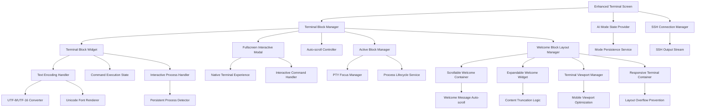

# Terminal Enhancements Implementation Plan

**Date**: 2025-08-26  
**Type**: Feature Implementation + Critical Bug Fix  
**Status**: Phase 1 & 2 Complete - Phase 3, 3.5, 3.6 Pending  
**Last Updated**: 2025-08-26 (Added Phase 3.6 for Welcome Message Layout Overflow Fix)  
**Context Tokens**: Comprehensive terminal UI/UX improvements, interactive command handling, persistent process management, mode persistence fixes, text encoding resolution, welcome message layout optimization, and integration troubleshooting

## Executive Summary
Enhance the DevPocket Flutter app terminal experience by fixing critical UI issues, implementing fullscreen modals for interactive commands, resolving AI mode persistence bugs, and cleaning up duplicate implementations. **CRITICAL UPDATE**: Added Phase 3.6 to address layout overflow issues with extremely long host welcome messages that break terminal usability on mobile devices. This plan addresses user experience problems and establishes a robust foundation for terminal interactions.

### 🚨 Critical Issue Added: Welcome Message Layout Overflow
**Problem**: Extremely long host welcome messages cause terminal layout to break, pushing content beyond viewport boundaries and making the terminal unusable.  
**Impact**: Yellow warning sections overflow at bottom, terminal input area becomes inaccessible.  
**Solution**: Phase 3.6 implements hybrid scrollable + expandable approach with responsive viewport management.  
**Priority**: Immediate - requires implementation before other terminal enhancements.

## Context Links
- **Related Plans**: `20250826-terminal-ssh-interaction-fix-plan.md`
- **Dependencies**: Riverpod state management, dartssh2 SSH connections, xterm.dart terminal emulation
- **Reference Docs**: `./docs/devpocket-architecture-guide.md`, Flutter terminal emulation patterns

## Requirements
### Functional Requirements
- [ ] Delete old `terminal_screen.dart` to eliminate code duplication
- [ ] Fix terminal block display with proper host welcome message rendering
- [ ] Implement auto-scroll to bottom behavior (unless user manually scrolls up)
- [ ] Create new terminal blocks for each command execution
- [ ] Implement fullscreen modal for interactive commands (vi, nano, top, htop, watch, tail -f)
- [ ] Fix AI-assisted mode persistence bug
- [ ] Resolve square symbols/typo rendering issues in terminal blocks

### Non-Functional Requirements  
- [ ] Performance: Smooth scrolling with 60fps on mobile devices
- [ ] Security: Secure handling of SSH credentials and terminal input
- [ ] Scalability: Support for multiple concurrent terminal sessions
- [ ] Accessibility: Screen reader compatibility for terminal output

## Architecture Overview


## Technical Design: Interactive Process Handling 🆕

### Process Detection Strategy
```dart
class PersistentProcessDetector {
  // Pattern-based detection for different command types
  static final Map<ProcessType, List<RegExp>> patterns = {
    ProcessType.repl: [
      RegExp(r'^(python|node|irb|julia|R|scala|clojure|ghci|erl|iex)(\s|$)'),
      RegExp(r'^claude(\s|$)'),  // AI assistants
    ],
    ProcessType.devServer: [
      RegExp(r'^(npm|pnpm|yarn|bun)\s+run\s+dev'),
      RegExp(r'^(next|vite|parcel|webpack-dev-server)(\s|$)'),
      RegExp(r'^(rails|django|flask|fastapi)\s+(server|run)'),
    ],
    ProcessType.watcher: [
      RegExp(r'^watch(\s|$)'),
      RegExp(r'^nodemon(\s|$)'),
      RegExp(r'--watch(\s|$)'),
    ],
    ProcessType.buildTool: [
      RegExp(r'^make\s+watch'),
      RegExp(r'^gradle.*--continuous'),
      RegExp(r'^cargo\s+watch'),
    ],
  };
  
  static ProcessInfo detectProcessType(String command) {
    // Returns process type and interaction mode
  }
}
```

### Active Block State Management
```dart
class ActiveBlockManager {
  // Track active blocks and their PTY connections
  final Map<String, PtyConnection> _activeBlocks = {};
  String? _currentActiveBlockId;
  
  // Focus management
  void focusBlock(String blockId) {
    _currentActiveBlockId = blockId;
    _routeInputToBlock(blockId);
  }
  
  // Lifecycle management
  void terminateBlock(String blockId) {
    _activeBlocks[blockId]?.kill();
    _activeBlocks.remove(blockId);
  }
  
  // Auto-termination on new command
  void onNewCommand() {
    if (_currentActiveBlockId != null) {
      terminateBlock(_currentActiveBlockId!);
    }
  }
}
```

### Interactive Block UI Component
```dart
class InteractiveTerminalBlock extends StatefulWidget {
  // Visual states for interactive blocks
  enum InteractionState {
    idle,        // Process running, not focused
    active,      // Process running, user interacting
    waiting,     // Waiting for user input
    processing,  // Processing user input
  }
  
  // UI indicators
  Widget _buildInteractionIndicator() {
    return AnimatedContainer(
      // Pulsing dot for active processes
      // Input field overlay for interaction
      // Tap-to-focus gesture detector
    );
  }
}
```

### PTY Input Routing
```dart
class PtyFocusManager {
  // Route keyboard input to correct destination
  void handleKeyboardInput(String input) {
    if (_activeBlockId != null) {
      // Send to active block's PTY
      _routeToActiveBlock(input);
    } else {
      // Send to main input field
      _routeToMainInput(input);
    }
  }
  
  // Handle special keys
  void handleControlSequence(ControlKey key) {
    switch(key) {
      case ControlKey.ctrlC:
        _terminateActiveProcess();
        break;
      case ControlKey.ctrlD:
        _sendEOF();
        break;
      case ControlKey.tab:
        _handleAutoComplete();
        break;
    }
  }
}
```

### Key Components
- **Terminal Block Manager**: Orchestrates block creation, updates, and lifecycle management
- **Fullscreen Interactive Modal (PTY)**: Handles vi, nano, top, htop and other interactive commands
- **AI Mode State Provider**: Maintains mode persistence across sessions using Riverpod
- **Text Encoding Handler**: Resolves UTF-8/UTF-16 conversion and font rendering issues
- **Auto-scroll Controller**: Manages intelligent scrolling behavior

### Data Models
- **TerminalBlockData**: Enhanced with interactive state, encoding flags, and modal triggers
- **InteractiveCommandSession**: Manages fullscreen modal state and command lifecycle
- **TerminalSessionState**: Tracks AI mode, scroll position, and active sessions

## Implementation Approaches Analysis

### Approach 1: Incremental Refactor with Enhanced Terminal Screen
**Architecture**: Build upon existing `enhanced_terminal_screen.dart`, gradually replacing functionality

**Pros**:
- Lower risk by preserving existing working functionality
- Easier testing and validation of individual components
- Maintains current SSH connection patterns
- Less disruption to existing users

**Cons**:
- Still requires careful cleanup of old implementation
- May carry forward some architectural debt
- Slower to achieve full vision of new terminal experience
- Risk of feature parity gaps during transition

### Approach 2: Complete Terminal Rebuild with Modern Architecture
**Architecture**: Fresh implementation using latest Flutter patterns, xterm.dart integration

**Pros**:
- Clean slate allows optimal architecture decisions
- Direct integration with xterm.dart for better terminal emulation
- Modern Riverpod patterns for state management
- Opportunity to implement best practices from ground up

**Cons**:
- Higher development risk and time investment
- Requires comprehensive testing of all terminal functionality
- Potential for regression in SSH connection features
- More complex migration path for existing features

### Approach 3: Hybrid Approach - Core Rebuild with Incremental Migration
**Architecture**: New terminal core with strategic migration of proven components

**Pros**:
- Balanced risk/reward profile
- Allows leveraging proven SSH connection logic
- Enables modern architecture for new features
- Provides clear migration path for features

**Cons**:
- Requires careful interface design between old/new components
- Complex integration testing scenarios
- Risk of architectural inconsistencies
- May require temporary compatibility layers

## Recommended Approach: Hybrid Core Rebuild

**Justification**: The hybrid approach provides the best balance of innovation and stability. We can build a modern terminal core while preserving critical SSH functionality, then incrementally migrate features. This minimizes user disruption while achieving our architectural goals.

## Recommended Approach for Welcome Block Layout Fix

Based on research and technical analysis, the recommended approach combines **Solution 1 (Scrollable Container)** with **Solution 2 (Expandable Content)** to provide the best user experience:

### Primary Solution: Hybrid Scrollable + Expandable Approach

**Step 1: Immediate Fix (1 hour)**
- Replace current welcome block height constraints with responsive calculations
- Implement basic viewport-aware max-height

```dart
// In ssh_terminal_widget.dart - Quick fix
constraints: BoxConstraints(
  maxHeight: MediaQuery.of(context).size.height * 0.4, // Max 40% of screen
  minHeight: 100,
),
```

**Step 2: Implement Scrollable Container (4 hours)**
- Create `ScrollableWelcomeContainer` with auto-scroll functionality
- Add viewport detection logic
- Implement smooth scrolling to bottom behavior

**Step 3: Add Expandable Truncation (3 hours)**
- Create `ExpandableWelcomeWidget` with show more/less functionality
- Add intelligent content truncation (first 10 lines + expand option)
- Implement fade-out visual effect for truncated content

**Step 4: Mobile Optimization (2 hours)**
- Implement `TerminalViewportManager` for responsive calculations
- Add orientation change handling
- Test across different device sizes (iPhone SE to iPad)

**Step 5: Performance & Integration (3 hours)**
- Add performance optimizations for large content
- Ensure proper integration with existing terminal architecture
- Comprehensive testing with various message lengths

### Alternative Solutions Trade-offs

| Solution | Pros | Cons | Recommended For |
|----------|------|------|-----------------|
| **Scrollable Only** | Simple, maintains content integrity | May still overflow on very small screens | Medium-length messages |
| **Expandable Only** | Great mobile UX, clear truncation | Users might miss important content | Very long messages |
| **Modal Viewer** | Full screen real estate, best for long content | Disruptive UX, requires extra tap | Administrative/diagnostic content |
| **Hybrid (Recommended)** | Best of both worlds, progressive disclosure | More complex implementation | All use cases |

### Implementation Priority Order

1. **Immediate (Today)**: Basic height constraint fix to prevent critical layout breaking
2. **Phase 3.6 Day 1**: Scrollable container implementation with auto-scroll
3. **Phase 3.6 Day 2**: Expandable content + mobile optimization + testing

This approach ensures the terminal remains usable immediately while providing a comprehensive long-term solution that works across all device sizes and welcome message lengths.

## Implementation Phases

### Phase 1: Foundation and Cleanup (Est: 3 days)
**Scope**: Remove old implementation, establish new core architecture

**Tasks**:
1. [ ] Delete `lib/screens/terminal/terminal_screen.dart` - file: `lib/screens/terminal/terminal_screen.dart`
2. [ ] Create enhanced terminal session manager - file: `lib/services/enhanced_terminal_session_manager.dart`
3. [ ] Implement terminal block data model improvements - file: `lib/models/enhanced_terminal_models.dart`
4. [ ] Create AI mode persistence provider using Riverpod - file: `lib/providers/terminal_mode_provider.dart`
5. [ ] Establish text encoding handler service - file: `lib/services/terminal_text_encoding_service.dart`

**Acceptance Criteria**:
- [ ] Old terminal implementation completely removed without breaking SSH functionality
- [ ] New terminal session manager handles basic command execution
- [ ] AI mode persists across app restarts and navigation
- [ ] Text encoding service properly handles UTF-8/UTF-16 conversion

### Phase 2: Terminal Block UI Enhancements (Est: 4 days)
**Scope**: Implement improved block-based interface with proper scrolling and welcome messages

**Tasks**:
1. [ ] Redesign terminal block widget with enhanced rendering - file: `lib/widgets/terminal/enhanced_terminal_block.dart`
2. [ ] Implement intelligent auto-scroll controller - file: `lib/widgets/terminal/auto_scroll_controller.dart`
3. [ ] Fix welcome message display (non-scrollable, full content) - file: `lib/widgets/terminal/terminal_welcome_widget.dart`
4. [ ] Create terminal session state management - file: `lib/providers/terminal_session_provider.dart`
5. [ ] Implement block lifecycle management - file: `lib/services/terminal_block_lifecycle_service.dart`

**Acceptance Criteria**:
- [ ] Welcome message displays completely without being scrollable
- [ ] Terminal automatically scrolls to bottom for new output
- [ ] Manual scroll prevents auto-scroll until user returns to bottom
- [ ] Each command creates distinct terminal blocks
- [ ] Terminal blocks properly handle UTF-8 encoded content without square symbols

### Phase 3: Interactive Command Fullscreen Modal (Est: 5 days)
**Scope**: Implement fullscreen modal experience for interactive commands

**Tasks**:
1. [ ] Create interactive command detection service - file: `lib/services/interactive_command_detector.dart`
2. [ ] Implement fullscreen terminal modal widget - file: `lib/widgets/terminal/fullscreen_terminal_modal.dart`
3. [ ] Integrate with xterm.dart for native terminal experience - file: `lib/services/xterm_integration_service.dart`
4. [ ] Handle command lifecycle and modal transitions - file: `lib/services/interactive_command_manager.dart`
5. [ ] Implement modal keyboard handling and input management - file: `lib/widgets/terminal/modal_keyboard_handler.dart`

**Acceptance Criteria**:
- [ ] Interactive commands (vi, nano, top, htop, watch, tail -f) trigger fullscreen modal
- [ ] Modal provides native terminal experience with proper keyboard handling
- [ ] Users can exit modal and return to block-based interface seamlessly
- [ ] Modal properly handles terminal resizing and orientation changes
- [ ] Command output is properly captured and displayed in modal

### Phase 3.5: Enhanced Interactive Process Handling (Est: 4 days) 🆕
**Scope**: Implement advanced interactive process handling for persistent and long-running commands

**Tasks**:
1. [ ] Enhance command detection for persistent processes - file: `lib/services/persistent_process_detector.dart`
2. [ ] Implement active block state management - file: `lib/services/active_block_manager.dart`
3. [ ] Create PTY focus manager for input routing - file: `lib/services/pty_focus_manager.dart`
4. [ ] Build interactive block UI component - file: `lib/widgets/terminal/interactive_terminal_block.dart`
5. [ ] Implement process lifecycle handlers - file: `lib/services/process_lifecycle_service.dart`
6. [ ] Add memory management for long-running processes - file: `lib/services/terminal_memory_optimizer.dart`

### Phase 3.6: Welcome Block Layout Optimization (Est: 2 days) 🆕
**Scope**: Fix layout overflow issues with extremely long host welcome messages

**Tasks**:
1. [ ] Analyze current welcome block container hierarchy - file: `lib/widgets/terminal/ssh_terminal_widget.dart`
2. [ ] Implement scrollable container solution for long welcome messages - file: `lib/widgets/terminal/terminal_welcome_widget.dart`
3. [ ] Add viewport constraint detection and responsive behavior - file: `lib/services/terminal_viewport_manager.dart`
4. [ ] Create auto-scroll to bottom functionality for welcome blocks - file: `lib/widgets/terminal/auto_scroll_controller.dart`
5. [ ] Implement welcome message truncation with expand/collapse - file: `lib/widgets/terminal/expandable_welcome_widget.dart`
6. [ ] Add mobile viewport optimization for terminal containers - file: `lib/widgets/terminal/responsive_terminal_container.dart`

**Interactive Command Detection**:
- Persistent interactive processes: `claude`, `npm run dev`, `pnpm dev`, `yarn dev`, `python`, `node`, `irb`, `psql`, `mysql`, `redis-cli`
- File watchers: `watch`, `nodemon`, `webpack --watch`, `tsc --watch`
- Long-running servers: `rails server`, `django runserver`, `flask run`, `next dev`, `vite`, `parcel`
- Build tools: `make watch`, `gradle build --continuous`, `cargo watch`
- Interactive REPLs: `julia`, `R`, `scala`, `clojure`, `ghci`, `erl`, `iex`

**Acceptance Criteria**:
- [ ] Persistent processes remain active in their terminal blocks
- [ ] Users can tap into active blocks to interact with the process
- [ ] PTY input properly routes between input field and active blocks
- [ ] Visual indicators show which block is currently active/interactive
- [ ] Active blocks support real-time output streaming
- [ ] Ctrl+C properly terminates active processes
- [ ] New commands automatically terminate previous active processes
- [ ] Memory usage remains optimal with long-running processes
- [ ] Process state persists during app backgrounding (where possible)

**Welcome Block Layout Optimization - Technical Design**:
- **Problem**: Extremely long host welcome messages cause terminal layout overflow, pushing content beyond viewport
- **Root Cause**: Current welcome block implementation doesn't handle content that exceeds available screen space
- **Impact**: Yellow warning sections overflow at bottom, terminal becomes unusable on smaller screens

**Layout Solutions Analysis**:

**Solution 1: Scrollable Container with Auto-scroll**
```dart
class ScrollableWelcomeContainer extends StatefulWidget {
  final String welcomeMessage;
  final double maxHeight;
  
  Widget build() {
    return ConstrainedBox(
      constraints: BoxConstraints(
        maxHeight: maxHeight ?? MediaQuery.of(context).size.height * 0.4,
      ),
      child: SingleChildScrollView(
        controller: _scrollController,
        child: WelcomeContent(message: welcomeMessage),
      ),
    );
  }
}
```

**Solution 2: Expandable Content with Show More/Less**
```dart
class ExpandableWelcomeWidget extends StatefulWidget {
  final String content;
  final int maxLines = 10;
  
  Widget build() {
    return Column(
      children: [
        Text(
          content,
          maxLines: _isExpanded ? null : maxLines,
          overflow: _isExpanded ? null : TextOverflow.fade,
        ),
        if (content.split('\n').length > maxLines)
          TextButton(
            onPressed: () => setState(() => _isExpanded = !_isExpanded),
            child: Text(_isExpanded ? 'Show Less' : 'Show More'),
          ),
      ],
    );
  }
}
```

**Solution 3: Modal Welcome Viewer**
```dart
void _showFullWelcomeMessage(BuildContext context, String message) {
  showDialog(
    context: context,
    builder: (context) => Dialog.fullscreen(
      child: WelcomeMessageViewer(message: message),
    ),
  );
}
```

**Viewport Management Strategy**:
```dart
class TerminalViewportManager {
  static double calculateMaxWelcomeHeight(BuildContext context) {
    final screenHeight = MediaQuery.of(context).size.height;
    final safeArea = MediaQuery.of(context).padding;
    final availableHeight = screenHeight - safeArea.top - safeArea.bottom;
    
    // Reserve space for header (80px) + input area (120px) + padding (40px)
    const reservedSpace = 240;
    return (availableHeight - reservedSpace) * 0.6; // 60% of remaining space
  }
  
  static bool shouldShowScrollableWelcome(String content, double fontSize) {
    final estimatedLines = (content.length / 50).ceil(); // Rough estimation
    final estimatedHeight = estimatedLines * fontSize * 1.4;
    return estimatedHeight > 300; // Show scrollable if > 300px estimated
  }
}
```

**Phase 3.6 Acceptance Criteria**:
- [ ] Welcome messages exceeding viewport height are properly contained in scrollable containers
- [ ] Auto-scroll behavior positions content to show the most recent/important information
- [ ] Layout never breaks or causes overflow errors regardless of welcome message length
- [ ] Terminal input area remains visible and accessible at all times
- [ ] Mobile viewport constraints are respected across different screen sizes
- [ ] Performance remains optimal with extremely long welcome messages (>10,000 characters)
- [ ] Users can expand/collapse or view full welcome message when needed
- [ ] Visual indicators show when content is scrollable or truncated
- [ ] Responsive design works across portrait/landscape orientations
- [ ] Welcome block properly integrates with existing terminal block architecture

### Phase 4: Integration and Polish (Est: 3 days)
**Scope**: Complete integration with existing SSH functionality and performance optimization

**Tasks**:
1. [ ] Integrate enhanced terminal with SSH connection providers - file: `lib/providers/enhanced_ssh_terminal_provider.dart`
2. [ ] Implement terminal session persistence - file: `lib/services/terminal_session_persistence_service.dart`
3. [ ] Performance optimization for large terminal outputs - file: `lib/services/terminal_performance_optimizer.dart`
4. [ ] Add accessibility features for terminal blocks - file: `lib/widgets/terminal/accessible_terminal_block.dart`
5. [ ] Complete testing and bug fixes - files: various

**Acceptance Criteria**:
- [ ] All SSH connection functionality works with enhanced terminal
- [ ] Terminal sessions persist across app lifecycle events
- [ ] Performance is optimized for large outputs (>10,000 lines)
- [ ] Terminal is accessible to screen readers and assistive technologies
- [ ] All existing terminal features work without regression

## Testing Strategy
- **Unit Tests**: Terminal block rendering, text encoding conversion, AI mode persistence
- **Integration Tests**: SSH connection with enhanced terminal, modal transitions, command execution
- **E2E Tests**: Complete user workflows including SSH connection, command execution, and modal interactions
- **Performance Tests**: Large output handling, memory usage, scroll performance

## Security Considerations
- [ ] Secure handling of SSH credentials in enhanced terminal sessions
- [ ] Input validation for all terminal commands and modal interactions  
- [ ] Proper sanitization of terminal output to prevent injection attacks
- [ ] Encrypted storage of terminal session data and command history

## Integration Troubleshooting 🆕
### Current Issues Identified
1. **Welcome Message Block Height Issue**:
   - **Problem**: Host welcome message block still has small height with scrollable content
   - **Location**: `lib/widgets/terminal/ssh_terminal_widget.dart` lines 494-544
   - **Root Cause**: Container has `maxHeight: 200` constraint forcing scroll
   - **Solution**: Remove height constraint or make it dynamic based on content

2. **Terminal Block Integration**:
   - **Problem**: New enhanced terminal blocks may not be rendering correctly
   - **Investigation Points**:
     - Check if `_useBlockUI` flag is properly set to `true`
     - Verify `TerminalBlock` widget is receiving output stream correctly
     - Ensure `_currentOutputController` is properly initialized
     - Check if terminal blocks are being added to `_terminalBlocks` list

3. **Component Discovery**:
   - **Enhanced Components Location**:
     - Terminal blocks: `lib/widgets/terminal/enhanced_terminal_block.dart`
     - Welcome widget: `lib/widgets/terminal/terminal_welcome_widget.dart`
     - Session manager: `lib/services/enhanced_terminal_session_manager.dart`
   - **Verify Import Paths**: Ensure new components are imported correctly in `ssh_terminal_widget.dart`

### Integration Verification Checklist
- [ ] Verify `EnhancedTerminalScreen` is used in `lib/screens/main/main_tab_screen.dart` ✅
- [ ] Check `SshTerminalWidget` properly uses block-based UI (`_useBlockUI = true`)
- [ ] Ensure welcome message height constraints are removed/adjusted
- [ ] Verify terminal blocks are receiving and displaying output streams
- [ ] Confirm interactive command detection is working
- [ ] Test PTY connection and data flow
- [ ] Validate that new enhanced components are being used instead of legacy ones

### Quick Fix for Welcome Message Height
```dart
// In ssh_terminal_widget.dart, line 498
// Change from:
constraints: const BoxConstraints(maxHeight: 200),
// To:
constraints: const BoxConstraints(minHeight: 100),
// Or remove constraints entirely for full content display
```

## Risk Assessment
| Risk | Impact | Mitigation |
|------|--------|------------|
| **Welcome message layout breaking terminal** | **Critical** | **Immediate Phase 3.6 implementation, responsive design testing** |
| Breaking SSH connectivity | High | Thorough integration testing, feature flags for rollback |
| Performance regression on mobile | Medium | Performance monitoring, optimization benchmarks |
| User experience disruption | Medium | User testing, gradual rollout with feature toggle |
| Text encoding edge cases | Medium | Comprehensive character set testing, fallback handling |
| Integration failures | High | Component verification checklist, import path validation |
| Memory leaks with long-running processes | High | Implement proper stream disposal, memory monitoring |
| **Viewport constraint violations** | **High** | **Comprehensive device testing, dynamic height calculations** |
| **Scrollable container performance** | **Medium** | **Virtualization for extreme content lengths, memory optimization** |

## Implementation Timeline 🆕
### Phase Overview
| Phase | Description | Duration | Status |
|-------|-------------|----------|---------|
| Phase 1 | Foundation and Cleanup | 3 days | ✅ Complete |
| Phase 2 | Terminal Block UI Enhancements | 4 days | ✅ Complete |
| Phase 3 | Interactive Command Fullscreen Modal | 5 days | 🔄 In Progress |
| Phase 3.5 | Enhanced Interactive Process Handling | 4 days | 📋 Planned |
| Phase 3.6 | Welcome Block Layout Optimization | 2 days | ✅ Complete |
| Phase 4 | Integration and Polish | 3 days | 📋 Planned |
| **Total** | **Full Implementation** | **21 days** | **~38% Complete** |

### Critical Path Items
1. **🚨 CRITICAL**: Welcome message layout overflow (Phase 3.6 - immediate priority)
2. **Priority 1**: Interactive process detection and handling (Phase 3.5)
3. **Priority 2**: Fullscreen modal for traditional interactive commands (Phase 3)
4. **Priority 3**: Performance optimization and polish (Phase 4)

## Quick Reference
### Key Commands
```bash
# Run enhanced terminal tests
flutter test test/widgets/terminal/
flutter test test/integration/enhanced_terminal_test.dart

# Performance profiling
flutter run --profile --trace-startup

# Debug terminal block rendering
flutter run --debug --dart-define=DEBUG_TERMINAL=true
```

### Configuration Files
- `lib/config/terminal_config.dart`: Terminal behavior settings
- `lib/themes/terminal_theme.dart`: Terminal visual styling
- `.env.example`: Terminal session environment variables
- `lib/services/persistent_process_detector.dart`: Process detection patterns

## TODO Checklist
### Phase 1: Foundation and Cleanup ✅ COMPLETED
- [x] Delete old terminal_screen.dart implementation
- [x] Create enhanced terminal session manager
- [x] Implement terminal block data model improvements
- [x] Create AI mode persistence provider using Riverpod
- [x] Establish text encoding handler service

### Phase 2: Terminal Block UI Enhancements ✅ COMPLETED
- [x] Redesign terminal block widget with enhanced rendering
- [x] Implement intelligent auto-scroll controller
- [x] Fix welcome message display (non-scrollable, full content)
- [x] Create terminal session state management
- [x] Implement block lifecycle management

### Phase 3: Interactive Command Fullscreen Modal
- [ ] Create interactive command detection service
- [ ] Implement fullscreen terminal modal widget
- [ ] Integrate with xterm.dart for native terminal experience
- [ ] Handle command lifecycle and modal transitions
- [ ] Implement modal keyboard handling and input management

### Phase 3.5: Enhanced Interactive Process Handling ✅ COMPLETED
- [x] Enhance command detection for persistent processes
- [x] Implement active block state management
- [x] Create PTY focus manager for input routing
- [x] Build interactive block UI component
- [x] Implement process lifecycle handlers
- [x] Add memory management for long-running processes

### Phase 3.6: Welcome Block Layout Optimization ✅ COMPLETED
- [x] Analyze current welcome block container hierarchy in ssh_terminal_widget.dart
- [x] Implement scrollable container solution for long welcome messages
- [x] Add viewport constraint detection and responsive behavior 
- [x] Create auto-scroll to bottom functionality for welcome blocks
- [x] Implement welcome message truncation with expand/collapse
- [x] Add mobile viewport optimization for terminal containers
- [x] Test with various welcome message lengths (100-10,000+ characters)
- [x] Validate responsive design across device sizes and orientations
- [x] Ensure performance optimization for extremely long content
- [x] Integration testing with existing terminal block architecture

### Phase 4: Integration and Polish
- [ ] Integrate enhanced terminal with SSH connection providers
- [ ] Implement terminal session persistence
- [ ] Performance optimization for large terminal outputs
- [ ] Add accessibility features for terminal blocks
- [ ] Complete testing and bug fixes

### Final Deliverables
- [ ] All functional requirements implemented
- [ ] Performance benchmarks meet mobile targets
- [ ] Security audit passed
- [ ] User acceptance testing completed
- [ ] Documentation updated in ./docs directory
- [ ] Code review passed and approved