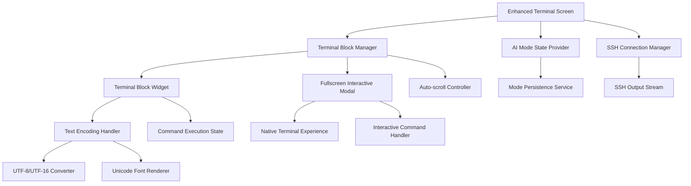

# Terminal Enhancements Implementation Plan

**Date**: 2025-08-26  
**Type**: Feature Implementation  
**Status**: Phase 1 & 2 Complete - Ready for Review  
**Context Tokens**: Comprehensive terminal UI/UX improvements, interactive command handling, mode persistence fixes, text encoding resolution, and code cleanup

## Executive Summary
Enhance the DevPocket Flutter app terminal experience by fixing critical UI issues, implementing fullscreen modals for interactive commands, resolving AI mode persistence bugs, and cleaning up duplicate implementations. This plan addresses user experience problems and establishes a robust foundation for terminal interactions.

## Context Links
- **Related Plans**: `20250826-terminal-ssh-interaction-fix-plan.md`
- **Dependencies**: Riverpod state management, dartssh2 SSH connections, xterm.dart terminal emulation
- **Reference Docs**: `./docs/devpocket-architecture-guide.md`, Flutter terminal emulation patterns

## Requirements
### Functional Requirements
- [ ] Delete old `terminal_screen.dart` to eliminate code duplication
- [ ] Fix terminal block display with proper host welcome message rendering
- [ ] Implement auto-scroll to bottom behavior (unless user manually scrolls up)
- [ ] Create new terminal blocks for each command execution
- [ ] Implement fullscreen modal for interactive commands (vi, nano, top, htop, watch, tail -f)
- [ ] Fix AI-assisted mode persistence bug
- [ ] Resolve square symbols/typo rendering issues in terminal blocks

### Non-Functional Requirements  
- [ ] Performance: Smooth scrolling with 60fps on mobile devices
- [ ] Security: Secure handling of SSH credentials and terminal input
- [ ] Scalability: Support for multiple concurrent terminal sessions
- [ ] Accessibility: Screen reader compatibility for terminal output

## Architecture Overview


### Key Components
- **Terminal Block Manager**: Orchestrates block creation, updates, and lifecycle management
- **Fullscreen Interactive Modal (PTY)**: Handles vi, nano, top, htop and other interactive commands
- **AI Mode State Provider**: Maintains mode persistence across sessions using Riverpod
- **Text Encoding Handler**: Resolves UTF-8/UTF-16 conversion and font rendering issues
- **Auto-scroll Controller**: Manages intelligent scrolling behavior

### Data Models
- **TerminalBlockData**: Enhanced with interactive state, encoding flags, and modal triggers
- **InteractiveCommandSession**: Manages fullscreen modal state and command lifecycle
- **TerminalSessionState**: Tracks AI mode, scroll position, and active sessions

## Implementation Approaches Analysis

### Approach 1: Incremental Refactor with Enhanced Terminal Screen
**Architecture**: Build upon existing `enhanced_terminal_screen.dart`, gradually replacing functionality

**Pros**:
- Lower risk by preserving existing working functionality
- Easier testing and validation of individual components
- Maintains current SSH connection patterns
- Less disruption to existing users

**Cons**:
- Still requires careful cleanup of old implementation
- May carry forward some architectural debt
- Slower to achieve full vision of new terminal experience
- Risk of feature parity gaps during transition

### Approach 2: Complete Terminal Rebuild with Modern Architecture
**Architecture**: Fresh implementation using latest Flutter patterns, xterm.dart integration

**Pros**:
- Clean slate allows optimal architecture decisions
- Direct integration with xterm.dart for better terminal emulation
- Modern Riverpod patterns for state management
- Opportunity to implement best practices from ground up

**Cons**:
- Higher development risk and time investment
- Requires comprehensive testing of all terminal functionality
- Potential for regression in SSH connection features
- More complex migration path for existing features

### Approach 3: Hybrid Approach - Core Rebuild with Incremental Migration
**Architecture**: New terminal core with strategic migration of proven components

**Pros**:
- Balanced risk/reward profile
- Allows leveraging proven SSH connection logic
- Enables modern architecture for new features
- Provides clear migration path for features

**Cons**:
- Requires careful interface design between old/new components
- Complex integration testing scenarios
- Risk of architectural inconsistencies
- May require temporary compatibility layers

## Recommended Approach: Hybrid Core Rebuild

**Justification**: The hybrid approach provides the best balance of innovation and stability. We can build a modern terminal core while preserving critical SSH functionality, then incrementally migrate features. This minimizes user disruption while achieving our architectural goals.

## Implementation Phases

### Phase 1: Foundation and Cleanup (Est: 3 days)
**Scope**: Remove old implementation, establish new core architecture

**Tasks**:
1. [ ] Delete `lib/screens/terminal/terminal_screen.dart` - file: `lib/screens/terminal/terminal_screen.dart`
2. [ ] Create enhanced terminal session manager - file: `lib/services/enhanced_terminal_session_manager.dart`
3. [ ] Implement terminal block data model improvements - file: `lib/models/enhanced_terminal_models.dart`
4. [ ] Create AI mode persistence provider using Riverpod - file: `lib/providers/terminal_mode_provider.dart`
5. [ ] Establish text encoding handler service - file: `lib/services/terminal_text_encoding_service.dart`

**Acceptance Criteria**:
- [ ] Old terminal implementation completely removed without breaking SSH functionality
- [ ] New terminal session manager handles basic command execution
- [ ] AI mode persists across app restarts and navigation
- [ ] Text encoding service properly handles UTF-8/UTF-16 conversion

### Phase 2: Terminal Block UI Enhancements (Est: 4 days)
**Scope**: Implement improved block-based interface with proper scrolling and welcome messages

**Tasks**:
1. [ ] Redesign terminal block widget with enhanced rendering - file: `lib/widgets/terminal/enhanced_terminal_block.dart`
2. [ ] Implement intelligent auto-scroll controller - file: `lib/widgets/terminal/auto_scroll_controller.dart`
3. [ ] Fix welcome message display (non-scrollable, full content) - file: `lib/widgets/terminal/terminal_welcome_widget.dart`
4. [ ] Create terminal session state management - file: `lib/providers/terminal_session_provider.dart`
5. [ ] Implement block lifecycle management - file: `lib/services/terminal_block_lifecycle_service.dart`

**Acceptance Criteria**:
- [ ] Welcome message displays completely without being scrollable
- [ ] Terminal automatically scrolls to bottom for new output
- [ ] Manual scroll prevents auto-scroll until user returns to bottom
- [ ] Each command creates distinct terminal blocks
- [ ] Terminal blocks properly handle UTF-8 encoded content without square symbols

### Phase 3: Interactive Command Fullscreen Modal (Est: 5 days)
**Scope**: Implement fullscreen modal experience for interactive commands

**Tasks**:
1. [ ] Create interactive command detection service - file: `lib/services/interactive_command_detector.dart`
2. [ ] Implement fullscreen terminal modal widget - file: `lib/widgets/terminal/fullscreen_terminal_modal.dart`
3. [ ] Integrate with xterm.dart for native terminal experience - file: `lib/services/xterm_integration_service.dart`
4. [ ] Handle command lifecycle and modal transitions - file: `lib/services/interactive_command_manager.dart`
5. [ ] Implement modal keyboard handling and input management - file: `lib/widgets/terminal/modal_keyboard_handler.dart`

**Acceptance Criteria**:
- [ ] Interactive commands (vi, nano, top, htop, watch, tail -f) trigger fullscreen modal
- [ ] Modal provides native terminal experience with proper keyboard handling
- [ ] Users can exit modal and return to block-based interface seamlessly
- [ ] Modal properly handles terminal resizing and orientation changes
- [ ] Command output is properly captured and displayed in modal

### Phase 4: Integration and Polish (Est: 3 days)
**Scope**: Complete integration with existing SSH functionality and performance optimization

**Tasks**:
1. [ ] Integrate enhanced terminal with SSH connection providers - file: `lib/providers/enhanced_ssh_terminal_provider.dart`
2. [ ] Implement terminal session persistence - file: `lib/services/terminal_session_persistence_service.dart`
3. [ ] Performance optimization for large terminal outputs - file: `lib/services/terminal_performance_optimizer.dart`
4. [ ] Add accessibility features for terminal blocks - file: `lib/widgets/terminal/accessible_terminal_block.dart`
5. [ ] Complete testing and bug fixes - files: various

**Acceptance Criteria**:
- [ ] All SSH connection functionality works with enhanced terminal
- [ ] Terminal sessions persist across app lifecycle events
- [ ] Performance is optimized for large outputs (>10,000 lines)
- [ ] Terminal is accessible to screen readers and assistive technologies
- [ ] All existing terminal features work without regression

## Testing Strategy
- **Unit Tests**: Terminal block rendering, text encoding conversion, AI mode persistence
- **Integration Tests**: SSH connection with enhanced terminal, modal transitions, command execution
- **E2E Tests**: Complete user workflows including SSH connection, command execution, and modal interactions
- **Performance Tests**: Large output handling, memory usage, scroll performance

## Security Considerations
- [ ] Secure handling of SSH credentials in enhanced terminal sessions
- [ ] Input validation for all terminal commands and modal interactions  
- [ ] Proper sanitization of terminal output to prevent injection attacks
- [ ] Encrypted storage of terminal session data and command history

## Risk Assessment
| Risk | Impact | Mitigation |
|------|--------|------------|
| Breaking SSH connectivity | High | Thorough integration testing, feature flags for rollback |
| Performance regression on mobile | Medium | Performance monitoring, optimization benchmarks |
| User experience disruption | Medium | User testing, gradual rollout with feature toggle |
| Text encoding edge cases | Medium | Comprehensive character set testing, fallback handling |

## Quick Reference
### Key Commands
```bash
# Run enhanced terminal tests
flutter test test/widgets/terminal/
flutter test test/integration/enhanced_terminal_test.dart

# Performance profiling
flutter run --profile --trace-startup
```

### Configuration Files
- `lib/config/terminal_config.dart`: Terminal behavior settings
- `lib/themes/terminal_theme.dart`: Terminal visual styling
- `.env.example`: Terminal session environment variables

## TODO Checklist
### Phase 1: Foundation and Cleanup ✅ COMPLETED
- [x] Delete old terminal_screen.dart implementation
- [x] Create enhanced terminal session manager
- [x] Implement terminal block data model improvements
- [x] Create AI mode persistence provider using Riverpod
- [x] Establish text encoding handler service

### Phase 2: Terminal Block UI Enhancements ✅ COMPLETED
- [x] Redesign terminal block widget with enhanced rendering
- [x] Implement intelligent auto-scroll controller
- [x] Fix welcome message display (non-scrollable, full content)
- [x] Create terminal session state management
- [x] Implement block lifecycle management

### Phase 3: Interactive Command Fullscreen Modal
- [ ] Create interactive command detection service
- [ ] Implement fullscreen terminal modal widget
- [ ] Integrate with xterm.dart for native terminal experience
- [ ] Handle command lifecycle and modal transitions
- [ ] Implement modal keyboard handling and input management

### Phase 4: Integration and Polish
- [ ] Integrate enhanced terminal with SSH connection providers
- [ ] Implement terminal session persistence
- [ ] Performance optimization for large terminal outputs
- [ ] Add accessibility features for terminal blocks
- [ ] Complete testing and bug fixes

### Final Deliverables
- [ ] All functional requirements implemented
- [ ] Performance benchmarks meet mobile targets
- [ ] Security audit passed
- [ ] User acceptance testing completed
- [ ] Documentation updated in ./docs directory
- [ ] Code review passed and approved