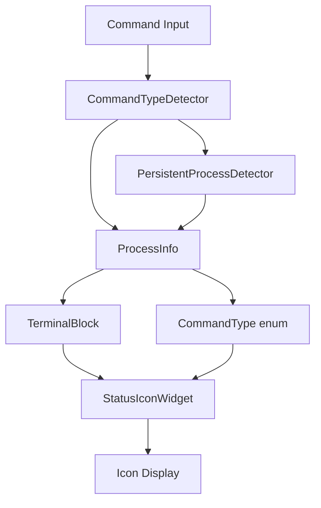

# Intelligent Command Type Detection Implementation Plan

**Date**: 2025-01-27  
**Type**: Feature Implementation  
**Status**: Planning  
**Context Tokens**: ~150 words

## Executive Summary
Implement intelligent command type detection system to display appropriate status icons in terminal blocks instead of always showing "Running" icon. Leverage existing PersistentProcessDetector service and enhance terminal block UI to provide better visual feedback.

## Context Links
- **Related Plans**: No direct dependencies  
- **Dependencies**: Existing PersistentProcessDetector service
- **Reference Docs**: `/docs/terminal-architecture.md` (if exists)

## Requirements

### Functional Requirements
- [ ] Detect command type on block creation (one-shot, continuous, interactive)
- [ ] Display appropriate icons based on command type and status
- [ ] Handle status transitions (running → completed, running → failed)
- [ ] Support edge cases (pipes, options, unknown commands)
- [ ] Maintain visual consistency with existing block design

### Non-Functional Requirements  
- [ ] Performance: Minimal impact on command parsing (<1ms)
- [ ] Security: No security implications (read-only operation)
- [ ] Scalability: Efficient caching for repeated commands

## Architecture Overview


### Key Components
- **CommandTypeDetector**: New service wrapping PersistentProcessDetector
- **StatusIconWidget**: New widget for intelligent icon display
- **Enhanced Terminal Block**: Updated to use command type information

### Data Models
- **CommandType**: Enum mapping ProcessType to UI categories
- **CommandTypeInfo**: Wrapper for ProcessInfo with UI-specific data

## Implementation Phases

### Phase 1: Command Type Detection Service (Est: 0.5 days)
**Scope**: Create service to bridge PersistentProcessDetector and UI needs
**Tasks**:
1. [ ] Create `lib/services/command_type_detector.dart` service
2. [ ] Define `CommandType` enum (oneShot, continuous, interactive)
3. [ ] Create mapping from `ProcessType` to `CommandType`
4. [ ] Add caching and performance optimizations
5. [ ] Add unit tests for command detection logic

**Acceptance Criteria**:
- [ ] Commands correctly classified into UI command types
- [ ] Service provides consistent results for identical commands
- [ ] Performance impact < 1ms per command
- [ ] Handles edge cases (pipes, complex commands, unknown commands)

### Phase 2: Status Icon System (Est: 0.5 days)
**Scope**: Create intelligent icon display system
**Tasks**:
1. [ ] Create `lib/widgets/terminal/status_icon_widget.dart`
2. [ ] Define icon mappings for each command type and status
3. [ ] Implement animated transitions between states
4. [ ] Add accessibility labels and tooltips
5. [ ] Create icon theme integration

**Acceptance Criteria**:
- [ ] Icons correctly reflect command type and current status
- [ ] Smooth animations between status changes
- [ ] Icons are accessible and have proper semantic meaning
- [ ] Visual consistency with app theme

### Phase 3: Terminal Block Integration (Est: 1 day)
**Scope**: Integrate command type detection into terminal blocks
**Tasks**:
1. [ ] Update `EnhancedTerminalBlock` to use CommandTypeDetector
2. [ ] Replace hardcoded status icons with StatusIconWidget
3. [ ] Update `_getStatusIcon()` method to use command type
4. [ ] Implement status + type combination logic
5. [ ] Update visual styling and spacing
6. [ ] Add debug information for command type detection

**Acceptance Criteria**:
- [ ] Terminal blocks display appropriate icons for each command type
- [ ] Icon changes reflect actual command behavior
- [ ] No regression in existing functionality
- [ ] Debug information available for troubleshooting

### Phase 4: Testing and Polish (Est: 0.5 days)
**Scope**: Comprehensive testing and edge case handling
**Tasks**:
1. [ ] Write unit tests for CommandTypeDetector
2. [ ] Write widget tests for StatusIconWidget
3. [ ] Write integration tests for terminal block behavior
4. [ ] Test edge cases (pipes, unknown commands, complex chains)
5. [ ] Performance testing and optimization
6. [ ] Visual regression testing

**Acceptance Criteria**:
- [ ] All tests pass with >90% code coverage
- [ ] Edge cases handled gracefully
- [ ] Performance requirements met
- [ ] Visual design approved

## Testing Strategy
- **Unit Tests**: CommandTypeDetector logic, icon mapping functions
- **Widget Tests**: StatusIconWidget rendering, terminal block integration
- **Integration Tests**: End-to-end command execution and icon display

## Security Considerations
- [ ] No security implications (read-only command analysis)
- [ ] Validate command input to prevent injection attacks in debug logs

## Risk Assessment
| Risk | Impact | Mitigation |
|------|--------|------------|
| Performance degradation | Medium | Cache command detection results |
| Icon confusion | Low | User testing and clear visual design |
| Edge case failures | Medium | Comprehensive test coverage |

## Quick Reference
### Key Commands
```bash
flutter test test/services/command_type_detector_test.dart
flutter test test/widgets/terminal/status_icon_widget_test.dart
```

### Configuration Files
- `lib/services/command_type_detector.dart`: Main detection service
- `lib/widgets/terminal/status_icon_widget.dart`: Icon display widget

## TODO Checklist
- [ ] Phase 1: Command Type Detection Service
- [ ] Phase 2: Status Icon System  
- [ ] Phase 3: Terminal Block Integration
- [ ] Phase 4: Testing and Polish
- [ ] Testing complete
- [ ] Documentation updated  
- [ ] Code review passed

## Technical Implementation Details

### Command Type Categories

**One-Shot Commands**:
- File operations: `ls`, `pwd`, `mkdir`, `rmdir`, `cp`, `mv`, `rm`, `touch`
- System info: `whoami`, `date`, `uname`, `df`, `free`, `uptime`  
- Text processing: `cat`, `head`, `tail`, `grep`, `wc`, `sort`, `uniq`
- Network: `ping` (limited), `wget`, `curl`

**Continuous Commands**:
- System monitoring: `top`, `htop`, `iostat`, `vmstat`, `netstat`
- Log monitoring: `tail -f`, `watch`, `journalctl -f`
- Network monitoring: `ping` (continuous), `traceroute`, `tcpdump`

**Interactive Commands**:
- Text editors: `vi`, `vim`, `nano`, `emacs`
- Remote access: `ssh`, `telnet`, `ftp`
- Interactive tools: `python`, `node`, `mysql`, `psql`
- Process management: `less`, `more`, `man`

### Icon Design Specifications

**Icon Examples**:
- One-shot Running: ⚡ (lightning) - `Icons.flash_on`
- One-shot Completed: ✓ (checkmark) - `Icons.check_circle`
- Continuous Running: 📊 (activity chart) - `Icons.timeline` or `Icons.monitor`
- Interactive Running: ⌨️ (keyboard) - `Icons.keyboard`
- Failed: ❌ (error) - `Icons.error`
- Cancelled: ⏹️ (stop) - `Icons.stop_circle`

**Styling Guidelines**:
- Use consistent icon size (16px for status, 12px for indicators)
- Apply appropriate colors from app theme
- Maintain visual harmony with existing block design
- Ensure icons are accessible and clear at different sizes
- Add subtle animations for status transitions

### Status + Type Combinations
Handle different combinations:
- **Running + OneShot**: `Icons.flash_on` with blue color
- **Running + Continuous**: `Icons.timeline` with yellow color
- **Running + Interactive**: `Icons.keyboard` with cyan color
- **Completed**: `Icons.check_circle` with green color
- **Failed**: `Icons.error` with red color
- **Cancelled**: `Icons.stop_circle` with gray color

### Edge Cases to Handle
- Commands with pipes: `ls | grep test` → classify based on primary command
- Commands with options: `tail -f logfile.txt` → detect continuous behavior
- Unknown/custom commands: Default to one-shot behavior
- Complex command chains: `cd /tmp && ls -la` → classify as one-shot