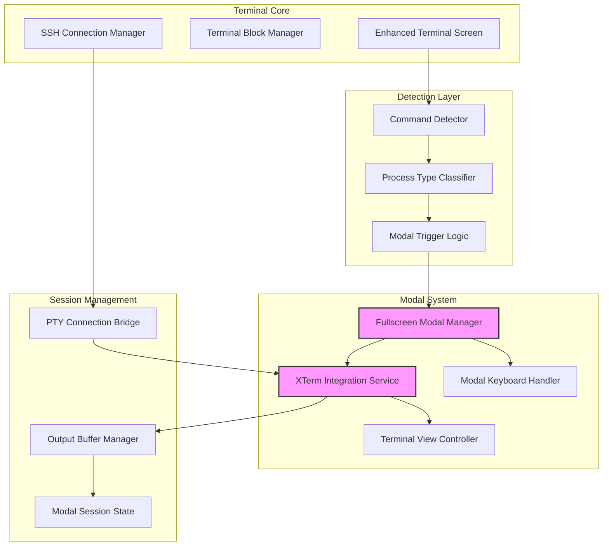

# Phase 3: Interactive Command Fullscreen Modal Implementation Plan

**Date**: 2025-08-27  
**Type**: Feature Implementation  
**Status**: Planning Complete  
**Priority**: High  
**Dependencies**: Phase 3.5 (Enhanced Interactive Process Handling) - Complete  
**Context**: Implement fullscreen modal experience for traditional interactive terminal commands

## Executive Summary

This plan details the implementation of Phase 3 from the comprehensive terminal enhancements plan, focusing on fullscreen modal functionality for interactive terminal commands like vi, nano, top, and htop. The implementation builds upon the existing enhanced terminal architecture while differentiating from Phase 3.5's persistent process handling.

## Context and Differentiation

### Phase 3 vs Phase 3.5 Distinction

**Phase 3.5 (Complete)**: Handles persistent processes within terminal blocks
- Commands: `npm run dev`, `python`, `node`, `irb`, REPLs
- Implementation: Interactive blocks with PTY focus management
- User Experience: Tap-to-focus interaction within blocks

**Phase 3 (This Plan)**: Handles fullscreen interactive commands via modal
- Commands: `vi`, `vim`, `nano`, `top`, `htop`, `less`, `man`
- Implementation: Fullscreen modal with native terminal emulation
- User Experience: Full-screen takeover for immersive terminal experience

## Requirements

### Functional Requirements
- [ ] Detect commands requiring fullscreen modal presentation
- [ ] Launch fullscreen modal with proper xterm.dart integration
- [ ] Handle terminal control sequences and keyboard input
- [ ] Support modal lifecycle (open, interact, close)
- [ ] Maintain session state between modal and blocks
- [ ] Handle orientation changes and responsive layout
- [ ] Support proper exit sequences (ESC, :q, Ctrl+C)

### Non-Functional Requirements
- [ ] 60fps performance for terminal rendering
- [ ] Sub-100ms modal launch time
- [ ] Proper memory management for long sessions
- [ ] Accessibility support for screen readers
- [ ] Cross-platform consistency (iOS/Android)

## Architecture Overview



## Technical Design

### Command Classification Matrix

| Command Type | Handling Mode | Trigger | Examples |
|-------------|---------------|---------|----------|
| **Text Editors** | Fullscreen Modal | Immediate | vi, vim, nvim, nano, emacs |
| **System Monitors** | Fullscreen Modal | Immediate | top, htop, btop, atop |
| **Pagers** | Fullscreen Modal | Immediate | less, more, man |
| **Multiplexers** | Fullscreen Modal | Immediate | tmux, screen |
| **REPLs** | Block Interactive | On Detection | python, node, irb |
| **Dev Servers** | Block Interactive | On Detection | npm run dev, rails server |
| **File Explorers** | Fullscreen Modal | Immediate | mc, ranger, nnn |

### Detection Enhancement

```dart
// lib/services/fullscreen_command_detector.dart
class FullscreenCommandDetector {
  static const _fullscreenCommands = {
    // Text Editors
    'vi', 'vim', 'nvim', 'neovim', 'emacs', 'nano', 'pico', 'micro',
    
    // System Monitors  
    'top', 'htop', 'btop', 'atop', 'iotop', 'iftop', 'nethogs',
    
    // Pagers
    'less', 'more', 'most',
    
    // Multiplexers
    'tmux', 'screen', 'byobu',
    
    // File Managers
    'mc', 'ranger', 'nnn', 'lf', 'vifm',
    
    // Database Clients (fullscreen mode)
    'mycli', 'pgcli',
  };
  
  static bool shouldTriggerFullscreen(String command) {
    final executable = command.split(' ').first.toLowerCase();
    
    // Direct match
    if (_fullscreenCommands.contains(executable)) {
      return true;
    }
    
    // Pattern matching for complex commands
    if (_isManCommand(command) || _isGitPager(command)) {
      return true;
    }
    
    return false;
  }
  
  static bool _isManCommand(String command) {
    return command.startsWith('man ');
  }
  
  static bool _isGitPager(String command) {
    // Git commands that use pager
    return RegExp(r'^git\s+(log|diff|show|blame)').hasMatch(command);
  }
}
```

### Fullscreen Modal Implementation

```dart
// lib/widgets/terminal/fullscreen_terminal_modal.dart
class FullscreenTerminalModal extends ConsumerStatefulWidget {
  final String command;
  final SSHClient? sshClient;
  final VoidCallback onClose;
  
  @override
  _FullscreenTerminalModalState createState() => _FullscreenTerminalModalState();
}

class _FullscreenTerminalModalState extends ConsumerState<FullscreenTerminalModal> {
  late Terminal _terminal;
  late TerminalController _controller;
  StreamSubscription? _outputSubscription;
  
  @override
  void initState() {
    super.initState();
    _initializeTerminal();
    _executeCommand();
  }
  
  void _initializeTerminal() {
    _terminal = Terminal(
      maxLines: 10000,
      onOutput: _handleTerminalInput,
    );
    
    _controller = TerminalController();
  }
  
  void _executeCommand() {
    if (widget.sshClient != null) {
      // SSH mode - execute via SSH
      _executeSSHCommand();
    } else {
      // Local mode - execute via PTY
      _executeLocalCommand();
    }
  }
  
  @override
  Widget build(BuildContext context) {
    return WillPopScope(
      onWillPop: _handleBackButton,
      child: Scaffold(
        backgroundColor: Colors.black,
        body: SafeArea(
          child: Column(
            children: [
              _buildHeader(),
              Expanded(
                child: TerminalView(
                  _terminal,
                  controller: _controller,
                  autofocus: true,
                  backgroundOpacity: 1.0,
                  padding: EdgeInsets.all(8),
                ),
              ),
              _buildControlBar(),
            ],
          ),
        ),
      ),
    );
  }
  
  Widget _buildHeader() {
    return Container(
      height: 40,
      color: Colors.grey[900],
      child: Row(
        children: [
          IconButton(
            icon: Icon(Icons.close, color: Colors.white),
            onPressed: _handleClose,
          ),
          Expanded(
            child: Text(
              widget.command,
              style: TextStyle(color: Colors.white),
              overflow: TextOverflow.ellipsis,
            ),
          ),
          IconButton(
            icon: Icon(Icons.keyboard, color: Colors.white),
            onPressed: _toggleKeyboard,
          ),
        ],
      ),
    );
  }
}
```

### XTerm Integration Service

```dart
// lib/services/xterm_integration_service.dart
class XTermIntegrationService {
  final Terminal terminal;
  final TerminalController controller;
  
  // Terminal configuration
  static const TerminalTheme darkTheme = TerminalTheme(
    cursor: Color(0xFFFFFFFF),
    selection: Color(0x3FFFFFFF),
    foreground: Color(0xFFFFFFFF),
    background: Color(0xFF000000),
    // ANSI Colors
    black: Color(0xFF000000),
    red: Color(0xFFCD0000),
    green: Color(0xFF00CD00),
    yellow: Color(0xFFCDCD00),
    blue: Color(0xFF0000EE),
    magenta: Color(0xFFCD00CD),
    cyan: Color(0xFF00CDCD),
    white: Color(0xFFE5E5E5),
    // Bright ANSI Colors
    brightBlack: Color(0xFF7F7F7F),
    brightRed: Color(0xFFFF0000),
    brightGreen: Color(0xFF00FF00),
    brightYellow: Color(0xFFFFFF00),
    brightBlue: Color(0xFF5C5CFF),
    brightMagenta: Color(0xFFFF00FF),
    brightCyan: Color(0xFF00FFFF),
    brightWhite: Color(0xFFFFFFFF),
  );
  
  XTermIntegrationService({
    required this.terminal,
    required this.controller,
  });
  
  void configureForFullscreen() {
    // Set terminal dimensions based on device
    final size = _calculateTerminalSize();
    terminal.resize(size.width.toInt(), size.height.toInt());
    
    // Configure input handling
    terminal.onOutput = (data) {
      _handleUserInput(data);
    };
    
    // Configure bell handling
    terminal.onBell = () {
      HapticFeedback.lightImpact();
    };
  }
  
  Size _calculateTerminalSize() {
    // Calculate based on screen size and font metrics
    final screenSize = MediaQuery.of(context).size;
    final charWidth = 9.0; // Approximate character width
    final charHeight = 18.0; // Approximate character height
    
    return Size(
      screenSize.width / charWidth,
      (screenSize.height - 100) / charHeight, // Subtract header/control bar
    );
  }
}
```

### Modal Keyboard Handler

```dart
// lib/widgets/terminal/modal_keyboard_handler.dart
class ModalKeyboardHandler extends StatefulWidget {
  final Function(String) onInput;
  final VoidCallback onEscape;
  
  @override
  Widget build(BuildContext context) {
    return RawKeyboardListener(
      focusNode: _focusNode,
      onKey: _handleKeyEvent,
      child: Focus(
        autofocus: true,
        child: widget.child,
      ),
    );
  }
  
  void _handleKeyEvent(RawKeyEvent event) {
    if (event is! RawKeyDownEvent) return;
    
    // Handle special keys
    if (event.logicalKey == LogicalKeyboardKey.escape) {
      widget.onEscape();
      return;
    }
    
    // Handle Ctrl combinations
    if (event.isControlPressed) {
      _handleControlKey(event);
      return;
    }
    
    // Handle regular character input
    if (event.character != null) {
      widget.onInput(event.character!);
    }
  }
  
  void _handleControlKey(RawKeyEvent event) {
    final key = event.logicalKey;
    
    // Common control sequences
    final controlMap = {
      LogicalKeyboardKey.keyC: '\x03', // Ctrl+C (SIGINT)
      LogicalKeyboardKey.keyD: '\x04', // Ctrl+D (EOF)
      LogicalKeyboardKey.keyZ: '\x1A', // Ctrl+Z (SIGTSTP)
      LogicalKeyboardKey.keyL: '\x0C', // Ctrl+L (Clear)
      LogicalKeyboardKey.keyA: '\x01', // Ctrl+A (Home)
      LogicalKeyboardKey.keyE: '\x05', // Ctrl+E (End)
    };
    
    final sequence = controlMap[key];
    if (sequence != null) {
      widget.onInput(sequence);
    }
  }
}
```

### Modal Lifecycle Manager

```dart
// lib/services/interactive_command_manager.dart
class InteractiveCommandManager {
  static Future<void> launchFullscreenModal({
    required BuildContext context,
    required String command,
    required SSHClient? sshClient,
    required Function(TerminalOutput) onOutput,
  }) async {
    // Check if command requires fullscreen
    if (!FullscreenCommandDetector.shouldTriggerFullscreen(command)) {
      return;
    }
    
    // Prepare modal session
    final session = ModalSession(
      id: Uuid().v4(),
      command: command,
      startTime: DateTime.now(),
      sshClient: sshClient,
    );
    
    // Launch modal
    final result = await Navigator.push(
      context,
      MaterialPageRoute(
        fullscreenDialog: true,
        builder: (context) => FullscreenTerminalModal(
          command: command,
          sshClient: sshClient,
          onClose: () => Navigator.pop(context),
        ),
      ),
    );
    
    // Handle modal close
    _handleModalClose(session, result, onOutput);
  }
  
  static void _handleModalClose(
    ModalSession session,
    dynamic result,
    Function(TerminalOutput) onOutput,
  ) {
    // Capture final output
    final output = TerminalOutput(
      sessionId: session.id,
      type: TerminalOutputType.info,
      data: 'Process exited',
      timestamp: DateTime.now(),
    );
    
    onOutput(output);
    
    // Clean up resources
    session.dispose();
  }
}
```

## Implementation Approaches Analysis

### Approach 1: Native Modal with XTerm.dart
**Architecture**: Full MaterialPageRoute modal with embedded xterm.dart

**Pros**:
- Native Flutter navigation patterns
- Full control over UI/UX
- Easy state management with Riverpod
- Consistent with existing app architecture

**Cons**:
- Requires careful keyboard handling
- Complex terminal resize logic
- Potential performance overhead

### Approach 2: Overlay-based Implementation
**Architecture**: Custom overlay widget without navigation

**Pros**:
- Faster transitions
- Better performance
- No navigation stack complexity
- Maintains background state

**Cons**:
- Complex gesture handling
- Difficult back button management
- Custom lifecycle management needed

### Approach 3: Platform View Integration
**Architecture**: Native terminal views for each platform

**Pros**:
- Best native performance
- Platform-specific optimizations
- Native keyboard handling

**Cons**:
- Complex platform channel setup
- Maintenance overhead
- Inconsistent behavior across platforms

## Recommended Approach

**Selected**: Approach 1 - Native Modal with XTerm.dart

**Justification**: 
- Aligns with existing Flutter patterns in the codebase
- XTerm.dart v4.0.0 provides robust terminal emulation
- MaterialPageRoute with fullscreenDialog provides proper modal behavior
- Easier to maintain and extend

## Implementation Phases

### Sub-Phase 3.1: Detection and Classification (Day 1)
**Tasks**:
1. [ ] Create `fullscreen_command_detector.dart` with command patterns
2. [ ] Enhance `persistent_process_detector.dart` integration
3. [ ] Add modal trigger logic to `enhanced_terminal_block.dart`
4. [ ] Update `terminal_block_lifecycle_service.dart` for modal support

**Files to Create/Modify**:
- `lib/services/fullscreen_command_detector.dart` (new)
- `lib/services/persistent_process_detector.dart` (modify)
- `lib/widgets/terminal/enhanced_terminal_block.dart` (modify)

### Sub-Phase 3.2: Modal Infrastructure (Day 2)
**Tasks**:
1. [ ] Implement `fullscreen_terminal_modal.dart` widget
2. [ ] Create `xterm_integration_service.dart` for terminal setup
3. [ ] Build `modal_keyboard_handler.dart` for input management
4. [ ] Add modal theme configuration

**Files to Create**:
- `lib/widgets/terminal/fullscreen_terminal_modal.dart`
- `lib/services/xterm_integration_service.dart`
- `lib/widgets/terminal/modal_keyboard_handler.dart`
- `lib/themes/terminal_modal_theme.dart`

### Sub-Phase 3.3: Session Management (Day 3)
**Tasks**:
1. [ ] Implement `interactive_command_manager.dart`
2. [ ] Create modal session state management
3. [ ] Build PTY bridge for modal communication
4. [ ] Add output buffer management

**Files to Create**:
- `lib/services/interactive_command_manager.dart`
- `lib/models/modal_session_models.dart`
- `lib/services/modal_pty_bridge.dart`
- `lib/services/modal_output_buffer.dart`

### Sub-Phase 3.4: Integration and Polish (Day 4)
**Tasks**:
1. [ ] Integrate with SSH terminal widget
2. [ ] Add orientation change handling
3. [ ] Implement gesture controls (pinch zoom, pan)
4. [ ] Add accessibility support

**Files to Modify**:
- `lib/widgets/terminal/ssh_terminal_widget.dart`
- `lib/screens/terminal/enhanced_terminal_screen.dart`
- `lib/providers/terminal_session_provider.dart`

### Sub-Phase 3.5: Testing and Optimization (Day 5)
**Tasks**:
1. [ ] Create unit tests for detection logic
2. [ ] Add integration tests for modal flow
3. [ ] Performance optimization for large outputs
4. [ ] Memory leak testing

**Files to Create**:
- `test/services/fullscreen_command_detector_test.dart`
- `test/widgets/fullscreen_terminal_modal_test.dart`
- `test/integration/modal_lifecycle_test.dart`

## Testing Strategy

### Unit Tests
- Command detection accuracy
- Keyboard input handling
- Terminal resize calculations
- Session state management

### Integration Tests
- Modal launch and close flow
- SSH command execution in modal
- Output synchronization
- Keyboard focus management

### E2E Tests
- Vi/Vim editing workflow
- Top/htop monitoring
- Man page navigation
- Terminal multiplexer usage

### Performance Tests
- Modal launch time (<100ms)
- Rendering performance (60fps)
- Memory usage during long sessions
- Large output handling (>10MB)

## Security Considerations

- [ ] Sanitize command input before execution
- [ ] Validate SSH session before modal launch
- [ ] Secure keyboard input handling
- [ ] Prevent injection attacks
- [ ] Clear sensitive data on modal close

## Risk Assessment

| Risk | Impact | Probability | Mitigation |
|------|--------|-------------|------------|
| Keyboard input conflicts | High | Medium | Comprehensive key mapping |
| Performance degradation | High | Low | Optimize rendering pipeline |
| Memory leaks | High | Medium | Proper stream disposal |
| Gesture conflicts | Medium | High | Custom gesture recognizers |
| Platform inconsistencies | Medium | Medium | Platform-specific testing |

## Dependencies

### External Packages
- `xterm: ^4.0.0` - Terminal emulation
- `flutter_keyboard_visibility: ^5.4.0` - Keyboard detection
- `uuid: ^4.0.0` - Session ID generation

### Internal Dependencies
- Phase 3.5 completion (Active Block Manager)
- Enhanced Terminal Architecture
- SSH Connection Manager
- PTY Focus Manager

## Success Criteria

- [ ] All fullscreen commands launch modal correctly
- [ ] Keyboard input works reliably
- [ ] Modal closes properly with ESC/:q/Ctrl+C
- [ ] No memory leaks after extended use
- [ ] 60fps performance maintained
- [ ] Orientation changes handled gracefully
- [ ] SSH and local modes both supported

## Migration Strategy

1. **Feature Flag**: Add `enableFullscreenModal` flag
2. **Gradual Rollout**: Start with basic commands (vi, nano)
3. **User Testing**: Beta test with power users
4. **Feedback Integration**: Refine based on usage
5. **Full Deployment**: Enable for all users

## TODO Checklist

### Detection Layer
- [ ] Create fullscreen command detector service
- [ ] Integrate with existing process detector
- [ ] Add command classification logic
- [ ] Implement trigger conditions

### Modal Implementation
- [ ] Build fullscreen modal widget
- [ ] Integrate xterm.dart terminal
- [ ] Implement keyboard handler
- [ ] Add gesture controls

### Session Management
- [ ] Create modal session models
- [ ] Build PTY bridge service
- [ ] Implement output buffering
- [ ] Add state persistence

### Integration
- [ ] Connect to SSH terminal widget
- [ ] Update terminal screen
- [ ] Modify block lifecycle service
- [ ] Add provider support

### Testing
- [ ] Write unit tests
- [ ] Create integration tests
- [ ] Perform E2E testing
- [ ] Conduct performance testing

### Documentation
- [ ] Update API documentation
- [ ] Create user guide
- [ ] Document keyboard shortcuts
- [ ] Add troubleshooting guide

## Quick Reference

### Key Commands for Testing
```bash
# Text Editors
vi test.txt
nano config.json
emacs README.md

# System Monitors
top
htop
iotop

# Pagers
man ls
less /var/log/system.log
git log --oneline

# Multiplexers
tmux new-session
screen -S test
```

### Configuration
```dart
// Enable fullscreen modal
final enableModal = ref.watch(featureFlagsProvider).enableFullscreenModal;

// Terminal dimensions
const modalTerminalCols = 80;
const modalTerminalRows = 40;

// Keyboard shortcuts
const shortcuts = {
  'ESC': 'Exit modal',
  'Ctrl+C': 'Interrupt process',
  'Ctrl+D': 'Send EOF',
  'Ctrl+L': 'Clear screen',
};
```

## Conclusion

Phase 3 implementation provides a crucial enhancement to the DevPocket terminal experience by enabling fullscreen modal support for interactive commands. This builds upon the existing enhanced terminal architecture while maintaining clear separation from Phase 3.5's block-based interaction model. The implementation prioritizes user experience, performance, and maintainability while leveraging the robust xterm.dart package for terminal emulation.