# Phase 4: Integration and Polish Implementation Plan

**Date**: 2025-08-27  
**Type**: Feature Integration + Performance Optimization  
**Status**: Ready for Implementation  
**Context Tokens**: Terminal enhancement finalization, SSH integration, session persistence, performance optimization, accessibility support, comprehensive testing

## Executive Summary

Phase 4 completes the comprehensive terminal enhancement project by integrating all enhanced terminal features with existing SSH functionality, implementing session persistence, optimizing performance for mobile devices, and adding accessibility support. This phase ensures the enhanced terminal works seamlessly with all existing features while meeting production-quality standards.

## Context Links
- **Master Plan**: `./plans/20250826-terminal-enhancements-comprehensive-plan.md`
- **Dependencies**: Phases 1, 2, 3, 3.5, and 3.6 (completed)
- **Integration Points**: SSH connection providers, terminal session management, performance optimization

## Requirements

### Functional Requirements
- [ ] Enhanced SSH terminal provider integrates seamlessly with existing SSH functionality
- [ ] Terminal sessions persist across app lifecycle events (background/foreground/restart)
- [ ] Performance optimized for large terminal outputs (>10,000 lines)
- [ ] Accessibility features support screen readers and assistive technologies
- [ ] All existing terminal features work without regression
- [ ] Memory usage optimized with no memory leaks

### Non-Functional Requirements
- [ ] Performance: Maintain 60fps scrolling with large outputs
- [ ] Battery: Efficient power usage for long-running terminal sessions
- [ ] Memory: Optimal memory management for resource-constrained devices
- [ ] Network: Efficient data handling for SSH connections
- [ ] Accessibility: WCAG 2.1 AA compliance for terminal interface

## Architecture Overview

```mermaid
graph TB
    A[Phase 4: Integration & Polish] --> B[SSH Integration Layer]
    A --> C[Session Persistence Layer]
    A --> D[Performance Optimization Layer]
    A --> E[Accessibility Layer]
    A --> F[Testing & Quality Assurance]
    
    B --> G[Enhanced SSH Terminal Provider]
    B --> H[SSH Connection Bridge]
    B --> I[Terminal Output Stream Manager]
    
    C --> J[Session State Persistence]
    C --> K[App Lifecycle Handler]
    C --> L[Connection Recovery Manager]
    
    D --> M[Virtual Scrolling Engine]
    D --> N[Memory Optimization Service]
    D --> O[Performance Monitor]
    
    E --> P[Screen Reader Support]
    E --> Q[High Contrast Mode]
    E --> R[Font Scaling Support]
    
    F --> S[Integration Tests]
    F --> T[Performance Benchmarks]
    F --> U[Accessibility Audit]
    
    G --> V[SSH Provider Integration]
    H --> W[Connection State Sync]
    I --> X[Stream Processing]
    
    J --> Y[State Serialization]
    K --> Z[Lifecycle Events]
    L --> AA[Auto-Reconnect Logic]
    
    M --> BB[Efficient Rendering]
    N --> CC[Memory Management]
    O --> DD[Performance Metrics]
    
    P --> EE[Semantic Labels]
    Q --> FF[Theme Integration]
    R --> GG[Dynamic Typography]
```



## Implementation Approaches Analysis

### Approach 1: Incremental Integration
**Architecture**: Build upon existing enhanced components, integrate step-by-step

**Pros**:
- Lower risk by preserving working functionality
- Easier testing and validation of each integration point
- Maintains current SSH connection patterns
- Allows for gradual rollout and testing

**Cons**:
- May carry forward some architectural inconsistencies
- Requires careful interface management between old/new components
- Slower to achieve full optimization benefits

### Approach 2: Comprehensive Integration Rebuild
**Architecture**: Complete integration with unified architecture

**Pros**:
- Clean integration architecture
- Optimal performance from unified design
- Consistent patterns throughout codebase
- Better long-term maintainability

**Cons**:
- Higher implementation risk
- More complex testing requirements
- Potential for regression in working features

### Approach 3: Hybrid Integration Strategy (Recommended)
**Architecture**: Core integration with selective component optimization

**Pros**:
- Balanced risk/reward profile
- Preserves proven SSH connection logic
- Enables optimal performance where needed
- Clear migration path for features

**Cons**:
- Requires careful interface design
- Complex integration testing scenarios

## Recommended Approach: Hybrid Integration Strategy

**Justification**: The hybrid approach provides the best balance of stability and optimization. We can integrate enhanced terminal features with existing SSH infrastructure while selectively optimizing performance-critical components and adding comprehensive accessibility support.

## Implementation Tasks

### Task 1: Enhanced SSH Terminal Provider Integration
**File**: `lib/providers/enhanced_ssh_terminal_provider.dart`
**Duration**: 1 day

**Objectives**:
- Create unified provider that bridges enhanced terminal with SSH connections
- Ensure seamless integration with existing SSH connection providers
- Maintain session persistence across SSH connections

**Technical Specifications**:
```dart
class EnhancedSshTerminalProvider extends StateNotifier<EnhancedSshTerminalState> {
  // Bridge enhanced terminal session manager with SSH connections
  // Integrate with enhanced_ssh_connection_providers.dart
  // Manage terminal blocks for SSH sessions
  // Handle SSH connection state changes
  // Provide unified interface for SSH terminal operations
}
```

**Integration Points**:
- `lib/providers/enhanced_ssh_connection_providers.dart`
- `lib/services/enhanced_terminal_session_manager.dart`
- `lib/widgets/terminal/ssh_terminal_widget.dart`

**Acceptance Criteria**:
- [ ] SSH connections work seamlessly with enhanced terminal blocks
- [ ] Terminal output streams properly to enhanced terminal blocks
- [ ] Connection state changes reflected in terminal interface
- [ ] Interactive commands trigger fullscreen modal for SSH sessions
- [ ] Session management integrated with SSH lifecycle

### Task 2: Terminal Session Persistence Service
**File**: `lib/services/terminal_session_persistence_service.dart`
**Duration**: 1.5 days

**Objectives**:
- Implement comprehensive session state persistence
- Handle app backgrounding and foregrounding gracefully
- Restore terminal state and connections after app restart

**Technical Specifications**:
```dart
class TerminalSessionPersistenceService {
  // Serialize terminal session state (blocks, connections, UI state)
  // Handle app lifecycle events (WidgetsBindingObserver)
  // Implement state restoration logic
  // Manage background task execution
  // Handle SSH connection recovery
  
  Future<void> persistSessionState(String sessionId);
  Future<void> restoreSessionState(String sessionId);
  void handleAppLifecycleChange(AppLifecycleState state);
}
```

**Integration Points**:
- `lib/services/enhanced_terminal_session_manager.dart`
- `lib/providers/enhanced_ssh_connection_providers.dart`
- Flutter's `WidgetsBindingObserver`
- Secure storage for session data

**Acceptance Criteria**:
- [ ] Terminal sessions persist when app goes to background
- [ ] Sessions restore correctly when app returns to foreground  
- [ ] SSH connections recover automatically after app restart
- [ ] Terminal blocks and output preserved across lifecycle events
- [ ] Interactive sessions handle lifecycle transitions gracefully

### Task 3: Terminal Performance Optimizer
**File**: `lib/services/terminal_performance_optimizer.dart`
**Duration**: 2 days

**Objectives**:
- Optimize performance for large terminal outputs (>10,000 lines)
- Implement virtual scrolling for efficient rendering
- Memory management for terminal blocks and sessions

**Technical Specifications**:
```dart
class TerminalPerformanceOptimizer {
  // Virtual scrolling implementation for large outputs
  // Memory management for terminal blocks
  // Output truncation and buffering strategies
  // Performance monitoring and metrics
  // Efficient text rendering optimization
  
  Widget buildVirtualizedTerminalOutput(List<TerminalBlockData> blocks);
  void optimizeMemoryUsage(String sessionId);
  Map<String, double> getPerformanceMetrics();
}
```

**Performance Targets**:
- Handle >10,000 lines of output without performance degradation
- Maintain 60fps scrolling performance
- Memory usage <100MB for large terminal sessions
- CPU usage <20% during heavy output processing

**Integration Points**:
- `lib/widgets/terminal/enhanced_terminal_block.dart`
- `lib/services/enhanced_terminal_session_manager.dart`
- Flutter's `ListView.builder` or custom virtualized widgets

**Acceptance Criteria**:
- [ ] Smooth 60fps scrolling with >10,000 lines of output
- [ ] Memory usage remains optimal with large terminal sessions
- [ ] No memory leaks during extended terminal usage
- [ ] Performance metrics available for monitoring
- [ ] Automatic optimization triggers for large outputs

### Task 4: Accessible Terminal Block Widget
**File**: `lib/widgets/terminal/accessible_terminal_block.dart`
**Duration**: 1.5 days

**Objectives**:
- Add comprehensive accessibility features for terminal blocks
- Screen reader compatibility with meaningful semantics
- High contrast mode and font scaling support

**Technical Specifications**:
```dart
class AccessibleTerminalBlock extends StatelessWidget {
  // Semantic labels for screen readers
  // High contrast mode support
  // Dynamic font scaling
  // Keyboard navigation support
  // Focus management for accessibility
  
  Widget build(BuildContext context) {
    return Semantics(
      label: 'Terminal command block',
      hint: 'Command: ${block.command}',
      child: _buildAccessibleContent(),
    );
  }
}
```

**Accessibility Features**:
- Screen reader support with meaningful labels
- High contrast mode compatibility
- Font scaling (up to 200% size increase)
- Keyboard navigation support
- Focus indicators for interactive elements

**Integration Points**:
- `lib/widgets/terminal/enhanced_terminal_block.dart`
- `lib/themes/app_theme.dart` for high contrast support
- Flutter's accessibility framework

**Acceptance Criteria**:
- [ ] Screen readers can navigate and announce terminal content
- [ ] High contrast mode provides sufficient color contrast
- [ ] Font scaling works correctly up to 200% size
- [ ] Keyboard navigation allows full terminal interaction
- [ ] Focus indicators clearly show current selection

### Task 5: Comprehensive Testing and Bug Fixes
**Duration**: 1 day

**Objectives**:
- Run comprehensive integration tests for all Phase 4 features
- Performance benchmarking and validation
- Bug fixes and edge case handling

**Testing Scope**:
- Integration tests for SSH terminal provider
- Session persistence across app lifecycle events
- Performance tests with large outputs
- Accessibility testing with screen readers
- Memory leak detection and validation
- End-to-end user workflow testing

**Acceptance Criteria**:
- [ ] All integration tests pass
- [ ] Performance benchmarks meet targets
- [ ] No memory leaks detected
- [ ] Accessibility tests pass
- [ ] All critical bugs resolved

## Integration Requirements

### SSH Compatibility
- Must work with all existing SSH connection types
- Preserve all current SSH authentication methods
- Maintain SSH connection health monitoring
- Support SSH key management integration

### Session Management
- Integrate with existing terminal session providers
- Preserve command history across sessions
- Support multiple concurrent SSH sessions
- Handle session timeouts gracefully

### Performance Standards
- 60fps scrolling with large outputs
- <100MB memory usage for extended sessions
- <500ms response time for command execution
- Smooth animations on mobile devices

### Accessibility Compliance
- WCAG 2.1 AA compliance
- Screen reader compatibility
- High contrast mode support
- Font scaling up to 200%

## Testing Strategy

### Unit Tests
- Terminal performance optimizer algorithms
- Session persistence serialization/deserialization
- Accessibility semantic label generation
- Memory management optimization logic

### Integration Tests
- SSH terminal provider integration
- Session persistence across app lifecycle
- Performance optimization with large datasets
- Accessibility feature interaction

### Performance Tests
- Large output handling (>10,000 lines)
- Memory usage monitoring over time
- Scrolling performance benchmarks
- Network efficiency for SSH connections

### Accessibility Tests
- Screen reader navigation testing
- High contrast mode validation
- Font scaling verification
- Keyboard navigation testing

## Security Considerations

- [ ] Secure storage of persistent session data
- [ ] Encryption of sensitive terminal output
- [ ] Proper cleanup of cached session data
- [ ] SSH credential security in persistence
- [ ] Memory security for sensitive terminal data

## Performance Optimization Guidelines

### Mobile-Specific Optimizations
- Battery efficiency for long-running sessions
- Memory optimization for resource-constrained devices
- Network efficiency for SSH connections
- Smooth UI performance during heavy output

### Rendering Optimizations
- Virtual scrolling for large terminal outputs
- Efficient text rendering with proper font caching
- Optimized re-render strategies for terminal blocks
- Lazy loading of terminal block content

## Risk Assessment

| Risk | Impact | Probability | Mitigation |
|------|--------|-------------|------------|
| SSH integration breaking existing functionality | High | Medium | Comprehensive integration testing, feature flags |
| Performance regression on low-end devices | High | Medium | Performance benchmarking, device-specific testing |
| Session persistence data corruption | High | Low | Data validation, backup mechanisms, fallback handling |
| Accessibility compliance gaps | Medium | Medium | Accessibility testing, expert review |
| Memory leaks in long-running sessions | High | Medium | Memory monitoring, automated leak detection |

## Success Metrics

### Performance Metrics
- Scrolling performance: 60fps maintained
- Memory usage: <100MB for large sessions
- Response time: <500ms for command execution
- Battery usage: <5% per hour for active terminal

### Quality Metrics
- Test coverage: >90% for new components
- Accessibility score: WCAG 2.1 AA compliance
- User satisfaction: >4.5/5 rating
- Crash rate: <0.1% for terminal features

## Implementation Timeline

| Task | Duration | Dependencies | Status |
|------|----------|-------------|---------|
| Enhanced SSH Terminal Provider Integration | 1 day | Phases 1-3.6 complete | 📋 Planned |
| Terminal Session Persistence Service | 1.5 days | Task 1 complete | 📋 Planned |
| Terminal Performance Optimizer | 2 days | Task 1 complete | 📋 Planned |
| Accessible Terminal Block Widget | 1.5 days | Enhanced terminal blocks | 📋 Planned |
| Comprehensive Testing and Bug Fixes | 1 day | All tasks complete | 📋 Planned |
| **Total** | **7 days** | **Phase 4 Implementation** | **📋 Planned** |

## Configuration and Environment

### Required Dependencies
- Flutter 3.16+ for latest accessibility features
- Riverpod for state management
- Secure Storage for session persistence
- Performance monitoring tools

### Configuration Files
- `lib/config/terminal_config.dart`: Terminal behavior settings
- `lib/themes/terminal_theme.dart`: Accessibility theme support
- Performance monitoring configuration

## TODO Checklist

### Task 1: Enhanced SSH Terminal Provider Integration
- [ ] Create `lib/providers/enhanced_ssh_terminal_provider.dart`
- [ ] Integrate with existing SSH connection providers
- [ ] Bridge enhanced terminal session manager with SSH connections
- [ ] Implement unified SSH terminal state management
- [ ] Add SSH-specific terminal block handling
- [ ] Test SSH connection integration

### Task 2: Terminal Session Persistence Service
- [ ] Create `lib/services/terminal_session_persistence_service.dart`
- [ ] Implement session state serialization
- [ ] Add app lifecycle event handling
- [ ] Create session restoration logic
- [ ] Implement SSH connection recovery
- [ ] Test persistence across app lifecycle events

### Task 3: Terminal Performance Optimizer
- [ ] Create `lib/services/terminal_performance_optimizer.dart`
- [ ] Implement virtual scrolling for large outputs
- [ ] Add memory management optimization
- [ ] Create performance monitoring system
- [ ] Optimize text rendering performance
- [ ] Test with large terminal outputs (>10,000 lines)

### Task 4: Accessible Terminal Block Widget
- [ ] Create `lib/widgets/terminal/accessible_terminal_block.dart`
- [ ] Implement screen reader support
- [ ] Add high contrast mode compatibility
- [ ] Create font scaling support
- [ ] Add keyboard navigation
- [ ] Test accessibility compliance

### Task 5: Comprehensive Testing and Bug Fixes
- [ ] Run integration tests for all components
- [ ] Perform performance benchmarking
- [ ] Conduct accessibility testing
- [ ] Fix identified bugs and issues
- [ ] Validate all acceptance criteria

### Final Deliverables
- [ ] All functional requirements implemented
- [ ] Performance benchmarks meet mobile targets
- [ ] Accessibility compliance validated
- [ ] Integration testing completed
- [ ] Documentation updated
- [ ] Code review passed and approved

## Post-Implementation Validation

### Verification Checklist
- [ ] SSH connections work seamlessly with enhanced terminal
- [ ] Sessions persist correctly across all app lifecycle events
- [ ] Performance optimized for large outputs without degradation
- [ ] Accessibility features work with assistive technologies
- [ ] Memory usage optimized with no detectable leaks
- [ ] All existing terminal features function without regression

### Success Validation
- [ ] End-to-end user workflows tested and validated
- [ ] Performance metrics meet or exceed targets
- [ ] Accessibility audit passes with WCAG 2.1 AA compliance
- [ ] No critical or high-severity issues remain
- [ ] User acceptance testing completed successfully