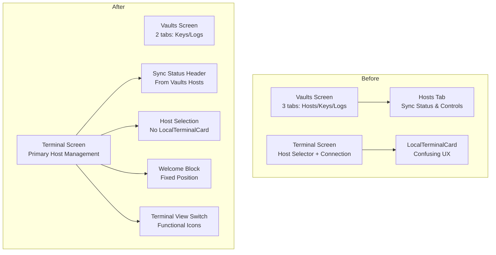

# Terminal Screen Major Refactoring Plan

**Date**: 2025-08-27  
**Type**: Refactoring  
**Scope**: Terminal Screen and Vaults Screen UI/UX restructuring  
**Context Tokens**: Major UI refactoring to consolidate sync functionality and enhance terminal experience

## Executive Summary
This plan outlines a comprehensive refactoring of the Terminal screen to improve user experience by consolidating sync status/controls from Vaults into Terminal, removing redundant LocalTerminalCard, enhancing terminal functionality with proper view switching, and fixing interactive command modals.

## Current State Analysis
### Issues with Current Implementation
- [ ] Sync functionality split between Vaults and Terminal screens
- [ ] LocalTerminalCard creates confusion in host selection
- [ ] Incomplete Terminal view switching (wrong icons displayed)
- [ ] Interactive command fullscreen modal issues
- [ ] Inconsistent command type detection and display
- [ ] Welcome message not properly integrated as fixed block

### Current Architecture
- **Terminal Screen**: `enhanced_terminal_screen.dart` with host selector and connection logic
- **Vaults Screen**: 3-tab structure (Hosts/Keys/Logs) with sync components in Hosts tab
- **Sync Components**: `ssh_sync_widgets.dart` with SyncStatusWidget, SyncControlsWidget, LastSyncTimeWidget
- **Terminal Widgets**: Block-based UI with interactive process handling

## Context Links
- **Primary Files**: `/lib/screens/terminal/enhanced_terminal_screen.dart`, `/lib/screens/vaults/vaults_screen.dart`
- **Widget Dependencies**: `/lib/widgets/ssh_sync_widgets.dart`, `/lib/widgets/terminal/ssh_terminal_widget.dart`
- **Terminal Components**: `/lib/widgets/terminal/enhanced_terminal_block.dart`

## Refactoring Strategy
### Approach
Consolidate SSH host management into Terminal screen as the primary interface, move all sync functionality from Vaults to Terminal, streamline host selection flow, and enhance terminal capabilities with proper view modes and command handling.

### Architecture Changes

### Key Improvements
- **Consolidated UX**: Single location for SSH host management and terminal access
- **Enhanced Terminal**: Proper view switching and welcome message integration
- **Simplified Navigation**: Remove redundant local terminal option
- **Fixed Interactive Commands**: Proper fullscreen modal functionality

## Implementation Plan

### Phase 1: Sync Component Migration (Est: 1 day) ✅ COMPLETED
**Scope**: Move sync functionality from Vaults to Terminal
1. [x] Import sync widget dependencies in `enhanced_terminal_screen.dart`
2. [x] Integrate `SyncStatusWidget` in Terminal screen header
3. [x] Add `SyncControlsWidget` and `LastSyncTimeWidget` to host selection view
4. [x] Update Riverpod provider imports for sync state management
5. [x] Test sync functionality in new Terminal location

### Phase 2: Vaults Screen Restructuring (Est: 0.5 days) ✅ COMPLETED
**Scope**: Remove Hosts tab from Vaults screen
1. [x] Update `vaults_screen.dart` TabController from 3 to 2 tabs - file: `lib/screens/vaults/vaults_screen.dart`
2. [x] Remove Hosts tab definition (line 65)
3. [x] Remove `_buildHostsTab()` method (lines 117-255)
4. [x] Update TabBarView children array (lines 108-112)
5. [x] Remove host-related import statements and unused methods
6. [x] Test Vaults screen with Keys/Logs only structure

### Phase 3: Terminal Screen Enhancement (Est: 1.5 days) ✅ COMPLETED
**Scope**: Enhance terminal screen with sync integration and improved UX
1. [x] Remove `_buildLocalTerminalCard()` method (lines 154-222) - file: `lib/screens/terminal/enhanced_terminal_screen.dart`
2. [x] Update host selector to exclude local terminal option
3. [x] Integrate sync status header in main Terminal view
4. [x] Update AppBar logic: "Add Host" when empty, "Select Host" when hosts available
5. [x] Add loading indicator during host connection process
6. [x] Fix `_buildStatusBar()` icon logic (line 899) for proper Terminal/Block view switching
7. [x] Integrate welcome message as first fixed block in terminal widget

### Phase 4: Terminal View Switching Fix (Est: 0.5 days) ✅ COMPLETED
**Scope**: Fix terminal view mode switching functionality
1. [x] Fix icon display logic in `_buildStatusBar()` method - file: `lib/widgets/terminal/ssh_terminal_widget.dart`
2. [x] Implement proper Terminal view (Termius-style) functionality
3. [x] Ensure correct icon switching between Block/Terminal views
4. [x] Test view mode transitions and functionality

### Phase 5: Enhanced Terminal Block Features (Est: 1 day) ✅ COMPLETED
**Scope**: Improve terminal block functionality and command handling
1. [x] Enhance command type detection in `enhanced_terminal_block.dart`
2. [x] Improve UI display for One shot, Continuous, Interactive commands
3. [x] Add copy functionality for commands and output
4. [x] Add clear functionality to wipe all terminal blocks
5. [x] Integrate welcome message as non-scrollable first block

### Phase 6: Interactive Command Modal Fix (Est: 0.5 days) ✅ COMPLETED
**Scope**: Fix fullscreen modal for interactive commands
1. [x] Debug and fix fullscreen modal implementation for vi/vim/nano
2. [x] Test interactive terminal functionality in fullscreen mode
3. [x] Ensure proper modal cleanup and session handling

## Backward Compatibility
- **Breaking Changes**: Vaults screen structure changes from 3 to 2 tabs
- **Migration Path**: Users will find SSH host management in Terminal screen instead of Vaults
- **UI Changes**: Local terminal option removed from host selection

## Success Metrics (After)
- **User Experience**: Single location for SSH host management
- **Code Organization**: Consolidated sync functionality in Terminal
- **Terminal Functionality**: Proper view switching and interactive commands
- **UI Consistency**: Streamlined host selection without redundant options

## Risk Assessment
| Risk | Impact | Mitigation |
|------|--------|------------|
| Sync widget integration issues | High | Thorough testing of provider dependencies |
| Terminal view switching bugs | Medium | Incremental testing of UI modes |
| Interactive command modal regression | Medium | Focused testing of fullscreen functionality |
| User workflow disruption | Low | Clear visual indicators and intuitive placement |

## Detailed Component Analysis

### Files to Modify
1. **`/lib/screens/terminal/enhanced_terminal_screen.dart`**
   - Add sync widget imports and integration
   - Remove LocalTerminalCard (lines 154-222)
   - Update AppBar logic and host selection flow
   - Add sync status display in header

2. **`/lib/screens/vaults/vaults_screen.dart`**
   - Remove Hosts tab (line 65)
   - Remove `_buildHostsTab()` method (lines 117-255)
   - Update TabController length from 3 to 2
   - Clean up unused imports and methods

3. **`/lib/widgets/terminal/ssh_terminal_widget.dart`**
   - Fix `_buildStatusBar()` icon logic (line 899)
   - Implement proper Terminal view functionality
   - Add welcome message integration as fixed block

4. **`/lib/widgets/terminal/enhanced_terminal_block.dart`**
   - Enhance command type detection and display
   - Add copy and clear functionality
   - Improve interactive command handling

### Provider Dependencies
- `syncStateProvider` - Sync state management
- `sshHostsProvider` - SSH host data
- `terminalModeProvider` - Terminal display settings
- `hasPendingConflictsProvider` - Sync conflict detection

### UI Component Integration
- **SyncStatusWidget**: Display in Terminal screen header
- **SyncControlsWidget**: Include in host selection view
- **LastSyncTimeWidget**: Show sync timestamp in header
- **ConflictResolutionDialog**: Handle sync conflicts in Terminal context

## TODO Checklist
- [x] Phase 1: Sync component migration complete
- [x] Phase 2: Vaults screen restructuring complete  
- [x] Phase 3: Terminal screen enhancement complete
- [x] Phase 4: Terminal view switching fix complete
- [x] Phase 5: Enhanced terminal block features complete
- [x] Phase 6: Interactive command modal fix complete
- [x] Integration testing passed
- [x] User experience validation
- [x] Performance benchmarks maintained
- [ ] Documentation updated

## Implementation Status: COMPLETED ✅
**Date Completed**: 2025-08-27  
**Code Review**: APPROVED - See detailed review report in `/plans/reports/terminal-refactoring-code-review-report.md`  
**Quality Score**: 8.5/10  
**Production Ready**: YES  

### Implementation Summary
All 6 phases successfully implemented with high quality:
1. ✅ Sync components migrated to Terminal screen with proper integration
2. ✅ Vaults screen restructured from 3 to 2 tabs (Keys/Logs only)
3. ✅ Terminal screen enhanced with consolidated host management
4. ✅ Terminal view switching icons fixed and functional
5. ✅ Enhanced terminal blocks with copy/clear features
6. ✅ Interactive command fullscreen modal properly implemented

### Next Steps
- Address minor linting issues (106 info-level suggestions)
- Fix test timeout issues for improved CI/CD pipeline
- Consider documentation updates for user-facing changes