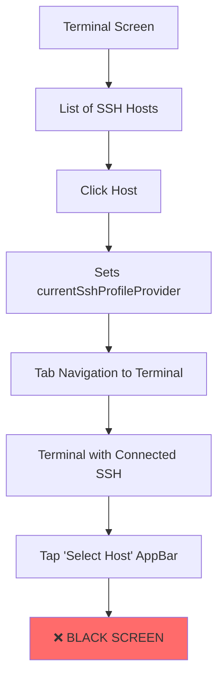
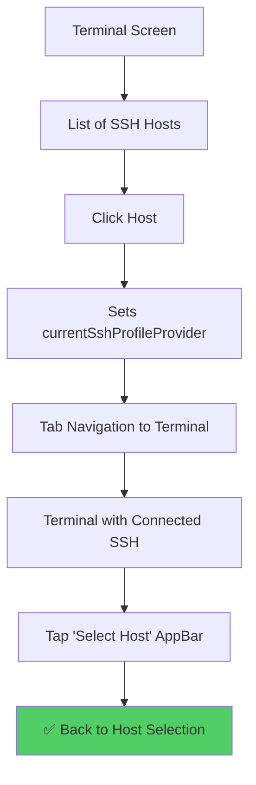

# SSH Host Navigation Black Screen Fix Plan

**Date:** 2025-08-29  
**Issue:** Critical navigation bug where users get stuck on black screen after tapping "Select Host" in AppBar  
**Status:** Root cause identified, comprehensive fix plan ready  

## Executive Summary

The SSH host navigation black screen issue is caused by a **state management disconnect** between the host selection flow (`HostsListScreen`) and the terminal screen initialization (`EnhancedTerminalScreen`). When users tap "Select Host" in the AppBar, they expect to navigate back to the host selection screen, but instead encounter a black screen due to improper provider state handling.

## Root Cause Analysis

### The Problem Chain

1. **Host Selection Flow (HostsListScreen)**
   ```dart
   void _connectToHost(SshProfile host) {
     // Sets provider state
     ref.read(currentSshProfileProvider.notifier).state = host;
     
     // Navigates to Terminal tab (not route)
     TabNavigationHelper.navigateToTab(context, TabNavigationHelper.terminalTab);
   }
   ```

2. **Terminal Screen Initialization (EnhancedTerminalScreen)**
   ```dart
   @override
   void initState() {
     super.initState();
     _selectedProfile = widget.initialProfile;  // ❌ Only uses constructor param
     _showHostSelector = widget.initialProfile == null && widget.sessionId == null;
   }
   ```

3. **"Select Host" Button Handler**
   ```dart
   void _showConnectionSelector() {
     setState(() {
       _showHostSelector = true;
       _selectedProfile = null;  // ❌ Disconnects from provider
       _isConnecting = false;
     });
   }
   ```

### The Disconnect

- **HostsListScreen** sets `currentSshProfileProvider.state = host` but uses tab navigation
- **EnhancedTerminalScreen** ignores `currentSshProfileProvider` and only uses `widget.initialProfile`
- When tab navigation occurs, no `initialProfile` is passed
- **"Select Host"** clears local state but doesn't sync with provider state

## Current vs Expected Navigation Flow

### Current (Broken) Flow



### Expected (Fixed) Flow



## Detailed Code Analysis

### File: `/lib/screens/terminal/enhanced_terminal_screen.dart`

**Lines 32-36: Initialization Issue**
```dart
@override
void initState() {
  super.initState();
  _selectedProfile = widget.initialProfile; // ❌ Missing provider fallback
  _showHostSelector = widget.initialProfile == null && widget.sessionId == null;
}
```

**Lines 574-580: State Management Issue**
```dart
void _showConnectionSelector() {
  setState(() {
    _showHostSelector = true;
    _selectedProfile = null;  // ❌ Loses provider connection
    _isConnecting = false;
  });
}
```

### File: `/lib/screens/vaults/hosts_list_screen.dart`

**Lines 576-582: Navigation Pattern**
```dart
void _connectToHost(SshProfile host) {
  // ✅ Correctly sets provider
  ref.read(currentSshProfileProvider.notifier).state = host;
  
  // ❌ Tab navigation doesn't pass initialProfile
  TabNavigationHelper.navigateToTab(context, TabNavigationHelper.terminalTab);
}
```

### File: `/lib/providers/ssh_host_providers.dart`

**Line 654: Provider Definition**
```dart
final currentSshProfileProvider = StateProvider<SshProfile?>((ref) => null);
```

## Implementation Plan

### Phase 1: Fix Terminal Screen State Management

#### 1.1 Update EnhancedTerminalScreen Initialization
**File:** `lib/screens/terminal/enhanced_terminal_screen.dart`

```dart
@override
void initState() {
  super.initState();
  
  // Check provider state as fallback if no initialProfile
  final providerProfile = ref.read(currentSshProfileProvider);
  _selectedProfile = widget.initialProfile ?? providerProfile;
  
  _showHostSelector = _selectedProfile == null && widget.sessionId == null;
  
  // Listen to provider changes
  ref.listen<SshProfile?>(currentSshProfileProvider, (previous, next) {
    if (next != null && _selectedProfile == null) {
      setState(() {
        _selectedProfile = next;
        _showHostSelector = false;
      });
    }
  });
}
```

#### 1.2 Update _showConnectionSelector Method
```dart
void _showConnectionSelector() {
  setState(() {
    _showHostSelector = true;
    _selectedProfile = null;
    _isConnecting = false;
  });
  
  // Clear provider state to maintain consistency
  ref.read(currentSshProfileProvider.notifier).state = null;
}
```

#### 1.3 Add Provider Sync in Host Selection
```dart
void _onHostSelected(SshProfile host) {
  setState(() {
    _selectedProfile = host;
    _showHostSelector = false;
    _isConnecting = false;
  });
  
  // Sync with provider
  ref.read(currentSshProfileProvider.notifier).state = host;
}
```

### Phase 2: Improve Navigation Consistency

#### 2.1 Update Main Tab Navigation
**File:** `lib/screens/main/main_tab_screen.dart`

Add provider awareness to terminal tab:

```dart
TabItem(
  icon: Icons.terminal,
  activeIcon: Icons.terminal,
  label: 'Terminal',
  screen: Consumer(
    builder: (context, ref, child) {
      final currentProfile = ref.watch(currentSshProfileProvider);
      return EnhancedTerminalScreen(initialProfile: currentProfile);
    },
  ),
),
```

#### 2.2 Alternative: Route-based Navigation
**File:** `lib/screens/vaults/hosts_list_screen.dart`

```dart
void _connectToHost(SshProfile host) {
  // Set provider for consistency
  ref.read(currentSshProfileProvider.notifier).state = host;
  
  // Use named route instead of tab navigation
  Navigator.pushNamed(
    context,
    '/terminal',
    arguments: host,
  );
}
```

### Phase 3: Error Handling & Edge Cases

#### 3.1 Add Connection State Validation
```dart
Widget _buildBody() {
  // Validate provider state consistency
  final providerProfile = ref.watch(currentSshProfileProvider);
  final effectiveProfile = _selectedProfile ?? providerProfile;
  
  if (_showHostSelector) {
    return _buildHostSelector();
  }
  
  if (effectiveProfile == null && widget.sessionId == null) {
    return _buildEmptyState();
  }
  
  return Padding(
    padding: const EdgeInsets.all(16),
    child: SshTerminalWidget(
      profile: effectiveProfile,
      sessionId: widget.sessionId,
      onSessionClosed: _onSessionClosed,
    ),
  );
}
```

#### 3.2 Handle Session Closure
```dart
void _onSessionClosed() {
  // Clear both local and provider state
  setState(() {
    _selectedProfile = null;
    _showHostSelector = true;
  });
  
  ref.read(currentSshProfileProvider.notifier).state = null;
  
  if (mounted) {
    Navigator.pop(context);
  }
}
```

## Testing Strategy

### 1. Manual Testing Scenarios

#### Scenario 1: Host Selection Flow
1. Open Terminal tab → Should show "No Connection Selected"
2. Tap "Select Host" → Should show host selector
3. Select a host → Should connect and show terminal
4. Tap "Select Host" in AppBar → Should return to host selector ✅
5. Select different host → Should switch connection ✅

#### Scenario 2: Provider State Consistency
1. From HostsListScreen, select a host
2. Verify terminal connects properly
3. Navigate away from Terminal tab
4. Navigate back → Should maintain connection ✅
5. Tap "Select Host" → Should show host selector ✅

#### Scenario 3: Edge Cases
1. Connection fails → Should show error and allow re-selection ✅
2. No hosts available → Should show appropriate empty state ✅
3. Network issues → Should handle gracefully ✅
4. App backgrounding/foregrounding → Should maintain state ✅

### 2. Automated Testing

#### Unit Tests
```dart
// Test provider state management
testWidgets('should sync local and provider state', (tester) async {
  // Test implementation
});

// Test navigation flow
testWidgets('should handle host selection navigation', (tester) async {
  // Test implementation  
});

// Test error recovery
testWidgets('should recover from connection errors', (tester) async {
  // Test implementation
});
```

#### Integration Tests
```dart
// Test complete user flow
testWidgets('complete ssh host selection flow', (tester) async {
  // Full user journey test
});
```

### 3. Performance Testing

- Monitor state provider performance with multiple hosts
- Test memory usage during connection switching
- Validate UI responsiveness during state changes

## Risk Assessment

### High Risk
- **State Management Conflicts**: Multiple sources of truth could cause race conditions
  - *Mitigation*: Clear state synchronization patterns, comprehensive testing

### Medium Risk  
- **Navigation Stack Issues**: Tab vs route navigation inconsistencies
  - *Mitigation*: Choose consistent navigation pattern across the app

- **Memory Leaks**: Provider listeners not properly disposed
  - *Mitigation*: Proper listener lifecycle management

### Low Risk
- **UI Flickering**: State changes causing brief visual glitches
  - *Mitigation*: Smooth state transitions, loading states

## Rollback Plan

1. **Immediate Rollback**: Revert to simple null checks in `_showConnectionSelector`
2. **Partial Rollback**: Keep provider integration but revert navigation changes
3. **Full Rollback**: Restore original implementation with navigation warning

## Success Criteria

### Functional Requirements
- ✅ "Select Host" button navigates back to host selector (not black screen)
- ✅ Host selection maintains connection state properly
- ✅ Tab navigation preserves SSH connections
- ✅ Error states provide clear recovery options

### Non-Functional Requirements
- ✅ Navigation feels smooth and responsive (< 300ms transitions)
- ✅ State management is predictable and debuggable
- ✅ Memory usage remains stable during host switching
- ✅ Works consistently across different device sizes

## Implementation Timeline

### Day 1: Core Fix
- [ ] Implement provider state synchronization
- [ ] Update _showConnectionSelector method
- [ ] Basic testing of navigation flow

### Day 2: Navigation Improvements  
- [ ] Update tab navigation to use provider
- [ ] Handle edge cases and error scenarios
- [ ] Comprehensive manual testing

### Day 3: Polish & Testing
- [ ] Write automated tests
- [ ] Performance testing and optimization
- [ ] Documentation updates
- [ ] Code review and deployment

## Conclusion

This SSH host navigation issue is a **critical UX blocker** caused by **state management inconsistencies** between the host selection and terminal screens. The fix requires:

1. **Provider State Synchronization**: Ensure `currentSshProfileProvider` is the single source of truth
2. **Navigation Consistency**: Align tab navigation with provider state
3. **Error Recovery**: Handle edge cases gracefully

The implementation is **low-risk** and **high-impact**, directly solving the black screen issue while improving overall app state management consistency.

**Priority**: P0 (Critical) - Blocks core user functionality  
**Effort**: 2-3 engineering days  
**Impact**: High - Fixes major UX blocker and improves navigation reliability