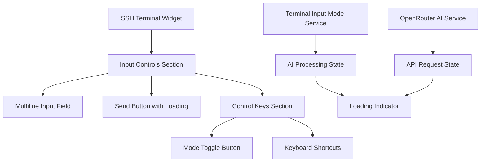

# SSH Terminal Widget Improvements Implementation Plan

**Date**: 2025-08-29  
**Type**: Feature Implementation  
**Status**: Planning  
**Context Tokens**: Improve SSH terminal widget with loading indicator, mode toggle relocation, and multiline input

## Executive Summary
Enhance the SSH terminal widget user experience by adding AI processing feedback, reorganizing control layout, and enabling multiline command input for better usability and professional appearance.

## Context Links
- **Current Implementation**: `/lib/widgets/terminal/ssh_terminal_widget.dart` (lines 1195-1357)
- **Related Services**: `/lib/services/terminal_input_mode_service.dart`, `/lib/services/openrouter_ai_service.dart`
- **Dependencies**: OpenRouter API integration, terminal input mode service
- **Reference Docs**: Flutter TextField multiline documentation

## Requirements

### Functional Requirements
- [ ] Add loading indicator during AI command processing in AI mode
- [ ] Move mode toggle button from input row to control keys section
- [ ] Convert input field from single-line to multiline mode
- [ ] Maintain existing functionality and keyboard shortcuts
- [ ] Preserve AI/Command mode switching behavior

### Non-Functional Requirements  
- [ ] Loading indicator should appear within 100ms of AI request start
- [ ] UI layout should remain responsive on different screen sizes
- [ ] Multiline input should support up to 5 lines with proper scrolling
- [ ] Smooth animations for loading states (300ms transitions)
- [ ] Maintain accessibility standards for input controls

## Architecture Overview



### Key Components
- **Input Controls Section**: Container for multiline input and control buttons
- **Loading Indicator**: Shows AI processing state with animation
- **Mode Toggle Button**: Relocated to control keys row
- **Multiline Input Field**: Enhanced TextField with proper sizing

### Data Models
- **Loading State**: `bool _isAiProcessing` - tracks AI request state
- **Input Field**: `TextEditingController _inputController` - handles multiline content
- **Mode State**: `TerminalInputMode _currentInputMode` - existing mode tracking

## Implementation Phases

### Phase 1: Add AI Loading Indicator (Est: 1 day)
**Scope**: Implement loading state management and visual feedback

**Tasks**:
1. [ ] Add `_isAiProcessing` state variable - file: `/lib/widgets/terminal/ssh_terminal_widget.dart`
2. [ ] Modify `_handleMainInputSubmission` to show loading during AI processing - file: `/lib/widgets/terminal/ssh_terminal_widget.dart` (line 671)
3. [ ] Update `_sendCommand` method to handle loading states - file: `/lib/widgets/terminal/ssh_terminal_widget.dart` (line 598)
4. [ ] Add loading spinner to send button when processing - file: `/lib/widgets/terminal/ssh_terminal_widget.dart` (line 1304)
5. [ ] Handle loading state in error scenarios - file: `/lib/widgets/terminal/ssh_terminal_widget.dart`

**Acceptance Criteria**:
- [ ] Loading indicator appears when AI mode is active and input is submitted
- [ ] Loading indicator disappears when AI response is received or error occurs
- [ ] Send button is disabled during loading state
- [ ] Loading animation is smooth and professional

### Phase 2: Relocate Mode Toggle Button (Est: 0.5 days)
**Scope**: Move mode toggle from input row to control keys section

**Tasks**:
1. [ ] Remove mode toggle button from input row - file: `/lib/widgets/terminal/ssh_terminal_widget.dart` (line 1218)
2. [ ] Add mode toggle to control keys row - file: `/lib/widgets/terminal/ssh_terminal_widget.dart` (line 1323)
3. [ ] Update UI spacing and layout for cleaner input row - file: `/lib/widgets/terminal/ssh_terminal_widget.dart` (line 1216)
4. [ ] Ensure mode toggle maintains existing styling and functionality - file: `/lib/widgets/terminal/ssh_terminal_widget.dart`

**Acceptance Criteria**:
- [ ] Mode toggle button appears in control keys section
- [ ] Input row has cleaner, simpler layout
- [ ] Mode toggle retains all existing functionality
- [ ] UI remains responsive on mobile devices

### Phase 3: Implement Multiline Input (Est: 1 day)
**Scope**: Convert single-line TextField to multiline with proper constraints

**Tasks**:
1. [ ] Update TextField configuration for multiline support - file: `/lib/widgets/terminal/ssh_terminal_widget.dart` (line 1262)
2. [ ] Add `maxLines` and `minLines` properties with reasonable limits - file: `/lib/widgets/terminal/ssh_terminal_widget.dart`
3. [ ] Implement proper height constraints and scrolling - file: `/lib/widgets/terminal/ssh_terminal_widget.dart`
4. [ ] Update keyboard handling for multiline (Shift+Enter for new line) - file: `/lib/widgets/terminal/ssh_terminal_widget.dart`
5. [ ] Adjust input decoration and padding for multiline appearance - file: `/lib/widgets/terminal/ssh_terminal_widget.dart` (line 1271)

**Acceptance Criteria**:
- [ ] Input field expands to show multiple lines (up to 5 lines)
- [ ] Enter key submits command, Shift+Enter creates new line
- [ ] Proper scrolling when content exceeds visible area
- [ ] Text cursor behavior works correctly across lines

## Implementation Approaches

### Approach 1: Gradual Enhancement (Recommended)
**Pros**:
- Lower risk of breaking existing functionality
- Easier testing and validation of each change
- Can deploy changes incrementally
- Better debugging capabilities

**Cons**:
- Slightly longer development time
- Multiple small commits instead of single feature

### Approach 2: Comprehensive Refactor
**Pros**:
- Single cohesive change
- Opportunity to clean up related code
- Faster overall delivery

**Cons**:
- Higher risk of introducing regressions
- More complex testing requirements
- Harder to isolate issues if problems arise

**Recommended**: Approach 1 (Gradual Enhancement) - safer for production codebase with existing users.

## Testing Strategy
- **Unit Tests**: Test loading state management, input validation, mode switching
- **Widget Tests**: Verify UI layout changes and user interactions
- **Integration Tests**: Test AI service integration with loading states

## Security Considerations
- [ ] Ensure multiline input sanitization remains intact
- [ ] Validate that loading states don't expose sensitive information
- [ ] Confirm AI processing timeout mechanisms work correctly

## Risk Assessment
| Risk | Impact | Mitigation |
|------|--------|------------|
| UI layout breaks on small screens | Medium | Test on multiple device sizes, implement responsive constraints |
| Multiline input affects performance | Low | Use reasonable line limits, implement proper text handling |
| Loading states cause UI freezing | Medium | Ensure async processing, implement timeout handling |
| Mode toggle becomes less discoverable | Low | Use clear iconography and tooltips |

## Implementation Details

### Current Code Analysis
The current implementation in `ssh_terminal_widget.dart` has:

1. **Input Controls Section** (lines 1195-1357):
   - Mode toggle button in input row (lines 1218-1257)
   - Single-line TextField (lines 1262-1299)
   - Send button (lines 1304-1316)
   - Control keys row (lines 1323-1353)

2. **AI Processing Flow** (lines 598-633):
   - `_sendCommand` method handles AI mode processing
   - Calls `_inputModeService.processInput` for AI conversion
   - No loading state feedback currently

3. **Mode Switching** (lines 683-686):
   - `_toggleInputMode` method switches between command/AI modes
   - Updates UI state and visual indicators

### Specific Changes Required

#### 1. Loading Indicator Implementation
```dart
// Add state variable
bool _isAiProcessing = false;

// Modify _sendCommand method
Future<void> _sendCommand(String command) async {
  // ... existing code ...
  
  if (_currentInputMode == TerminalInputMode.ai) {
    setState(() => _isAiProcessing = true);
  }
  
  try {
    // Process command through input mode service
    final processedCommand = await _inputModeService.processInput(command,
        sessionId: _currentSessionId);
    // ... rest of method
  } finally {
    if (mounted) {
      setState(() => _isAiProcessing = false);
    }
  }
}
```

#### 2. Mode Toggle Relocation
Move from input row (lines 1218-1257) to control keys row (after line 1327):
```dart
// In control keys row
Row(
  children: [
    _buildModeToggleButton(), // New location
    _buildControlKey('Ctrl'),
    _buildControlKey('Alt'),
    // ... rest of controls
  ],
)
```

#### 3. Multiline Input Configuration
```dart
TextField(
  controller: _inputController,
  maxLines: null, // Allow dynamic height
  minLines: 1,
  maxLines: 5, // Limit to 5 lines
  keyboardType: TextInputType.multiline,
  textInputAction: TextInputAction.send, // Show send button
  // ... rest of configuration
)
```

## Quick Reference

### Key Files to Modify
- `/lib/widgets/terminal/ssh_terminal_widget.dart`: Main implementation file
- `/lib/services/terminal_input_mode_service.dart`: May need loading state awareness

### Testing Commands
```bash
# Run widget tests
flutter test test/widgets/terminal/
# Run integration tests  
flutter test test/integration/ssh_terminal_integration_test.dart
```

## TODO Checklist
- [ ] Add AI processing loading state variable
- [ ] Implement loading indicator in send button
- [ ] Handle loading state in _sendCommand method
- [ ] Move mode toggle button to control keys section
- [ ] Update input row layout for cleaner appearance
- [ ] Convert TextField to multiline with proper constraints
- [ ] Add keyboard handling for multiline input
- [ ] Update input decoration for multiline appearance
- [ ] Test on multiple screen sizes
- [ ] Verify AI mode functionality with loading feedback
- [ ] Test multiline input with various command lengths
- [ ] Code review and optimization
- [ ] Documentation updates