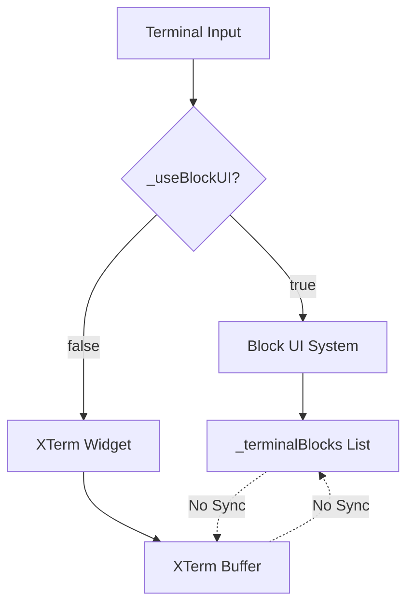
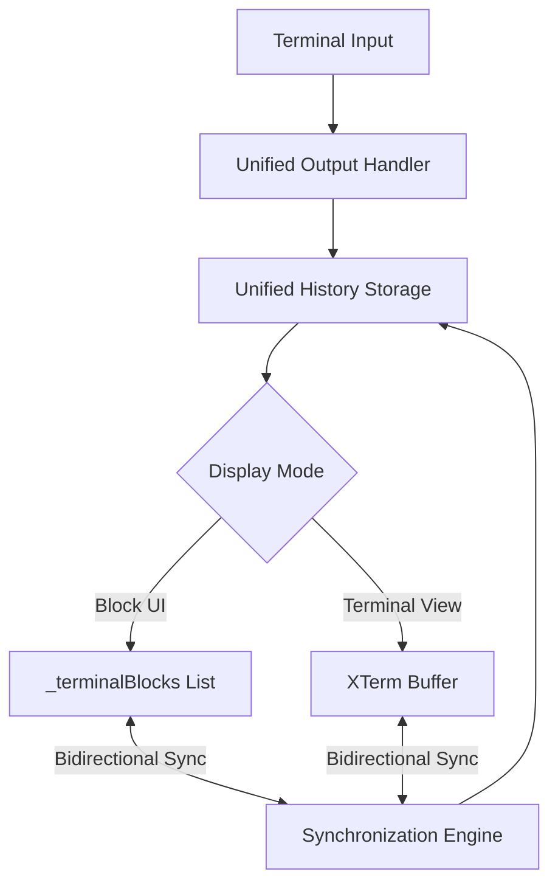

# Terminal View Mode Synchronization Implementation Plan

**Plan ID:** 20250829-terminal-sync-fix-plan  
**Created:** 2025-08-29  
**Target Completion:** 8 days  
**Priority:** High  

## Overview

This plan addresses the critical synchronization issue between Block UI and Terminal View modes in the SSH terminal widget. Currently, users lose command history and context when switching between these display modes, creating a fragmented user experience.

### Problem Statement

The terminal widget (`lib/widgets/terminal/ssh_terminal_widget.dart`) implements two display modes:
- **Block UI**: Uses `_terminalBlocks` list for structured command/output storage
- **Terminal View**: Uses XTerm widget with independent terminal buffer

These systems operate independently without synchronization, causing data loss during mode transitions.

### Success Criteria

- ✅ Seamless mode switching preserves complete command history
- ✅ Bidirectional synchronization between block and terminal formats
- ✅ Performance optimized for large terminal histories
- ✅ Maintains existing functionality and user experience
- ✅ Comprehensive test coverage validates all scenarios

## Requirements

### Functional Requirements
- **FR-1**: Preserve command history when switching from Block UI to Terminal View
- **FR-2**: Preserve terminal buffer when switching from Terminal View to Block UI
- **FR-3**: Maintain current session state during mode transitions
- **FR-4**: Support both SSH and local terminal sessions
- **FR-5**: Handle complex ANSI escape sequences and formatting

### Non-Functional Requirements
- **NFR-1**: Mode switching should complete within 500ms for histories up to 1000 commands
- **NFR-2**: Memory usage should not increase more than 20% during synchronization
- **NFR-3**: UI remains responsive during sync operations
- **NFR-4**: Backward compatibility with existing terminal functionality

## Architecture

### Current System Analysis



### Proposed Architecture



### Implementation Approach

**Approach 1: Unified Storage with Mode-Specific Views** (Recommended)
- **Pros**: Single source of truth, consistent data, easier to maintain
- **Cons**: Requires refactoring existing output handling
- **Trade-offs**: More initial work but better long-term maintainability

**Approach 2: Dual Storage with Synchronization Layer**
- **Pros**: Minimal changes to existing systems
- **Cons**: Data duplication, potential consistency issues
- **Trade-offs**: Faster implementation but higher maintenance overhead

**Recommended Approach**: Approach 1 - Unified Storage with Mode-Specific Views

## Implementation Details

### New Components

#### 1. UnifiedHistoryManager
```dart
class UnifiedHistoryManager {
  final List<TerminalHistoryItem> _unifiedHistory = [];
  
  void addOutput(String data, TerminalOutputType type);
  List<TerminalBlockData> getAsBlocks();
  String getAsTerminalBuffer();
  void syncFromBlocks(List<TerminalBlockData> blocks);
  void syncFromTerminal(String buffer);
}
```

#### 2. TerminalHistoryItem
```dart
class TerminalHistoryItem {
  final String id;
  final DateTime timestamp;
  final TerminalOutputType type;
  final String data;
  final Map<String, dynamic> metadata;
  final String? command;
  final TerminalBlockStatus? status;
}
```

### Core Methods to Implement

#### 1. _syncBlocksToTerminal()
```dart
Future<void> _syncBlocksToTerminal() async {
  _terminal.reset(); // Clear current buffer
  
  for (final block in _terminalBlocks) {
    // Write command with proper formatting
    _terminal.write('\$ ${block.command}\n');
    
    // Write output with ANSI formatting preserved
    if (block.output.isNotEmpty) {
      _terminal.write(block.output);
    }
    
    // Add status indicator for failed commands
    if (block.status == TerminalBlockStatus.failed) {
      _terminal.write('\x1b[31m[Command failed]\x1b[0m\n');
    }
  }
}
```

#### 2. _syncTerminalToBlocks()
```dart
Future<void> _syncTerminalToBlocks() async {
  final buffer = _terminal.buffer.toString();
  final lines = buffer.split('\n');
  final newBlocks = <TerminalBlockData>[];
  
  String? currentCommand;
  StringBuffer currentOutput = StringBuffer();
  
  for (final line in lines) {
    if (_isCommandLine(line)) {
      // Save previous block if exists
      if (currentCommand != null) {
        newBlocks.add(_createBlockFromData(
          currentCommand, 
          currentOutput.toString()
        ));
      }
      
      // Start new block
      currentCommand = _extractCommand(line);
      currentOutput = StringBuffer();
    } else {
      currentOutput.writeln(line);
    }
  }
  
  // Add final block
  if (currentCommand != null) {
    newBlocks.add(_createBlockFromData(
      currentCommand, 
      currentOutput.toString()
    ));
  }
  
  setState(() {
    _terminalBlocks.clear();
    _terminalBlocks.addAll(newBlocks);
  });
}
```

### Modified Methods

#### 1. Mode Switch Handler Enhancement
```dart
onPressed: () async {
  // Perform synchronization before mode switch
  if (_useBlockUI) {
    // Switching to Terminal View - sync blocks to terminal
    await _syncBlocksToTerminal();
  } else {
    // Switching to Block UI - sync terminal to blocks
    await _syncTerminalToBlocks();
  }
  
  setState(() {
    _useBlockUI = !_useBlockUI;
  });
  
  if (!_useBlockUI) {
    _resizeTerminalForCurrentScreen();
  }
}
```

#### 2. Enhanced Output Handler
```dart
void _handleTerminalOutput(TerminalOutput output) {
  // Store in unified history first
  _unifiedHistory.addOutput(output.data, output.type);
  
  if (_useBlockUI) {
    // Handle output in block-based UI
    switch (output.type) {
      case TerminalOutputType.stdout:
      case TerminalOutputType.stderr:
        _currentOutputController?.add(output.data);
        break;
      // ... existing block UI logic
    }
  } else {
    // Handle output in terminal view
    switch (output.type) {
      case TerminalOutputType.stdout:
      case TerminalOutputType.stderr:
        _terminal.write(output.data);
        break;
      // ... existing terminal view logic
    }
  }
}
```

## Implementation Phases

### Phase 1: Foundation (Days 1-2)
**Objectives**: Establish core synchronization infrastructure

#### Tasks:
- [ ] Create `UnifiedHistoryManager` class
- [ ] Define `TerminalHistoryItem` data structure
- [ ] Implement basic block-to-terminal conversion logic
- [ ] Add terminal buffer parsing utilities
- [ ] Create unit tests for conversion methods

**Deliverables**:
- Working unified history storage system
- Basic bidirectional conversion methods
- Unit test coverage >80%

**Success Criteria**:
- Conversion methods handle simple command/output scenarios
- No performance regression in existing functionality

### Phase 2: Integration (Days 3-4)  
**Objectives**: Integrate synchronization with existing terminal widget

#### Tasks:
- [ ] Modify mode switch handler to trigger synchronization
- [ ] Update `_handleTerminalOutput()` for unified storage
- [ ] Implement `_syncBlocksToTerminal()` method
- [ ] Implement `_syncTerminalToBlocks()` method
- [ ] Add error handling and recovery mechanisms

**Deliverables**:
- Functional bidirectional synchronization
- Enhanced mode switching logic
- Error handling for sync failures

**Success Criteria**:
- Mode switching preserves basic command history
- No data loss during normal operations

### Phase 3: Optimization (Days 5-6)
**Objectives**: Performance optimization and advanced feature support

#### Tasks:
- [ ] Optimize synchronization for large histories (>500 commands)
- [ ] Implement ANSI escape sequence preservation
- [ ] Add debouncing for frequent sync operations
- [ ] Handle interactive commands (vi, htop, etc.)
- [ ] Implement lazy loading for terminal buffer population

**Deliverables**:
- Performance-optimized synchronization
- Support for complex terminal scenarios
- Advanced ANSI formatting preservation

**Success Criteria**:
- Sync completes within 500ms for 1000+ commands
- Memory usage increase <20%
- Complex terminal applications work correctly

### Phase 4: Testing & Validation (Days 7-8)
**Objectives**: Comprehensive testing and user experience validation

#### Tasks:
- [ ] Integration testing across all terminal scenarios
- [ ] Performance testing with large command histories
- [ ] User experience testing for mode switching
- [ ] Edge case testing (empty history, malformed output)
- [ ] Regression testing for existing functionality

**Deliverables**:
- Comprehensive test suite
- Performance benchmarks
- Bug fixes and refinements
- Documentation updates

**Success Criteria**:
- All tests pass with >90% coverage
- Performance metrics meet requirements
- User experience matches design specifications

## Testing Strategy

### Unit Tests
```dart
// Test sync methods with various scenarios
testWidgets('syncBlocksToTerminal preserves command history', (tester) async {
  final blocks = [
    TerminalBlockData(command: 'ls -la', output: 'file1.txt\nfile2.txt'),
    TerminalBlockData(command: 'pwd', output: '/home/user'),
  ];
  
  await widget._syncBlocksToTerminal();
  
  expect(terminal.buffer.toString(), contains('ls -la'));
  expect(terminal.buffer.toString(), contains('file1.txt'));
});
```

### Integration Tests
```dart
testWidgets('mode switching preserves complete session', (tester) async {
  // Set up session with command history
  await tester.pumpWidget(terminalWidget);
  
  // Execute commands in block mode
  await tester.enterText(inputFinder, 'echo "test"');
  await tester.testTextInput.receiveAction(TextInputAction.done);
  
  // Switch to terminal mode
  await tester.tap(modeSwitchButton);
  await tester.pump();
  
  // Verify history is preserved
  expect(find.text('echo "test"'), findsOneWidget);
});
```

### Performance Tests
```dart
test('sync performance with large history', () async {
  // Create 1000 terminal blocks
  final blocks = List.generate(1000, (i) => 
    TerminalBlockData(command: 'command$i', output: 'output$i')
  );
  
  final stopwatch = Stopwatch()..start();
  await widget._syncBlocksToTerminal();
  stopwatch.stop();
  
  expect(stopwatch.elapsedMilliseconds, lessThan(500));
});
```

## Risks and Mitigation

### High Risk
- **Data Loss During Sync**: Implement atomic operations and backup mechanisms
- **Performance Impact**: Use progressive loading and debouncing strategies
- **ANSI Sequence Corruption**: Robust parsing with fallback to plain text

### Medium Risk
- **Memory Leaks**: Proper disposal of sync resources and circular references
- **Session State Loss**: Preserve active command state during transitions
- **Backward Compatibility**: Extensive regression testing

### Low Risk
- **UI Responsiveness**: Use async operations with loading indicators
- **Error Recovery**: Graceful fallback to original mode on sync failure

## Success Metrics

### Functional Metrics
- **Command Preservation Rate**: 100% of commands preserved during mode switches
- **Output Integrity**: 100% of terminal output maintained across transitions
- **Session Continuity**: No interruption to active terminal sessions

### Performance Metrics
- **Sync Duration**: <500ms for histories up to 1000 commands
- **Memory Usage**: <20% increase during synchronization operations
- **UI Responsiveness**: No frame drops during mode transitions

### Quality Metrics
- **Test Coverage**: >90% code coverage for synchronization logic
- **Bug Rate**: <1 critical bug per 1000 mode switches
- **User Satisfaction**: No user complaints about lost terminal data

## Conclusion

This implementation plan provides a comprehensive approach to solving the terminal view mode synchronization issue. The unified storage architecture ensures data consistency while maintaining the existing user experience. The phased implementation approach allows for iterative testing and refinement, reducing risk and ensuring a high-quality delivery.

The solution balances performance, maintainability, and user experience, providing a foundation for future terminal enhancements while immediately addressing the critical synchronization gap.

---

**Next Steps:**
1. Review and approve implementation plan
2. Set up development environment and testing framework
3. Begin Phase 1 implementation
4. Establish regular progress reviews and milestone checkpoints

**Dependencies:**
- No external dependencies required
- Existing XTerm and terminal infrastructure sufficient
- Testing frameworks already available in project